# (PART) Descriptive Statistics {-}


# Introduction to Data {#introdata}

::: {.rmdnote}
This section is adapted from the Introduction to Statistics for the Life and Biomedical Sciences [@vu]
:::

**Packages used in this Section**


```r
pacman::p_load(
  openintro,
  oibiostat, # devtools::install_github("OI-Biostat/oi_biostat_data")
  ggplot2,
  ggpubr,
  DT,
  kableExtra
)
```


## Case Study: preventing peanut allergies {#leapCaseStudy}

The proportion of young children in Western countries with peanut allergies has doubled in the last 10 years. Previous research suggests that exposing infants to peanut-based foods, rather than excluding such foods from their diets, may be an effective strategy for preventing the development of peanut allergies. The *Learning Early about Peanut Allergy (LEAP)* study was conducted to investigate whether early exposure to peanut products reduces the probability that a child will develop peanut allergies [@du2015randomized].

The study team enrolled children in the United Kingdom between 2006 and 2009, selecting 640 infants with eczema, egg allergy, or both. Each child was randomly assigned to either the peanut consumption (treatment) group or the peanut avoidance (control) group. Children in the treatment group were fed at least 6 grams of peanut protein daily until 5 years of age, while children in the control group avoided consuming peanut protein until 5 years of age.

At 5 years of age, each child was tested for peanut allergy using an oral food challenge (OFC): 5 grams of peanut protein in a single dose. A child was recorded as passing the oral food challenge if no allergic reaction was detected, and failing the oral food challenge if an allergic reaction occurred. These children had previously been tested for peanut allergy through a skin test, conducted at the time of study entry; the main analysis presented in the paper was based on data from 530 children with an earlier negative skin test. Although a total of 542 children had an earlier negative skin test, data collection did not occur for 12 children.

Individual-level data from the study are shown in Figure \@ref(fig:leapStudyResultsDF). Each row represents a participant and shows the participant's study ID number, treatment group assignment, and OFC outcome. The data are available as from the `oibiostat` R package.


```r
data(LEAP)
```


<div class="figure">

```{=html}
<div id="htmlwidget-ed2b050684acb1953ee2" style="width:100%;height:auto;" class="datatables html-widget"></div>
<script type="application/json" data-for="htmlwidget-ed2b050684acb1953ee2">{"x":{"filter":"none","vertical":false,"data":[["1","2","3","4","5","6","7","8","9","10","11","12","13","14","15","17","18","19","20","21","22","23","25","26","27","28","29","30","31","33","34","35","36","37","38","39","41","42","43","44","45","46","47","48","49","51","52","53","54","55","56","58","60","61","62","63","65","66","67","68","70","71","73","74","75","76","77","78","80","82","84","85","86","87","89","90","91","92","93","94","95","96","97","98","99","100","101","102","103","104","105","106","107","109","110","111","112","115","116","117","118","119","120","121","122","123","124","125","127","128","129","130","131","132","133","135","136","137","139","142","144","146","148","149","150","151","154","155","156","157","158","159","160","161","162","163","164","165","166","167","169","170","171","172","173","174","175","176","177","178","179","180","181","182","183","185","186","187","188","190","191","192","194","197","198","199","200","201","202","203","204","205","206","208","210","211","212","214","215","216","217","218","219","220","221","223","224","225","227","228","229","230","231","232","233","234","236","237","238","239","240","242","243","244","245","246","247","248","250","251","252","254","255","256","257","258","260","261","263","264","265","266","267","268","269","270","271","272","273","275","276","277","278","279","280","281","282","283","285","286","288","289","291","293","294","295","296","298","299","301","302","303","305","306","307","308","309","310","311","313","314","315","316","317","318","319","320","321","322","323","324","325","326","327","328","329","330","331","332","333","334","335","336","337","339","340","341","342","343","345","346","348","349","350","351","352","353","354","355","357","358","359","360","361","362","363","366","367","368","369","370","372","374","377","379","380","381","383","384","387","388","389","390","391","392","393","395","396","397","398","399","401","402","403","404","405","406","407","409","411","412","413","414","415","416","419","420","421","422","423","424","425","426","427","428","430","431","433","434","435","436","438","439","440","441","443","444","445","446","447","448","449","452","453","454","455","456","457","458","459","460","461","462","463","464","465","466","467","468","469","470","471","472","473","474","475","476","477","478","480","482","483","484","485","486","488","489","490","491","492","494","495","497","502","503","504","507","508","510","511","512","513","514","516","517","518","519","520","521","523","524","525","526","527","529","530","531","532","533","534","535","536","537","538","539","540","541","543","544","545","546","549","551","553","554","555","556","557","558","559","560","561","562","563","565","566","567","568","569","570","571","572","574","575","576","578","579","580","581","582","583","584","585","588","590","591","592","593","594","595","597","598","599","600","601","602","603","604","605","606","608","609","610","611","612","613","614","615","617","618","620","621","622","623","624","625","626","627","628","629","630","631","632","633","634","635","636","638","639","640"],["LEAP_100522","LEAP_103358","LEAP_105069","LEAP_105328","LEAP_106377","LEAP_107031","LEAP_107106","LEAP_108566","LEAP_109497","LEAP_111704","LEAP_112022","LEAP_112517","LEAP_112549","LEAP_112559","LEAP_114752","LEAP_115176","LEAP_117787","LEAP_118594","LEAP_119213","LEAP_120268","LEAP_125734","LEAP_126018","LEAP_126745","LEAP_127661","LEAP_138033","LEAP_138163","LEAP_138989","LEAP_139032","LEAP_143133","LEAP_148392","LEAP_148616","LEAP_149271","LEAP_151261","LEAP_151482","LEAP_154687","LEAP_157358","LEAP_159506","LEAP_166832","LEAP_169760","LEAP_171902","LEAP_172316","LEAP_173053","LEAP_180446","LEAP_180909","LEAP_181806","LEAP_183558","LEAP_184513","LEAP_185296","LEAP_185384","LEAP_188332","LEAP_189764","LEAP_190738","LEAP_192786","LEAP_199403","LEAP_200013","LEAP_201192","LEAP_206599","LEAP_207365","LEAP_210317","LEAP_212313","LEAP_213411","LEAP_215869","LEAP_217364","LEAP_220465","LEAP_222196","LEAP_223626","LEAP_225533","LEAP_226188","LEAP_227732","LEAP_237861","LEAP_241064","LEAP_241298","LEAP_242583","LEAP_244579","LEAP_246409","LEAP_246459","LEAP_248262","LEAP_249566","LEAP_250753","LEAP_254333","LEAP_254593","LEAP_256547","LEAP_258220","LEAP_258741","LEAP_259024","LEAP_259164","LEAP_260862","LEAP_262220","LEAP_263636","LEAP_263840","LEAP_265084","LEAP_267305","LEAP_269033","LEAP_270562","LEAP_270575","LEAP_271460","LEAP_271988","LEAP_272802","LEAP_273187","LEAP_273419","LEAP_275138","LEAP_279143","LEAP_280029","LEAP_280978","LEAP_280993","LEAP_287225","LEAP_287307","LEAP_287378","LEAP_288005","LEAP_288938","LEAP_288971","LEAP_289275","LEAP_290341","LEAP_290823","LEAP_291889","LEAP_294614","LEAP_294965","LEAP_295760","LEAP_296132","LEAP_301657","LEAP_304711","LEAP_305871","LEAP_309420","LEAP_310622","LEAP_311758","LEAP_313242","LEAP_318796","LEAP_320839","LEAP_320968","LEAP_323189","LEAP_323916","LEAP_324086","LEAP_325936","LEAP_325956","LEAP_327043","LEAP_329110","LEAP_330133","LEAP_330511","LEAP_330644","LEAP_331168","LEAP_335676","LEAP_336711","LEAP_338750","LEAP_342730","LEAP_345169","LEAP_345229","LEAP_346085","LEAP_348500","LEAP_349408","LEAP_350303","LEAP_350537","LEAP_351866","LEAP_354505","LEAP_356777","LEAP_358480","LEAP_359361","LEAP_360952","LEAP_361199","LEAP_365779","LEAP_368403","LEAP_370694","LEAP_371816","LEAP_377795","LEAP_383170","LEAP_383665","LEAP_384022","LEAP_385383","LEAP_387954","LEAP_390020","LEAP_390240","LEAP_392432","LEAP_393109","LEAP_394467","LEAP_397460","LEAP_402779","LEAP_405710","LEAP_406228","LEAP_407612","LEAP_408346","LEAP_409426","LEAP_410350","LEAP_410527","LEAP_413113","LEAP_416064","LEAP_418608","LEAP_420544","LEAP_423059","LEAP_424071","LEAP_425521","LEAP_426457","LEAP_428592","LEAP_428896","LEAP_429202","LEAP_436331","LEAP_436516","LEAP_437830","LEAP_446562","LEAP_448019","LEAP_448488","LEAP_451378","LEAP_452438","LEAP_453150","LEAP_454460","LEAP_454547","LEAP_454783","LEAP_454951","LEAP_457829","LEAP_459167","LEAP_459969","LEAP_463159","LEAP_463695","LEAP_465630","LEAP_466980","LEAP_470097","LEAP_470209","LEAP_477822","LEAP_479493","LEAP_479734","LEAP_481548","LEAP_482058","LEAP_482136","LEAP_482937","LEAP_483020","LEAP_483179","LEAP_483273","LEAP_483794","LEAP_485635","LEAP_487707","LEAP_488495","LEAP_493092","LEAP_494302","LEAP_494395","LEAP_494794","LEAP_495710","LEAP_497792","LEAP_497810","LEAP_498390","LEAP_499744","LEAP_501719","LEAP_501983","LEAP_503069","LEAP_503071","LEAP_505232","LEAP_506554","LEAP_507509","LEAP_508600","LEAP_509272","LEAP_512904","LEAP_515418","LEAP_519474","LEAP_520751","LEAP_521794","LEAP_524050","LEAP_528248","LEAP_529272","LEAP_530473","LEAP_530499","LEAP_532750","LEAP_533688","LEAP_538158","LEAP_538907","LEAP_539185","LEAP_539276","LEAP_539484","LEAP_540014","LEAP_540244","LEAP_540672","LEAP_541336","LEAP_541767","LEAP_542975","LEAP_544729","LEAP_546272","LEAP_546297","LEAP_546879","LEAP_548096","LEAP_548756","LEAP_550087","LEAP_552347","LEAP_552414","LEAP_553133","LEAP_553998","LEAP_555355","LEAP_555552","LEAP_555562","LEAP_556210","LEAP_556920","LEAP_559285","LEAP_559687","LEAP_561839","LEAP_563801","LEAP_564196","LEAP_573637","LEAP_577995","LEAP_578121","LEAP_581309","LEAP_582749","LEAP_583914","LEAP_585084","LEAP_585424","LEAP_586707","LEAP_593795","LEAP_595629","LEAP_596724","LEAP_597972","LEAP_600514","LEAP_606290","LEAP_609668","LEAP_610885","LEAP_611245","LEAP_611578","LEAP_613645","LEAP_619727","LEAP_622188","LEAP_624687","LEAP_626463","LEAP_627025","LEAP_628244","LEAP_635919","LEAP_639978","LEAP_644735","LEAP_649621","LEAP_650314","LEAP_650856","LEAP_653357","LEAP_655774","LEAP_656677","LEAP_665375","LEAP_666158","LEAP_666696","LEAP_667797","LEAP_669917","LEAP_674176","LEAP_675211","LEAP_677189","LEAP_678469","LEAP_681583","LEAP_681641","LEAP_681668","LEAP_683080","LEAP_686487","LEAP_686671","LEAP_688090","LEAP_689373","LEAP_689820","LEAP_690838","LEAP_694133","LEAP_696187","LEAP_697187","LEAP_702722","LEAP_704031","LEAP_704161","LEAP_707925","LEAP_708475","LEAP_709279","LEAP_710556","LEAP_714134","LEAP_717712","LEAP_718928","LEAP_723012","LEAP_723752","LEAP_725639","LEAP_727761","LEAP_727943","LEAP_728165","LEAP_730953","LEAP_732398","LEAP_732618","LEAP_732668","LEAP_733177","LEAP_733429","LEAP_734853","LEAP_735579","LEAP_742983","LEAP_749158","LEAP_754312","LEAP_754355","LEAP_754393","LEAP_754779","LEAP_756271","LEAP_758706","LEAP_761757","LEAP_762379","LEAP_764336","LEAP_765130","LEAP_765956","LEAP_766764","LEAP_767006","LEAP_768151","LEAP_770359","LEAP_770646","LEAP_771384","LEAP_771521","LEAP_771562","LEAP_771660","LEAP_772376","LEAP_773800","LEAP_775222","LEAP_775305","LEAP_777443","LEAP_785626","LEAP_788063","LEAP_790041","LEAP_790390","LEAP_791556","LEAP_794123","LEAP_795656","LEAP_797766","LEAP_798248","LEAP_799886","LEAP_800387","LEAP_802575","LEAP_804021","LEAP_805992","LEAP_817194","LEAP_819191","LEAP_820128","LEAP_825101","LEAP_825330","LEAP_829921","LEAP_830441","LEAP_830699","LEAP_834694","LEAP_835195","LEAP_836944","LEAP_837524","LEAP_837692","LEAP_838335","LEAP_840251","LEAP_841012","LEAP_845509","LEAP_846170","LEAP_850942","LEAP_851801","LEAP_851920","LEAP_853048","LEAP_856949","LEAP_858459","LEAP_859120","LEAP_861116","LEAP_861126","LEAP_862338","LEAP_863766","LEAP_864474","LEAP_867202","LEAP_871515","LEAP_871953","LEAP_877803","LEAP_883437","LEAP_885213","LEAP_885402","LEAP_887446","LEAP_889489","LEAP_890248","LEAP_892807","LEAP_894520","LEAP_894804","LEAP_895089","LEAP_895759","LEAP_896669","LEAP_897490","LEAP_898145","LEAP_901391","LEAP_901550","LEAP_901735","LEAP_903449","LEAP_903640","LEAP_904466","LEAP_905573","LEAP_906763","LEAP_907505","LEAP_909565","LEAP_910034","LEAP_910190","LEAP_916720","LEAP_916932","LEAP_919140","LEAP_920179","LEAP_920244","LEAP_921936","LEAP_924439","LEAP_924922","LEAP_925009","LEAP_925423","LEAP_930398","LEAP_932031","LEAP_932590","LEAP_934998","LEAP_935263","LEAP_936599","LEAP_936726","LEAP_944019","LEAP_944203","LEAP_944952","LEAP_945071","LEAP_945267","LEAP_948368","LEAP_951541","LEAP_952082","LEAP_953037","LEAP_956087","LEAP_957799","LEAP_958598","LEAP_960016","LEAP_960171","LEAP_960621","LEAP_960719","LEAP_962369","LEAP_963646","LEAP_969122","LEAP_970058","LEAP_971383","LEAP_972737","LEAP_973812","LEAP_976746","LEAP_977218","LEAP_981487","LEAP_983884","LEAP_984770","LEAP_986315","LEAP_987745","LEAP_988757","LEAP_988935","LEAP_989899","LEAP_990511","LEAP_991386","LEAP_991698","LEAP_992325","LEAP_993322","LEAP_994047","LEAP_997608"],["Peanut Consumption","Peanut Consumption","Peanut Avoidance","Peanut Consumption","Peanut Avoidance","Peanut Consumption","Peanut Consumption","Peanut Consumption","Peanut Avoidance","Peanut Avoidance","Peanut Consumption","Peanut Avoidance","Peanut Avoidance","Peanut Consumption","Peanut Avoidance","Peanut Avoidance","Peanut Avoidance","Peanut Consumption","Peanut Avoidance","Peanut Avoidance","Peanut Consumption","Peanut Avoidance","Peanut Avoidance","Peanut Consumption","Peanut Avoidance","Peanut Consumption","Peanut Avoidance","Peanut Consumption","Peanut Consumption","Peanut Avoidance","Peanut Avoidance","Peanut Consumption","Peanut Avoidance","Peanut Avoidance","Peanut Avoidance","Peanut Consumption","Peanut Avoidance","Peanut Consumption","Peanut Avoidance","Peanut Consumption","Peanut Avoidance","Peanut Avoidance","Peanut Avoidance","Peanut Consumption","Peanut Consumption","Peanut Avoidance","Peanut Consumption","Peanut Consumption","Peanut Consumption","Peanut Avoidance","Peanut Consumption","Peanut Avoidance","Peanut Consumption","Peanut Consumption","Peanut Consumption","Peanut Avoidance","Peanut Consumption","Peanut Avoidance","Peanut Avoidance","Peanut Consumption","Peanut Avoidance","Peanut Avoidance","Peanut Avoidance","Peanut Consumption","Peanut Consumption","Peanut Avoidance","Peanut Consumption","Peanut Consumption","Peanut Avoidance","Peanut Consumption","Peanut Consumption","Peanut Avoidance","Peanut Avoidance","Peanut Avoidance","Peanut Consumption","Peanut Avoidance","Peanut Avoidance","Peanut Avoidance","Peanut Avoidance","Peanut Consumption","Peanut Consumption","Peanut Consumption","Peanut Consumption","Peanut Consumption","Peanut Avoidance","Peanut Avoidance","Peanut Avoidance","Peanut Avoidance","Peanut Avoidance","Peanut Avoidance","Peanut Consumption","Peanut Consumption","Peanut Avoidance","Peanut Avoidance","Peanut Avoidance","Peanut Avoidance","Peanut Consumption","Peanut Avoidance","Peanut Consumption","Peanut Avoidance","Peanut Consumption","Peanut Avoidance","Peanut Consumption","Peanut Avoidance","Peanut Avoidance","Peanut Consumption","Peanut Consumption","Peanut Consumption","Peanut Consumption","Peanut Consumption","Peanut Consumption","Peanut Avoidance","Peanut Consumption","Peanut Avoidance","Peanut Avoidance","Peanut Consumption","Peanut Avoidance","Peanut Consumption","Peanut Avoidance","Peanut Avoidance","Peanut Consumption","Peanut Consumption","Peanut Avoidance","Peanut Consumption","Peanut Avoidance","Peanut Consumption","Peanut Consumption","Peanut Avoidance","Peanut Consumption","Peanut Avoidance","Peanut Consumption","Peanut Consumption","Peanut Consumption","Peanut Consumption","Peanut Consumption","Peanut Consumption","Peanut Consumption","Peanut Avoidance","Peanut Avoidance","Peanut Consumption","Peanut Consumption","Peanut Avoidance","Peanut Consumption","Peanut Avoidance","Peanut Consumption","Peanut Avoidance","Peanut Avoidance","Peanut Consumption","Peanut Avoidance","Peanut Consumption","Peanut Avoidance","Peanut Avoidance","Peanut Consumption","Peanut Avoidance","Peanut Avoidance","Peanut Avoidance","Peanut Consumption","Peanut Consumption","Peanut Consumption","Peanut Avoidance","Peanut Consumption","Peanut Avoidance","Peanut Avoidance","Peanut Avoidance","Peanut Avoidance","Peanut Consumption","Peanut Consumption","Peanut Consumption","Peanut Consumption","Peanut Avoidance","Peanut Avoidance","Peanut Consumption","Peanut Consumption","Peanut Consumption","Peanut Avoidance","Peanut Consumption","Peanut Consumption","Peanut Avoidance","Peanut Consumption","Peanut Consumption","Peanut Avoidance","Peanut Avoidance","Peanut Avoidance","Peanut Consumption","Peanut Consumption","Peanut Avoidance","Peanut Avoidance","Peanut Consumption","Peanut Avoidance","Peanut Avoidance","Peanut Consumption","Peanut Consumption","Peanut Avoidance","Peanut Avoidance","Peanut Avoidance","Peanut Avoidance","Peanut Avoidance","Peanut Avoidance","Peanut Avoidance","Peanut Avoidance","Peanut Avoidance","Peanut Consumption","Peanut Avoidance","Peanut Avoidance","Peanut Avoidance","Peanut Consumption","Peanut Avoidance","Peanut Avoidance","Peanut Consumption","Peanut Avoidance","Peanut Consumption","Peanut Avoidance","Peanut Consumption","Peanut Consumption","Peanut Consumption","Peanut Consumption","Peanut Consumption","Peanut Consumption","Peanut Avoidance","Peanut Avoidance","Peanut Avoidance","Peanut Avoidance","Peanut Avoidance","Peanut Consumption","Peanut Consumption","Peanut Consumption","Peanut Avoidance","Peanut Avoidance","Peanut Avoidance","Peanut Consumption","Peanut Consumption","Peanut Avoidance","Peanut Avoidance","Peanut Avoidance","Peanut Avoidance","Peanut Avoidance","Peanut Avoidance","Peanut Consumption","Peanut Consumption","Peanut Avoidance","Peanut Avoidance","Peanut Consumption","Peanut Consumption","Peanut Consumption","Peanut Consumption","Peanut Avoidance","Peanut Consumption","Peanut Consumption","Peanut Consumption","Peanut Consumption","Peanut Consumption","Peanut Avoidance","Peanut Avoidance","Peanut Avoidance","Peanut Avoidance","Peanut Avoidance","Peanut Consumption","Peanut Avoidance","Peanut Consumption","Peanut Consumption","Peanut Avoidance","Peanut Avoidance","Peanut Avoidance","Peanut Consumption","Peanut Consumption","Peanut Avoidance","Peanut Avoidance","Peanut Consumption","Peanut Consumption","Peanut Avoidance","Peanut Avoidance","Peanut Avoidance","Peanut Avoidance","Peanut Avoidance","Peanut Consumption","Peanut Consumption","Peanut Consumption","Peanut Avoidance","Peanut Avoidance","Peanut Avoidance","Peanut Avoidance","Peanut Consumption","Peanut Avoidance","Peanut Consumption","Peanut Avoidance","Peanut Avoidance","Peanut Avoidance","Peanut Consumption","Peanut Consumption","Peanut Consumption","Peanut Avoidance","Peanut Consumption","Peanut Avoidance","Peanut Consumption","Peanut Avoidance","Peanut Consumption","Peanut Avoidance","Peanut Consumption","Peanut Avoidance","Peanut Consumption","Peanut Avoidance","Peanut Avoidance","Peanut Consumption","Peanut Consumption","Peanut Avoidance","Peanut Consumption","Peanut Consumption","Peanut Avoidance","Peanut Avoidance","Peanut Avoidance","Peanut Consumption","Peanut Consumption","Peanut Avoidance","Peanut Avoidance","Peanut Consumption","Peanut Consumption","Peanut Avoidance","Peanut Consumption","Peanut Consumption","Peanut Avoidance","Peanut Consumption","Peanut Consumption","Peanut Consumption","Peanut Consumption","Peanut Avoidance","Peanut Avoidance","Peanut Consumption","Peanut Consumption","Peanut Consumption","Peanut Consumption","Peanut Consumption","Peanut Consumption","Peanut Consumption","Peanut Consumption","Peanut Avoidance","Peanut Avoidance","Peanut Avoidance","Peanut Avoidance","Peanut Avoidance","Peanut Consumption","Peanut Consumption","Peanut Consumption","Peanut Avoidance","Peanut Avoidance","Peanut Avoidance","Peanut Consumption","Peanut Avoidance","Peanut Avoidance","Peanut Consumption","Peanut Consumption","Peanut Consumption","Peanut Consumption","Peanut Consumption","Peanut Avoidance","Peanut Consumption","Peanut Consumption","Peanut Consumption","Peanut Consumption","Peanut Avoidance","Peanut Avoidance","Peanut Avoidance","Peanut Consumption","Peanut Consumption","Peanut Avoidance","Peanut Consumption","Peanut Consumption","Peanut Consumption","Peanut Consumption","Peanut Avoidance","Peanut Consumption","Peanut Avoidance","Peanut Consumption","Peanut Avoidance","Peanut Consumption","Peanut Consumption","Peanut Avoidance","Peanut Consumption","Peanut Consumption","Peanut Consumption","Peanut Avoidance","Peanut Consumption","Peanut Consumption","Peanut Avoidance","Peanut Avoidance","Peanut Avoidance","Peanut Consumption","Peanut Consumption","Peanut Consumption","Peanut Avoidance","Peanut Consumption","Peanut Consumption","Peanut Avoidance","Peanut Consumption","Peanut Avoidance","Peanut Avoidance","Peanut Consumption","Peanut Consumption","Peanut Consumption","Peanut Consumption","Peanut Consumption","Peanut Avoidance","Peanut Avoidance","Peanut Consumption","Peanut Avoidance","Peanut Consumption","Peanut Avoidance","Peanut Consumption","Peanut Avoidance","Peanut Consumption","Peanut Avoidance","Peanut Consumption","Peanut Consumption","Peanut Consumption","Peanut Avoidance","Peanut Avoidance","Peanut Avoidance","Peanut Consumption","Peanut Avoidance","Peanut Avoidance","Peanut Consumption","Peanut Consumption","Peanut Avoidance","Peanut Avoidance","Peanut Avoidance","Peanut Consumption","Peanut Consumption","Peanut Consumption","Peanut Avoidance","Peanut Avoidance","Peanut Avoidance","Peanut Consumption","Peanut Avoidance","Peanut Consumption","Peanut Avoidance","Peanut Consumption","Peanut Consumption","Peanut Avoidance","Peanut Avoidance","Peanut Consumption","Peanut Consumption","Peanut Avoidance","Peanut Consumption","Peanut Avoidance","Peanut Consumption","Peanut Avoidance","Peanut Consumption","Peanut Consumption","Peanut Avoidance","Peanut Consumption","Peanut Consumption","Peanut Consumption","Peanut Consumption","Peanut Consumption","Peanut Consumption","Peanut Consumption","Peanut Consumption","Peanut Avoidance","Peanut Consumption","Peanut Consumption","Peanut Consumption","Peanut Consumption","Peanut Avoidance","Peanut Avoidance","Peanut Consumption","Peanut Avoidance","Peanut Consumption","Peanut Avoidance","Peanut Avoidance","Peanut Consumption","Peanut Consumption","Peanut Avoidance","Peanut Avoidance","Peanut Consumption","Peanut Consumption","Peanut Consumption","Peanut Avoidance","Peanut Avoidance","Peanut Avoidance","Peanut Avoidance","Peanut Avoidance","Peanut Avoidance","Peanut Avoidance","Peanut Avoidance","Peanut Avoidance","Peanut Consumption","Peanut Avoidance","Peanut Avoidance","Peanut Consumption","Peanut Consumption","Peanut Consumption","Peanut Avoidance","Peanut Avoidance","Peanut Avoidance","Peanut Consumption","Peanut Consumption","Peanut Avoidance","Peanut Consumption","Peanut Consumption","Peanut Consumption","Peanut Avoidance","Peanut Consumption","Peanut Consumption","Peanut Avoidance","Peanut Consumption","Peanut Consumption","Peanut Consumption","Peanut Avoidance","Peanut Avoidance","Peanut Avoidance","Peanut Avoidance","Peanut Avoidance","Peanut Consumption","Peanut Consumption","Peanut Avoidance","Peanut Avoidance","Peanut Consumption","Peanut Consumption","Peanut Avoidance","Peanut Avoidance","Peanut Consumption","Peanut Avoidance","Peanut Avoidance","Peanut Avoidance","Peanut Avoidance","Peanut Consumption","Peanut Avoidance","Peanut Consumption","Peanut Avoidance","Peanut Avoidance","Peanut Consumption"],["PASS OFC","PASS OFC","PASS OFC","PASS OFC","PASS OFC","PASS OFC","PASS OFC","FAIL OFC","FAIL OFC","PASS OFC","PASS OFC","PASS OFC","FAIL OFC","PASS OFC","PASS OFC","PASS OFC","PASS OFC","PASS OFC","PASS OFC","PASS OFC","PASS OFC","PASS OFC","PASS OFC","PASS OFC","PASS OFC","PASS OFC","PASS OFC","PASS OFC","PASS OFC","PASS OFC","PASS OFC","PASS OFC","PASS OFC","PASS OFC","PASS OFC","PASS OFC","PASS OFC","PASS OFC","PASS OFC","PASS OFC","PASS OFC","PASS OFC","PASS OFC","PASS OFC","PASS OFC","PASS OFC","PASS OFC","PASS OFC","PASS OFC","PASS OFC","PASS OFC","PASS OFC","PASS OFC","PASS OFC","PASS OFC","PASS OFC","PASS OFC","PASS OFC","PASS OFC","PASS OFC","PASS OFC","PASS OFC","FAIL OFC","PASS OFC","PASS OFC","PASS OFC","PASS OFC","PASS OFC","PASS OFC","PASS OFC","PASS OFC","PASS OFC","FAIL OFC","PASS OFC","PASS OFC","PASS OFC","PASS OFC","PASS OFC","PASS OFC","PASS OFC","PASS OFC","PASS OFC","PASS OFC","PASS OFC","PASS OFC","PASS OFC","PASS OFC","FAIL OFC","PASS OFC","PASS OFC","PASS OFC","PASS OFC","FAIL OFC","FAIL OFC","PASS OFC","PASS OFC","PASS OFC","PASS OFC","PASS OFC","PASS OFC","PASS OFC","PASS OFC","PASS OFC","PASS OFC","FAIL OFC","PASS OFC","PASS OFC","PASS OFC","PASS OFC","PASS OFC","PASS OFC","PASS OFC","PASS OFC","PASS OFC","PASS OFC","PASS OFC","PASS OFC","PASS OFC","PASS OFC","PASS OFC","PASS OFC","PASS OFC","PASS OFC","PASS OFC","PASS OFC","PASS OFC","PASS OFC","PASS OFC","PASS OFC","PASS OFC","PASS OFC","PASS OFC","PASS OFC","PASS OFC","PASS OFC","PASS OFC","PASS OFC","PASS OFC","PASS OFC","PASS OFC","PASS OFC","PASS OFC","PASS OFC","PASS OFC","PASS OFC","PASS OFC","FAIL OFC","PASS OFC","PASS OFC","PASS OFC","PASS OFC","FAIL OFC","PASS OFC","PASS OFC","PASS OFC","PASS OFC","PASS OFC","PASS OFC","PASS OFC","PASS OFC","PASS OFC","PASS OFC","PASS OFC","PASS OFC","PASS OFC","PASS OFC","PASS OFC","PASS OFC","PASS OFC","FAIL OFC","PASS OFC","FAIL OFC","PASS OFC","PASS OFC","PASS OFC","PASS OFC","PASS OFC","PASS OFC","PASS OFC","PASS OFC","PASS OFC","PASS OFC","FAIL OFC","PASS OFC","PASS OFC","PASS OFC","PASS OFC","PASS OFC","PASS OFC","FAIL OFC","PASS OFC","PASS OFC","FAIL OFC","PASS OFC","PASS OFC","FAIL OFC","PASS OFC","PASS OFC","PASS OFC","PASS OFC","PASS OFC","PASS OFC","PASS OFC","PASS OFC","PASS OFC","PASS OFC","PASS OFC","PASS OFC","PASS OFC","PASS OFC","PASS OFC","PASS OFC","PASS OFC","PASS OFC","PASS OFC","PASS OFC","PASS OFC","PASS OFC","PASS OFC","FAIL OFC","PASS OFC","PASS OFC","PASS OFC","FAIL OFC","PASS OFC","PASS OFC","PASS OFC","FAIL OFC","PASS OFC","PASS OFC","PASS OFC","PASS OFC","PASS OFC","PASS OFC","PASS OFC","PASS OFC","PASS OFC","PASS OFC","PASS OFC","PASS OFC","PASS OFC","PASS OFC","PASS OFC","PASS OFC","PASS OFC","PASS OFC","PASS OFC","PASS OFC","PASS OFC","PASS OFC","PASS OFC","PASS OFC","FAIL OFC","PASS OFC","PASS OFC","PASS OFC","PASS OFC","PASS OFC","PASS OFC","PASS OFC","FAIL OFC","PASS OFC","PASS OFC","PASS OFC","PASS OFC","PASS OFC","PASS OFC","PASS OFC","PASS OFC","PASS OFC","PASS OFC","PASS OFC","PASS OFC","PASS OFC","PASS OFC","PASS OFC","PASS OFC","PASS OFC","PASS OFC","PASS OFC","PASS OFC","PASS OFC","PASS OFC","PASS OFC","PASS OFC","PASS OFC","PASS OFC","PASS OFC","PASS OFC","PASS OFC","PASS OFC","PASS OFC","PASS OFC","PASS OFC","PASS OFC","PASS OFC","PASS OFC","PASS OFC","PASS OFC","PASS OFC","PASS OFC","PASS OFC","PASS OFC","PASS OFC","PASS OFC","PASS OFC","PASS OFC","PASS OFC","PASS OFC","PASS OFC","PASS OFC","PASS OFC","PASS OFC","PASS OFC","PASS OFC","PASS OFC","PASS OFC","PASS OFC","PASS OFC","FAIL OFC","PASS OFC","PASS OFC","PASS OFC","PASS OFC","PASS OFC","PASS OFC","PASS OFC","PASS OFC","PASS OFC","PASS OFC","PASS OFC","PASS OFC","PASS OFC","PASS OFC","PASS OFC","PASS OFC","FAIL OFC","PASS OFC","PASS OFC","PASS OFC","PASS OFC","PASS OFC","PASS OFC","PASS OFC","PASS OFC","PASS OFC","PASS OFC","PASS OFC","PASS OFC","PASS OFC","PASS OFC","PASS OFC","PASS OFC","PASS OFC","PASS OFC","PASS OFC","PASS OFC","PASS OFC","PASS OFC","PASS OFC","PASS OFC","PASS OFC","PASS OFC","PASS OFC","PASS OFC","PASS OFC","PASS OFC","PASS OFC","PASS OFC","PASS OFC","PASS OFC","PASS OFC","PASS OFC","PASS OFC","PASS OFC","FAIL OFC","PASS OFC","PASS OFC","PASS OFC","PASS OFC","PASS OFC","PASS OFC","PASS OFC","PASS OFC","PASS OFC","PASS OFC","PASS OFC","PASS OFC","FAIL OFC","PASS OFC","PASS OFC","FAIL OFC","PASS OFC","PASS OFC","FAIL OFC","PASS OFC","PASS OFC","PASS OFC","PASS OFC","PASS OFC","PASS OFC","FAIL OFC","PASS OFC","PASS OFC","PASS OFC","PASS OFC","PASS OFC","PASS OFC","PASS OFC","FAIL OFC","PASS OFC","PASS OFC","PASS OFC","PASS OFC","PASS OFC","FAIL OFC","PASS OFC","PASS OFC","PASS OFC","PASS OFC","PASS OFC","PASS OFC","PASS OFC","PASS OFC","PASS OFC","PASS OFC","PASS OFC","PASS OFC","PASS OFC","PASS OFC","FAIL OFC","PASS OFC","PASS OFC","PASS OFC","PASS OFC","PASS OFC","PASS OFC","PASS OFC","PASS OFC","PASS OFC","PASS OFC","PASS OFC","FAIL OFC","PASS OFC","PASS OFC","PASS OFC","PASS OFC","PASS OFC","PASS OFC","PASS OFC","PASS OFC","PASS OFC","PASS OFC","PASS OFC","PASS OFC","PASS OFC","PASS OFC","PASS OFC","PASS OFC","PASS OFC","PASS OFC","PASS OFC","PASS OFC","PASS OFC","PASS OFC","PASS OFC","PASS OFC","PASS OFC","PASS OFC","PASS OFC","PASS OFC","PASS OFC","PASS OFC","PASS OFC","PASS OFC","PASS OFC","PASS OFC","PASS OFC","PASS OFC","PASS OFC","FAIL OFC","PASS OFC","PASS OFC","PASS OFC","PASS OFC","PASS OFC","PASS OFC","PASS OFC","PASS OFC","PASS OFC","PASS OFC","PASS OFC","FAIL OFC","PASS OFC","PASS OFC","PASS OFC","PASS OFC","PASS OFC","PASS OFC","PASS OFC","PASS OFC","PASS OFC","FAIL OFC","PASS OFC","PASS OFC","PASS OFC","FAIL OFC","FAIL OFC","PASS OFC","FAIL OFC","PASS OFC","FAIL OFC","PASS OFC","PASS OFC","FAIL OFC","PASS OFC","PASS OFC","PASS OFC","PASS OFC","PASS OFC","PASS OFC","PASS OFC","PASS OFC","PASS OFC","PASS OFC","PASS OFC","PASS OFC","PASS OFC","PASS OFC","PASS OFC"]],"container":"<table class=\"display\">\n  <thead>\n    <tr>\n      <th> <\/th>\n      <th>participant.ID<\/th>\n      <th>treatment.group<\/th>\n      <th>overall.V60.outcome<\/th>\n    <\/tr>\n  <\/thead>\n<\/table>","options":{"order":[],"autoWidth":false,"orderClasses":false,"columnDefs":[{"orderable":false,"targets":0}]}},"evals":[],"jsHooks":[]}</script>
```

<p class="caption">(\#fig:leapStudyResultsDF)Individual-level LEAP results</p>
</div>


<br><br>
 
The data can be organized in the form of a two-way summary table; Table \@ref(tab:leapStudyResults) shows the results categorized by treatment group and OFC outcome. 


```r
stats::addmargins(base::table(LEAP$treatment.group, LEAP$overall.V60.outcome)) 
```


<table class="table" style="margin-left: auto; margin-right: auto;">
<caption>(\#tab:leapStudyResults)Summary of LEAP results, organized by treatment group (either peanut avoidance or consumption) and result of the oral food challenge at 5 years of age (either pass or fail)</caption>
 <thead>
  <tr>
   <th style="text-align:left;">   </th>
   <th style="text-align:right;"> FAIL OFC </th>
   <th style="text-align:right;"> PASS OFC </th>
   <th style="text-align:right;"> Sum </th>
  </tr>
 </thead>
<tbody>
  <tr>
   <td style="text-align:left;"> Peanut Avoidance </td>
   <td style="text-align:right;"> 36 </td>
   <td style="text-align:right;"> 227 </td>
   <td style="text-align:right;"> 263 </td>
  </tr>
  <tr>
   <td style="text-align:left;"> Peanut Consumption </td>
   <td style="text-align:right;"> 5 </td>
   <td style="text-align:right;"> 262 </td>
   <td style="text-align:right;"> 267 </td>
  </tr>
  <tr>
   <td style="text-align:left;"> Sum </td>
   <td style="text-align:right;"> 41 </td>
   <td style="text-align:right;"> 489 </td>
   <td style="text-align:right;"> 530 </td>
  </tr>
</tbody>
</table>

<br><br>

The summary Table \@ref(tab:leapStudyResults) makes it easier to identify patterns in the data. Recall that the question of interest is whether children in the peanut consumption group are more or less likely to develop peanut allergies than those in the peanut avoidance group. In the avoidance group, the proportion of children failing the OFC is $36/263 = 0.137$ (13.7\%); in the consumption group, the proportion of children failing the OFC is $5/267 = 0.019$ (1.9\%).  Figure \@ref(fig:leapBarPlot) shows a graphical method of displaying the study results, using either the number of individuals per category from Table \@ref(tab:leapStudyResults) or the proportion of individuals with a specific OFC outcome in a group. 


```r
ggplot(data = LEAP, aes(x = treatment.group, fill = overall.V60.outcome)) + 
  geom_bar(position = position_stack(reverse = TRUE)) +
 theme(legend.position = "top") + ggpubr::theme_pubr() + 
  scale_fill_openintro()

ggplot(data = LEAP, aes(x = treatment.group, fill = overall.V60.outcome)) + 
  geom_bar(position = position_fill(reverse = TRUE)) +
 theme(legend.position = "top") + ggpubr::theme_pubr() + 
  scale_fill_openintro()
```

<div class="figure">
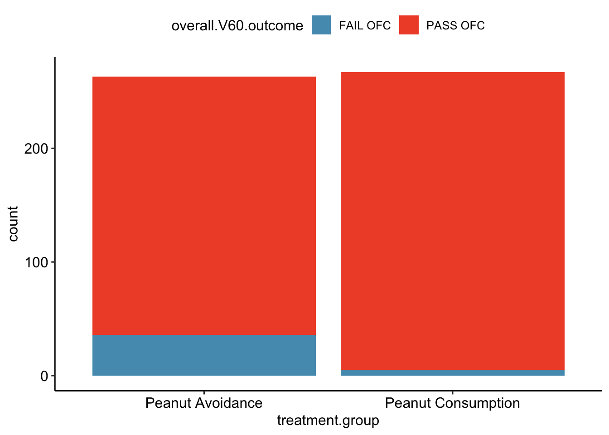
<p class="caption">(\#fig:leapBarPlot)(top) A bar plot displaying the number of individuals who failed or passed the OFC in each treatment group. (bottom) A bar plot displaying the proportions of individuals in each group that failed or passed the OFC.</p>
</div>


The proportion of participants failing the OFC is 11.8\% higher in the peanut avoidance group than the peanut consumption group. Another way to summarize the data is to compute the ratio of the two proportions (0.137/0.019 = 7.31), and conclude that the proportion of participants failing the OFC in the avoidance group is more than 7 times as large as in the consumption group; i.e., the risk of failing the OFC was more than 7 times as great for participants in the avoidance group relative to the consumption group.

Based on the results of the study, it seems that early exposure to peanut products may be an effective strategy for reducing the chances of developing peanut allergies later in life. It is important to note that this study was conducted in the United Kingdom at a single site of pediatric care; it is not clear that these results can be generalized to other countries or cultures.

The results also raise an important statistical issue: does the study provide definitive evidence that peanut consumption is beneficial? In other words, is the 11.8\% difference between the two groups larger than one would expect by chance variation alone? The material on inference in later chapters will provide the statistical tools to evaluate this question.


## Data basics {#dataBasics}


Effective organization and description of data is a first step in most
analyses. This section introduces a structure for organizing data and
basic terminology used to describe data.

### Observations, variables, and data matrices {#frogDataExample}

In evolutionary biology, parental investment refers to the amount of time, energy, or other resources devoted towards raising offspring. This section introduces the `frog` dataset, which originates from a 2013 study about maternal investment in a frog species [@chen2013maternal]. Reproduction is a costly process for female frogs, necessitating a trade-off between individual egg size and total number of eggs produced. Researchers were interested in investigating how maternal investment varies with altitude and collected measurements on egg clutches found at breeding ponds across 11 study sites; for 5 sites, the body size of individual female frogs was also recorded.

<div class="figure">

```{=html}
<div id="htmlwidget-629148407f379377453e" style="width:100%;height:auto;" class="datatables html-widget"></div>
<script type="application/json" data-for="htmlwidget-629148407f379377453e">{"x":{"filter":"none","vertical":false,"data":[["1","2","3","150"],["3,462.00","3,462.00","3,462.00","2,597.00"],[34.82,34.82,34.82,34.05],[181.970085860998,269.153480392692,158.489319246111,537.031796370253],[3.63078054770101,3.63078054770101,3.71535229097173,null],[177.827941003892,257.039578276886,151.356124843621,776.247116628692],[1.94984459975805,1.94984459975805,1.94984459975805,2.23872113856834]],"container":"<table class=\"display\">\n  <thead>\n    <tr>\n      <th> <\/th>\n      <th>altitude<\/th>\n      <th>latitude<\/th>\n      <th>clutch.size<\/th>\n      <th>body.size<\/th>\n      <th>clutch.volume<\/th>\n      <th>egg.size<\/th>\n    <\/tr>\n  <\/thead>\n<\/table>","options":{"columnDefs":[{"targets":3,"render":"function(data, type, row, meta) {\n    return type !== 'display' ? data : DTWidget.formatRound(data, 2, 3, \",\", \".\");\n  }"},{"targets":4,"render":"function(data, type, row, meta) {\n    return type !== 'display' ? data : DTWidget.formatRound(data, 2, 3, \",\", \".\");\n  }"},{"targets":5,"render":"function(data, type, row, meta) {\n    return type !== 'display' ? data : DTWidget.formatRound(data, 2, 3, \",\", \".\");\n  }"},{"targets":6,"render":"function(data, type, row, meta) {\n    return type !== 'display' ? data : DTWidget.formatRound(data, 2, 3, \",\", \".\");\n  }"},{"className":"dt-right","targets":[2,3,4,5,6]},{"orderable":false,"targets":0}],"order":[],"autoWidth":false,"orderClasses":false}},"evals":["options.columnDefs.0.render","options.columnDefs.1.render","options.columnDefs.2.render","options.columnDefs.3.render"],"jsHooks":[]}</script>
```

<p class="caption">(\#fig:frogDF)Data matrix for the frog dataset.</p>
</div>
     

Figure \@ref(fig:frogDF) displays rows 1, 2, 3, and 150 of the data from the 431 clutches
observed as part of the study. The `frog` dataset is available from the `oibiostat` R package. Each row in the table corresponds to a single clutch, indicating where the clutch was collected (`altitude` and `latitude`), `egg.size`, `clutch.size`, `clutch.volume`, and `body.size` of the mother when available. An empty cell corresponds to a missing value, indicating that information on an individual female was not collected for that particular clutch. The recorded characteristics are referred to as **variables**; in this table, each column represents a variable.

**variable**   **description**
-------------- ------------------------------------------------------
`altitude`             Altitude of the study site in meters above sea level
`latitude`             Latitude of the study site measured in degrees
`egg.size`             Average diameter of an individual egg to the 0.01 mm
`clutch.size`          Estimated number of eggs in clutch
`clutch.volume`        Volume of egg clutch in mm
`body.size`            Length of mother frog in cm


It is important to check the definitions of variables, as they are not always obvious. For example, why has `clutch.size` not been recorded as whole numbers? For a given clutch, researchers counted approximately 5 grams' worth of eggs and then estimated the total number of eggs based on the mass of the entire clutch. Definitions of the variables are given in the Table above.


The data in Figure \@ref(fig:frogDF) form a **data frame** and, in this example, are organized in **tidy format**. Each row of a tidy data frame corresponds to an observational unit, and each column corresponds to a variable. A piece of the data frame for the LEAP study introduced in Section \@ref(leapCaseStudy) is shown in Figure \@ref(fig:leapStudyResultsDF); the rows are study participants and three variables are shown for each participant. Tidy data frames are a convenient way to record and store data. If the data are collected for another individual, another row can easily be added; similarly, another column can be added for a new variable.

### Types of variables {#variableTypes}

The Functional polymorphisms Associated with human Muscle Size and Strength study (FAMuSS) measured a variety of demographic, phenotypic, and genetic characteristics for about 1,300 participants [@thompson2004functional]. Data from the study have been used in a number of subsequent studies, such as one examining the relationship between muscle strength and genotype at a location on the ACTN3 gene [@clarkson2005actn3]. 

The `famuss` dataset is a subset of the data for 595 participants [@foulkes2009genetic]. The `famuss` dataset from the `oibiostat` package is shown in Figure \@ref(fig:famussDF), and the variables are described in the Table below.


```r
data("famuss")
```


<div class="figure">

```{=html}
<div id="htmlwidget-88884d6234ecaf6c529b" style="width:100%;height:auto;" class="datatables html-widget"></div>
<script type="application/json" data-for="htmlwidget-88884d6234ecaf6c529b">{"x":{"filter":"none","vertical":false,"data":[["1","2","3","4","5","6","7","9","10","12","13","14","16","19","20","21","22","23","24","25","28","31","32","33","35","36","39","41","43","45","47","50","51","52","53","54","55","57","58","62","63","64","65","66","67","68","69","70","71","72","73","74","76","77","78","129","130","131","132","133","136","137","138","144","148","152","154","157","158","160","161","162","165","167","168","173","174","175","176","178","179","182","183","184","186","188","189","191","192","193","194","195","197","200","201","202","204","205","206","209","213","214","216","217","218","219","220","221","222","223","224","225","226","229","230","232","234","235","236","237","238","239","240","241","242","243","322","323","326","327","328","329","332","333","334","335","336","337","338","339","340","341","342","344","345","346","347","349","350","351","354","355","356","357","359","360","361","362","364","365","366","368","370","371","372","373","374","375","377","378","379","381","383","384","385","386","387","388","389","392","394","395","396","397","477","478","479","481","482","483","484","485","486","489","490","492","494","495","496","498","500","501","502","505","506","507","508","509","511","512","513","514","517","518","522","523","524","525","526","527","528","529","530","531","532","533","534","535","536","537","538","539","540","541","543","544","545","547","551","552","555","556","560","561","563","564","566","569","571","572","573","574","575","579","582","646","647","648","649","650","651","652","653","654","655","656","657","658","659","660","662","663","664","665","666","667","668","669","670","671","672","675","676","677","678","679","681","682","683","684","685","686","687","688","689","694","695","696","699","700","703","704","705","706","708","709","710","711","712","717","720","721","722","723","724","725","726","727","728","729","730","731","732","733","734","735","736","737","738","739","742","743","744","745","746","747","749","856","857","858","859","860","862","864","867","868","869","870","871","873","874","876","878","879","880","881","882","883","884","885","887","966","967","968","969","970","971","972","973","974","975","976","977","978","979","980","982","983","984","985","987","988","989","990","991","992","993","994","995","996","997","998","999","1000","1001","1002","1003","1004","1008","1009","1010","1011","1012","1013","1014","1015","1016","1017","1019","1021","1022","1023","1024","1025","1029","1030","1031","1032","1033","1034","1036","1037","1038","1039","1040","1041","1042","1043","1044","1045","1046","1047","1049","1050","1051","1052","1054","1055","1056","1058","1060","1061","1063","1065","1066","1068","1070","1072","1073","1079","1080","1081","1082","1083","1084","1085","1087","1088","1089","1090","1091","1092","1093","1094","1095","1097","1098","1099","1100","1101","1102","1103","1104","1105","1106","1108","1110","1111","1112","1113","1114","1115","1116","1117","1119","1121","1122","1123","1127","1128","1129","1130","1131","1133","1134","1136","1137","1138","1139","1140","1141","1142","1143","1144","1145","1146","1147","1148","1150","1151","1154","1155","1156","1157","1158","1159","1160","1161","1162","1163","1165","1167","1169","1170","1171","1172","1175","1261","1262","1263","1264","1265","1266","1267","1268","1269","1270","1271","1272","1273","1274","1276","1277","1278","1280","1282","1283","1284","1285","1288","1289","1290","1291","1292","1293","1295","1296","1297","1298","1300","1301","1305","1306","1307","1312","1313","1314","1316","1317","1320","1321","1322","1323","1324","1325","1326","1327","1328","1329","1332","1333","1334","1336","1337","1338","1339","1340","1341","1342","1343","1344","1345","1346","1347","1348"],["Female","Male","Female","Female","Female","Female","Female","Female","Male","Female","Female","Female","Female","Male","Female","Male","Female","Female","Female","Male","Male","Female","Female","Female","Female","Female","Female","Male","Female","Female","Female","Female","Female","Male","Female","Female","Female","Male","Female","Female","Female","Female","Male","Female","Female","Male","Male","Female","Female","Female","Female","Female","Female","Female","Female","Male","Male","Male","Female","Male","Male","Female","Female","Male","Male","Female","Female","Female","Female","Female","Male","Male","Female","Male","Male","Female","Female","Female","Male","Female","Male","Female","Female","Male","Female","Female","Male","Male","Female","Female","Male","Male","Male","Female","Female","Female","Male","Female","Male","Female","Male","Female","Female","Female","Male","Female","Female","Male","Male","Female","Female","Male","Female","Female","Female","Female","Female","Female","Female","Female","Female","Female","Female","Female","Female","Female","Male","Female","Female","Female","Male","Male","Male","Female","Female","Female","Female","Female","Male","Female","Female","Female","Female","Male","Male","Male","Male","Female","Female","Female","Male","Female","Male","Female","Male","Female","Female","Female","Female","Female","Female","Male","Female","Male","Male","Female","Female","Male","Female","Male","Male","Male","Female","Female","Male","Male","Male","Male","Female","Male","Female","Male","Male","Female","Male","Male","Female","Female","Male","Male","Male","Male","Female","Female","Male","Male","Male","Male","Female","Male","Male","Male","Male","Male","Male","Male","Male","Male","Male","Male","Male","Female","Male","Male","Female","Female","Female","Female","Male","Male","Male","Female","Male","Male","Male","Female","Female","Female","Male","Male","Female","Male","Female","Female","Female","Female","Female","Male","Female","Female","Male","Male","Male","Male","Male","Male","Male","Female","Female","Male","Male","Male","Male","Male","Male","Male","Female","Male","Female","Female","Male","Male","Female","Female","Male","Female","Male","Male","Male","Male","Male","Male","Male","Male","Male","Female","Female","Male","Female","Female","Female","Female","Female","Male","Male","Male","Male","Female","Male","Male","Female","Male","Female","Female","Female","Female","Female","Male","Male","Male","Female","Female","Female","Male","Male","Male","Female","Female","Male","Male","Male","Male","Male","Female","Male","Female","Female","Female","Male","Male","Male","Female","Male","Female","Male","Male","Male","Female","Female","Male","Male","Male","Male","Male","Male","Male","Male","Female","Female","Female","Female","Male","Male","Female","Female","Female","Female","Female","Female","Female","Male","Male","Female","Male","Female","Male","Male","Female","Male","Female","Male","Female","Female","Female","Female","Female","Female","Female","Male","Female","Female","Female","Female","Female","Female","Female","Female","Female","Female","Male","Male","Female","Female","Female","Female","Male","Male","Male","Female","Male","Female","Female","Female","Female","Male","Female","Male","Female","Male","Female","Female","Male","Male","Female","Female","Male","Female","Female","Female","Female","Female","Female","Female","Male","Female","Female","Female","Female","Male","Female","Male","Female","Female","Female","Female","Female","Female","Female","Female","Female","Female","Female","Female","Female","Male","Female","Female","Female","Female","Female","Female","Female","Male","Female","Female","Male","Female","Female","Female","Female","Male","Male","Male","Female","Female","Female","Female","Female","Female","Female","Female","Male","Female","Male","Female","Female","Female","Female","Female","Female","Female","Female","Male","Female","Male","Male","Male","Female","Female","Male","Male","Male","Female","Female","Female","Male","Female","Male","Female","Female","Male","Female","Male","Female","Male","Female","Female","Female","Female","Female","Male","Female","Female","Male","Female","Female","Female","Female","Male","Female","Male","Male","Male","Male","Female","Female","Female","Male","Female","Male","Male","Male","Female","Female","Female","Male","Female","Female","Female","Female","Female","Female","Female","Female","Female","Male","Female","Male","Female","Male","Female","Female","Female","Female","Female","Male","Female","Female","Female","Female","Female","Male","Female","Male","Male","Male","Female","Female","Male","Female","Female","Female","Female","Female","Female","Female","Male","Male","Male","Female","Male","Male","Male","Female","Female","Male","Male","Male","Female","Female","Female","Male","Female","Female","Male","Male","Female","Male","Male","Male","Male","Female","Female","Female","Female"],[27,36,24,40,32,24,30,28,27,30,20,23,24,34,31,38,39,26,30,35,33,23,22,25,20,25,24,26,38,31,22,22,26,27,31,31,35,33,21,40,23,32,35,37,20,27,33,27,22,39,20,35,22,33,30,20,19,26,20,20,19,18,19,20,19,19,19,34,20,21,25,21,20,22,23,17,18,18,21,20,19,20,22,18,18,19,19,22,22,18,23,23,25,23,23,22,19,23,18,19,26,27,23,23,28,25,19,19,28,22,26,26,20,19,18,24,23,18,19,18,18,18,20,19,20,18,33,31,25,19,24,34,23,21,27,36,33,34,40,26,28,34,34,28,27,29,22,29,38,28,34,21,27,39,28,30,21,31,22,23,26,39,23,38,22,34,36,30,21,21,32,25,23,20,30,39,22,29,24,36,38,32,32,36,23,25,26,26,22,20,21,25,21,23,21,22,21,23,20,25,18,18,24,22,20,20,29,29,22,30,25,20,33,25,19,18,18,19,18,19,18,18,18,18,19,19,19,19,18,18,19,21,19,18,20,19,18,19,18,18,24,36,20,21,20,24,18,20,23,19,25,26,24,30,24,25,26,25,39,21,25,22,23,22,34,34,21,21,28,24,25,23,24,21,20,22,33,26,23,22,23,18,20,25,30,24,23,19,19,19,20,19,19,19,18,19,31,27,33,23,37,19,25,24,22,23,21,21,25,25,18,22,24,22,25,22,19,19,20,29,18,19,20,22,38,23,29,19,19,19,32,20,25,21,18,22,28,22,20,22,20,21,20,19,19,27,36,19,20,23,21,21,19,22,21,21,21,20,21,19,24,39,18,22,18,22,21,19,19,23,19,19,22,21,29,32,21,20,39,18,20,21,19,21,23,26,21,22,21,22,21,19,19,27,39,20,22,24,24,35,19,22,27,21,21,26,21,25,19,19,21,31,20,20,20,21,26,21,23,21,21,21,20,19,18,32,20,23,26,18,22,21,21,30,29,19,21,21,19,26,24,22,19,21,21,23,19,23,20,22,19,25,20,20,20,26,38,39,27,18,36,36,30,37,26,33,37,36,18,31,25,20,24,25,35,20,36,38,25,25,21,33,37,21,25,19,20,20,22,34,22,25,19,34,21,23,21,21,19,33,19,19,19,20,20,19,20,22,20,20,29,32,35,27,31,23,24,19,21,24,19,33,22,19,19,29,28,31,37,35,27,22,31,22,37,27,20,19,22,24,20,23,19,29,20,38,24,23,20,24,22,39,21,39,21,22,30,26,22,38,25,20,20,20,22,26,24,22,22,32,33,30,24,26,33,33,28,27,24,31,40,26,20,22,29,39,19,19,20,24,24,22,21,31,30],["Caucasian","Caucasian","Caucasian","Caucasian","Caucasian","Hispanic","Caucasian","Caucasian","Hispanic","Caucasian","Caucasian","African Am","Caucasian","Caucasian","Caucasian","Caucasian","African Am","African Am","Caucasian","Caucasian","Asian","Caucasian","Other","African Am","Caucasian","Hispanic","Caucasian","Other","African Am","Caucasian","Hispanic","Caucasian","Asian","African Am","Caucasian","Asian","Asian","Caucasian","Caucasian","Hispanic","Hispanic","African Am","Caucasian","Caucasian","Caucasian","Caucasian","Other","Caucasian","Hispanic","Caucasian","Caucasian","Caucasian","Other","Hispanic","Caucasian","Caucasian","Caucasian","Caucasian","African Am","Caucasian","Caucasian","Other","Asian","Caucasian","Caucasian","Caucasian","Caucasian","Asian","Caucasian","Caucasian","Caucasian","Asian","Caucasian","Asian","Hispanic","Caucasian","Asian","Other","Caucasian","Caucasian","Caucasian","Caucasian","Caucasian","Hispanic","Other","Caucasian","Caucasian","African Am","Asian","African Am","Caucasian","Hispanic","Hispanic","Caucasian","Caucasian","Caucasian","Caucasian","Caucasian","Caucasian","Caucasian","Caucasian","Caucasian","African Am","Caucasian","Caucasian","African Am","Caucasian","Caucasian","Caucasian","Caucasian","Asian","Asian","Caucasian","Caucasian","Caucasian","Other","African Am","Caucasian","Caucasian","Caucasian","Caucasian","African Am","African Am","Asian","Caucasian","Caucasian","Caucasian","Caucasian","Caucasian","Caucasian","Other","Caucasian","Caucasian","Other","Hispanic","African Am","African Am","Caucasian","Caucasian","Caucasian","Caucasian","Caucasian","Caucasian","African Am","Caucasian","Caucasian","African Am","Caucasian","Caucasian","Asian","Caucasian","Caucasian","Other","Caucasian","Asian","Caucasian","Caucasian","Caucasian","Hispanic","Caucasian","African Am","Caucasian","Caucasian","Caucasian","Caucasian","Caucasian","Caucasian","Caucasian","Caucasian","Caucasian","Asian","Other","Caucasian","Caucasian","Asian","Asian","Asian","Asian","Asian","Hispanic","Hispanic","Hispanic","Caucasian","Caucasian","Caucasian","Caucasian","Other","Caucasian","Caucasian","Caucasian","Caucasian","Asian","Caucasian","Caucasian","Caucasian","Caucasian","Caucasian","Caucasian","Caucasian","Caucasian","Caucasian","Caucasian","Caucasian","Caucasian","Caucasian","Caucasian","Caucasian","Asian","Caucasian","Other","Caucasian","Caucasian","Caucasian","Caucasian","Caucasian","Caucasian","Caucasian","Caucasian","Caucasian","Caucasian","Caucasian","Caucasian","Caucasian","Caucasian","Caucasian","Caucasian","Caucasian","Caucasian","Caucasian","Caucasian","Caucasian","Caucasian","Caucasian","Caucasian","Caucasian","Caucasian","Caucasian","Caucasian","Caucasian","Caucasian","Caucasian","Caucasian","Caucasian","Caucasian","Caucasian","Caucasian","Caucasian","Caucasian","Caucasian","Caucasian","Caucasian","Other","Other","Other","Caucasian","Caucasian","Caucasian","Caucasian","Caucasian","Caucasian","Caucasian","Caucasian","Caucasian","Caucasian","Asian","Caucasian","Caucasian","Caucasian","Caucasian","Caucasian","Caucasian","Asian","Caucasian","Caucasian","Caucasian","Caucasian","Caucasian","Asian","Caucasian","Caucasian","Caucasian","Asian","Caucasian","Caucasian","Hispanic","Caucasian","Asian","Caucasian","Asian","Caucasian","Caucasian","Caucasian","Caucasian","Caucasian","Caucasian","Asian","Asian","Asian","Caucasian","Caucasian","Caucasian","Caucasian","Asian","Asian","Caucasian","Caucasian","Caucasian","Caucasian","Caucasian","Caucasian","Caucasian","Caucasian","Caucasian","Caucasian","Caucasian","Caucasian","Caucasian","African Am","Caucasian","Other","Hispanic","Caucasian","Caucasian","Caucasian","Caucasian","Caucasian","Caucasian","Caucasian","Caucasian","Caucasian","Caucasian","Asian","Caucasian","Caucasian","Caucasian","Hispanic","Asian","Caucasian","Caucasian","Caucasian","Caucasian","Caucasian","Caucasian","Caucasian","Caucasian","Caucasian","Caucasian","Caucasian","Caucasian","Caucasian","Caucasian","Caucasian","Caucasian","Caucasian","African Am","Caucasian","Caucasian","Caucasian","Caucasian","Caucasian","Caucasian","Caucasian","Caucasian","Caucasian","Caucasian","Caucasian","Caucasian","Caucasian","Asian","Caucasian","Caucasian","Caucasian","Caucasian","Caucasian","Caucasian","Caucasian","Caucasian","Caucasian","Caucasian","Caucasian","Caucasian","Caucasian","Caucasian","Caucasian","Caucasian","Asian","Caucasian","Caucasian","Caucasian","Caucasian","Caucasian","Caucasian","Caucasian","Caucasian","Asian","Caucasian","Asian","Caucasian","Asian","Caucasian","Caucasian","Asian","Other","Caucasian","Caucasian","Other","Caucasian","Caucasian","Caucasian","Caucasian","Caucasian","Asian","Caucasian","Caucasian","Caucasian","Caucasian","Asian","Caucasian","Hispanic","Caucasian","Caucasian","Caucasian","Caucasian","Caucasian","Caucasian","Caucasian","Caucasian","Caucasian","Caucasian","Caucasian","Caucasian","Caucasian","Caucasian","Caucasian","Caucasian","Caucasian","Caucasian","Caucasian","Caucasian","Caucasian","Caucasian","Caucasian","Hispanic","Caucasian","Caucasian","Caucasian","Caucasian","Caucasian","African Am","Caucasian","African Am","Caucasian","Caucasian","Caucasian","Caucasian","Caucasian","Caucasian","Caucasian","Caucasian","Other","Caucasian","Caucasian","Caucasian","Caucasian","Caucasian","Caucasian","Caucasian","Caucasian","Caucasian","Caucasian","Caucasian","Caucasian","Caucasian","Caucasian","African Am","Caucasian","Caucasian","Caucasian","Caucasian","Caucasian","Hispanic","Caucasian","Caucasian","Caucasian","Caucasian","Caucasian","Caucasian","Caucasian","Caucasian","Caucasian","Caucasian","Caucasian","Caucasian","Caucasian","Caucasian","Caucasian","Caucasian","Caucasian","Caucasian","Caucasian","Caucasian","African Am","Caucasian","Caucasian","Caucasian","Caucasian","Caucasian","Caucasian","Caucasian","Caucasian","Caucasian","Other","Other","Caucasian","Asian","Caucasian","Caucasian","Caucasian","Caucasian","Caucasian","Caucasian","Caucasian","Asian","Asian","Asian","Asian","Caucasian","Caucasian","Asian","Caucasian","Caucasian","Caucasian","Caucasian","Caucasian","Caucasian","Caucasian","Caucasian","Caucasian","Caucasian","Caucasian","Caucasian","Caucasian","Caucasian","Caucasian","Caucasian","Caucasian","Caucasian","Caucasian","Caucasian","Caucasian","Caucasian","Caucasian","Caucasian","Caucasian","Caucasian","Caucasian","Caucasian","Caucasian","Caucasian","African Am","Caucasian","Caucasian","Caucasian","Caucasian","Caucasian","Asian","Caucasian","Caucasian","Caucasian","Caucasian","Caucasian","Caucasian","Caucasian","Caucasian","Caucasian","Caucasian","Caucasian","Caucasian","Caucasian","Caucasian","Caucasian","Caucasian","Caucasian","Caucasian","Asian","Caucasian","Caucasian","Caucasian","Caucasian","Asian","Asian","Caucasian","Asian","Caucasian","Caucasian"],[65,71.7,65,68,61,62.2,65,68,68.2,62.2,69,62,67.2,73,67.5,70,68,61,69,68.5,66.5,67.5,63,68.5,64,60.5,67.5,67.5,65.5,69,66,62.5,65,73.5,65,64.5,65,74.5,62,69.5,63.2,66,70,66.3,67,64.5,67,64.3,61,66.7,66.5,64.7,72,65.7,66,69,68,65.5,63,69,70,68,65,67,66,66.5,64.5,62.5,67,68,70,68,64,68,67,67.5,62,67,66.5,68,67,69.2,65.5,71,62.5,62,69,70.2,68,66,75.5,66.2,68,64,65,71,72,63.5,74,63,67,61,62,63,69,66,64,71,72,68,63,69,61.2,66,65,65.2,65,57.3,63.5,65.7,67,65.5,65.5,60,63,63,70,66,64,69,62.5,73,69.5,62.5,57.5,62,64.5,67.5,72.5,64.3,64.8,69.8,69.8,69.3,68.2,66.5,68.5,62.5,65,61,70,63,72,65,71,64.2,65.8,69.2,62.5,65,65.5,69,66,70.5,66,62,66,68.8,65,68.7,68.7,72.5,63,62.5,65.5,69,71,68,60.5,65.5,60.5,68.2,73.8,63.7,69.4,70.4,67.6,67,75,72,65,67.6,60.7,64.5,73.2,67.5,70,70,64,69.5,71.2,72.4,71,74.4,75.3,66.9,72.4,66.5,71,70.3,68.1,66.3,70.5,67.9,63.4,67,67,67,67.6,70,67,64.4,67,71,74,63,65.5,64.7,67.3,68,64,70,62.1,66.6,66.5,65.1,65,71,67.3,67,72,71,71,68,71.2,71.3,70.3,61,64,66.5,67.7,67.8,72.6,66.5,67.2,68,62.5,67.5,66,65.5,69,72,63.5,66,57,65,74,68,73,65,75.3,64.5,72,67,68,63,63.5,71,67,67.2,62,60,59.5,69.5,66.5,68.5,64.7,67.5,71,70.5,66.7,70,64.5,60.5,68.2,63.2,64,67,71,67.5,71,64,60,68,69.7,64,66.7,60.2,73,70.5,72.7,73,73,66,70,69,61,66.5,67,71.5,68,66,67,62.7,73,73,71,67.2,63.5,77,68,72.5,69,69.5,72.5,73,71,71,68,67,64,67,70.5,61.7,70.8,63.5,65,69,67,63.3,72,69,65,69.5,69.3,67.8,69.7,63,69,64.5,69,64.7,66.7,64.7,61.7,66.2,67,68,68,62.7,65.7,62,65,66,63.7,62,70,68,66,70,71,63.5,63,70,64,66,72,73,64.5,69,67,65,64,57,62,62,67,68,74,63,63,67,67,65,63,73,69,64,67,62,64,63,65,76,66,70,70,65.9,68,67,68,62,65,64,65,65,69,63,66,66,68,64.3,65,67,74,65,63,66,70,61,67,63,70.5,60,65,65,67,68,68,71,69,66,70,64,65,67,63.5,66,68.5,60,64,69,64,65,66.7,61,68,68,67,64,61.5,64,71.5,66.5,69,72,69,66,68.5,74,68,67,67.5,66.5,64,71,71,69.5,67,67.3,69.3,63,74,64.5,68,67.5,62,69,64.5,65.5,72.5,64.5,64.5,66,66,61.5,66,64,72,66.5,70.5,67.5,67.5,71.5,62,62.2,65.5,68,62,67,70,71,62,63,62,64,65,68,64,66,66,66,62,62,68,75,60,70,69,73,63.5,66,66,60,68,70,66,64,60,65,65.5,74.4,64,70,65,73,63,63,74,62,65,65,65,65.5,62,65,72,68,67,65,69,73,70,66,62,70,71,71,64,62,64,75,62,62,68,72,61,72,74,67,71.5,65.5,59,64,64],[199,189,134,171,118,120,134,162,189,120,131,108,158,233,141,155,178,103,193,147,145,148,114,133,111,107,142,194,192,202,160,139,164,141,128,112,140,261,124,132,129,187,186,147,138,138,134,125,126,136,115,130,156,119,146,129,208,135,183,177,159,128,126,225,156,147,117,130,164,149,164,146,134,178,160,135,154,148,196,180,195,150,149,227,152,188,160,162,140,132,291,156,179,133,114,129,161,195,183,179,151,179,130,127,186,141,141,242,153,190,125,203,101,131,125,193,121,136,153,131,128,115,123,105,133,109,177,160,196,165,147,169,136,150,109,144,126,123,212,133,124,140,130,256,144,169,173,163,155,112,305,114,228,173,144,135,138,202,157,114,182,191,127,209,167,126,143,211,131,172,155,177,138,98,147,132,193,166,140,241,171,190,217,184,175,169,175,141,213,177,143,144,141,132,168,155,159,144,134,160,155,185,168,169,187,152,186,144,183,143,176,146,159,158,121,160,192,151,139,177,151,145,125,162,154,124,126,125,139,192,122,157,116,143,134,166,134,153,154,131,168,191,159,162,151,158,162,114,182,164,217,121,135,105,129,143,151,191,135,163,148,212,165,248,157,203,317,132,195,150,190,174,150,232,170,151,187,146,164,144,123,123,161,203,173,152,153,137,145,308,168,201,122,104,147,113,141,154,156,120,244,115,108,140,174,125,183,95,218,170,173,182,178,170,185,169,107,134,150,184,146,135,176,97,242,171,210,152,114,220,178,160,129,148,190,150,141,185,151,140,108,134,206,106,155,197,130,193,125,160,166,150,120,169,260,174,153,117,180,133,183,192,147,131,141,175,163,170,160,130,129,135,247,165,198,170,133,221,196,146,173,119,118,165,140,116,152,139,100,171,127,126,130,82,111,137,161,140,145,129,125,99,138,131,225,177,160,222,132,130,121,103,135,180,191,173,162,189,165,175,141,110,125,133,146,210,141,109,143,137,150,144,130,156,203,124,139,214,158,109,174,132,226,106,151,185,162,140,127,156,159,192,150,113,148,155,125,202,141,117,154,157,150,156,151,157,189,196,177,132,144,123,191,118,178,204,162,111,182,202,151,174,153,155,165,195,157,157,122,142,145,146,137,147,175,167,128,143,114,168,158,221,119,262,125,135,155,105,159,148,171,151,204,159,110,117,130,147,112,164,156,210,129,137,145,134,155,136,125,124,146,134,122,118,152,196,90,135,136,212,140,133,150,123,124,172,124,136,129,124,130,200,112,210,133,175,126,118,201,133,147,132,132,169,100,145,214,109,122,116,158,214,186,168,179,166,295,148,118,131,227,221,149,147,187,273,110,160,184,157,163,136,99.5,134,134],["CC","CT","CT","CT","CC","CT","TT","CT","CC","CT","CT","CT","TT","CT","CC","CT","CC","CC","TT","TT","CT","CT","CC","CC","CC","CT","CC","CT","TT","TT","TT","TT","TT","TT","TT","CC","CC","CT","CC","TT","TT","CC","CT","CC","TT","TT","CC","TT","TT","CC","CC","CC","CT","CC","CC","TT","CC","TT","CC","CC","CT","CT","CT","CC","CC","CC","CT","CC","CT","CT","TT","CT","CC","TT","CT","CT","TT","CT","CC","CT","CC","CC","CT","CT","CT","TT","TT","TT","TT","TT","TT","TT","CT","TT","CT","CT","TT","CT","CT","CT","TT","TT","CT","TT","CT","CC","TT","CT","TT","CC","CT","CC","CT","CT","TT","CT","CC","CT","CT","TT","CC","CC","CT","TT","CC","CC","CT","TT","CC","CT","CT","CC","CT","CT","TT","CC","CC","TT","CC","CT","CT","CT","CT","CT","CT","CC","CC","CT","TT","CC","CT","TT","CT","CT","CC","CT","CT","TT","CC","CC","CC","CT","CT","CT","CT","CC","CT","CT","TT","CT","TT","TT","CT","TT","CT","CC","CT","CC","CC","CT","TT","CC","CC","CC","CC","CT","CT","CC","CC","TT","CT","CC","CC","CT","TT","CC","CC","TT","CT","TT","CC","CT","CT","TT","CT","CT","TT","CT","CT","CC","CC","CC","CT","TT","CT","CT","CT","CC","CT","TT","CT","CT","CT","CT","CT","CT","CT","CC","CC","CT","TT","CC","CT","CT","CT","CC","CT","CC","CT","CT","CC","CT","CC","CT","CT","CT","CC","CC","TT","TT","CC","CC","TT","CC","CT","TT","CT","CT","CT","CC","CT","CC","CC","TT","TT","CT","CC","CT","CT","TT","CT","CT","TT","CT","CC","CT","CT","CT","CT","CC","CC","CT","CT","CT","TT","TT","TT","TT","CC","TT","CC","CT","CT","CT","CT","CC","CT","TT","CT","CT","CT","CC","CC","CC","TT","CC","CC","TT","CC","TT","CC","TT","CT","CT","CC","CT","TT","TT","CT","CC","CT","CT","CT","TT","CT","CT","CT","CT","CT","CT","CT","CT","TT","TT","CC","CT","CC","CT","TT","CT","TT","TT","CC","CT","CT","CT","CT","CC","CT","CC","CT","CT","CC","CC","CT","CT","CT","CT","CT","CC","CT","CC","CC","CT","CT","CT","CC","CT","TT","CT","CT","CT","TT","CC","CT","CC","TT","CT","CT","CT","CT","CT","CC","TT","CT","CT","TT","CT","CT","CT","CT","CT","CT","CC","CT","TT","CT","CC","CT","CC","CT","CT","TT","CT","CC","TT","TT","CT","CT","CC","TT","CC","CT","CC","TT","TT","TT","CT","TT","TT","TT","TT","TT","TT","TT","TT","TT","TT","TT","CT","TT","TT","CT","TT","TT","TT","TT","TT","TT","CT","CC","CT","CT","CT","CT","CT","CC","CC","CT","CC","CC","CC","CT","CT","CT","CT","CC","CC","CT","TT","CT","CT","CT","TT","CC","CC","CT","CC","CT","TT","CT","CT","CT","CC","CC","TT","CT","CC","CC","CC","CT","CT","CC","CT","CT","TT","CC","CT","CT","TT","TT","TT","CC","TT","TT","TT","TT","TT","CT","TT","TT","CC","TT","TT","TT","CC","TT","TT","TT","TT","CT","CT","CC","CT","CC","TT","CC","CT","CC","CT","CT","CC","TT","CC","TT","TT","CC","CT","TT","TT","CC","CC","CC","CT","CT","CC","CT","CC","CT","CC","TT","CC","TT","TT","TT","CT","TT","CC","CC","TT","CT","CT","CT","TT","CT","CT","CC","CT","TT","CC","TT","CT","CT","CT","CT","TT","TT","TT","CT","CC","TT","CT","CT","CT","CC","CC","TT","CC","TT","CC","CT","CC","CT","CT","CC","CT","TT","CT","CC","CC","CC","CT","CT","CT","CC"],[40,25,40,125,40,75,100,57.1,33.3,20,25,100,28.6,7.1,75,12.5,60,40,20,25,37.5,0,0,40,133.3,25,33.3,40,33.3,33.3,40,100,75,22.2,100,20,33.3,27.3,20,6.3,30,8.3,10,25,62.5,22.2,16.7,33.3,0,0,66.7,50,50,62.5,66.7,75,27.3,44.4,37.5,44.4,30,40,33.3,27.3,27.3,14.3,60,33.3,60,57.1,44.4,50,60,36.4,45.5,50,66.7,71.4,61.5,33.3,72.7,57.1,80,58.3,66.7,140,33.3,45.5,50,60,13.3,38.5,44.4,125,40,33.3,62.5,100,50,114.3,33.3,50,100,75,30,100,60,34.6,34.8,122.2,37.5,19.2,120,81.8,18.2,42.9,111.1,90,83.3,90,114.3,72.7,109.1,60,114.3,100,16.7,80,66.7,100,25,62.5,27.3,60,50,100,20,100,20,40,60,100,28.6,15.4,50,5.9,55.6,60,150,50,16.7,33.3,18.8,20,42.9,25,50,50,100,40,116.7,26.7,50,25,57.1,40,40,50,150,18.2,50,36.4,33.3,66.7,57.1,40,20,20,20,36.4,42.9,18.8,30.8,16.7,50,10,75,33.3,33.3,54.5,18.2,50,80,75,20,22.2,44.4,20,150,44.4,75,60,37.5,62.5,27.3,42.9,25,33.3,25,36.4,22.2,33.3,57.1,30,60,200,100,100,62.5,40,71.4,60,87.5,100,33.3,100,100,33.3,100,30,60,50,250,100,120,66.7,120,50,100,75,50,33.3,30,80,20,85.7,33.3,50,125,38.5,75,50,85.7,150,57.1,30,100,62.5,25,42.9,62.5,23.1,125,120,57.1,16.7,33.3,33.3,45.5,60,40,9.1,100,25,15.4,40,33.3,37.5,80,80,40,60,50,66.7,27.3,50,57.1,40,80,54.5,100,38.5,60,100,60,25,25,9.1,30.8,0,20,71.4,25,0,21.4,33.3,37.5,50,50,13.3,30.8,45.5,66.7,50,53.8,20,80,100,45.5,40,22.2,40,25,66.7,35.7,20,15.4,100,40,36.4,18.2,27.3,66.7,44.4,36.4,50,42.9,54.3,57.1,120,166.7,40,20,80,100,42.9,42.9,42.9,28.6,100,8.3,60,125,40,75,30.8,35.7,42.9,10,120,56.3,50,66.7,66.7,100,25,83.3,50,55.6,66.7,33.3,28.6,27.3,66.7,22.2,37.5,120,23.1,28.6,50,30,60,100,83.3,80,37.5,66.7,44.4,100,41.2,75,80,50,75,13.3,57.1,57.1,50,71.4,83.3,66.7,50,50,80,100,41.7,80,50,100,60,100,66.7,60,40,100,100,30,80,27.3,57.1,50,60,116,100,150,83.3,28.6,66.7,83.3,80,100,37.5,80,233.3,60,125,100,20,15.4,100,60,40,27.3,50,66.7,20,16.7,33.3,33.3,14.3,17.6,6.7,27.3,40,0,42.9,33.3,0,16.7,75,75,20,0,8.3,0,33.3,28.6,62.5,57.1,33.3,120,0,18.2,50,25,16.7,70,40,20,14.3,55.6,30.8,33.3,42.9,33.3,38.5,11.1,54.5,100,100,60,28.6,25,28.6,33.3,55.6,71.4,42.9,100,57.1,75,14.3,50,25,60,42.9,50,33.3,40,100,36.4,23.1,46.2,36.4,40,16.7,66.7,36.4,42.9,50,50,28.6,66.7,46,50,62.5,30,33.3,50,120,42.9,83.3,50,66.7,116.7,35.7,80,35.7,66.7,43.8,37.5,25,71.4,100,25,33.3,36.4,37.5,57.1,57.1,50,15.4,37.5,7.7,40,30,33.3,50,6.7,16.7,33.3,80,125,42.9,75,50,50,28.6,50,75,54.5,22.2,36.4,100,43.8,12.5,27.3,71.4,62.5,53.8,50,75,100,100,41.2,36.4,70,16.7,33.3,52.9,62.5,87.5,100,43.8,43.8]],"container":"<table class=\"display\">\n  <thead>\n    <tr>\n      <th> <\/th>\n      <th>sex<\/th>\n      <th>age<\/th>\n      <th>race<\/th>\n      <th>height<\/th>\n      <th>weight<\/th>\n      <th>actn3.r577x<\/th>\n      <th>ndrm.ch<\/th>\n    <\/tr>\n  <\/thead>\n<\/table>","options":{"columnDefs":[{"className":"dt-right","targets":[2,4,5,7]},{"orderable":false,"targets":0}],"order":[],"autoWidth":false,"orderClasses":false}},"evals":[],"jsHooks":[]}</script>
```

<p class="caption">(\#fig:famussDF)Data matrix for the famuss dataset.</p>
</div>


<br>

**variable**   **description**
-------------- -------------------------------------------------------------------------------------------------
`sex`             Sex of the participant
`age`             Age in years
`race`            Race, recorded as `African Am` (African American), `Caucasian`, `Asian`, `Hispanic` or `Other`
`height`          Height in inches
`weight`          Weight in pounds
`actn3.r577x`     Genotype at the location r577x in the ACTN3 gene.
`ndrm.ch`         Percent change in strength in the non-dominant arm, comparing strength after to before training


The variables `age`, `height`, `weight`, and `ndrm.ch` are **numerical variables**. They take on numerical values, and it is reasonable to add, subtract, or take averages with these values. In contrast, a variable reporting telephone numbers would not be classified as numerical, since sums, differences, and averages in this context have no meaning. Age measured in years is said to be **discrete**, since it can only take on numerical values with jumps; i.e., positive integer values. Percent change in strength in the non-dominant arm (`ndrm.ch`) is **continuous**, and can take on any value within a specified range.


The variables `sex`, `race`, and `actn3.r577x` are **categorical variables**, which take on values that are names or labels. The possible values of a categorical variable are called the variable's **levels**. For example, the levels of `actn3.r577x` are the three possible genotypes at this particular locus: CC, CT, or TT.  Categorical variables without a natural ordering are called **nominal categorical variables**; `sex`, `race`, and `actn3.r577x` are all nominal categorical variables. Categorical variables with levels that have a natural ordering are referred to as **ordinal categorical variables**. For example, age of the participants grouped into 5-year intervals (15-20, 21-25, 26-30, etc.) is an ordinal categorical variable.  

::: {.rmdnote}
Categorical variables are sometimes called factor variables.
:::


<div class="figure">

<p class="caption">(\#fig:variableTypesFig)Breakdown of variables into their respective types.</p>
</div>


### Relationships between variables {#variableRelations}


Many studies are motivated by a researcher examining how two or more variables are related. For example, do the values of one variable increase as the values of another decrease? Do the values of one variable tend to differ by the levels of another variable?

One study used the `famuss` data to investigate whether ACTN3 genotype at a particular location (residue 577) is associated with change in muscle strength. The ACTN3 gene codes for a protein involved in muscle function. A common mutation in the gene at a specific location changes the cytosine (C) nucleotide to a thymine (T) nucleotide; individuals with the TT genotype are unable to produce any ACTN3 protein. 

Researchers hypothesized that genotype at this location might influence muscle function. As a measure of muscle function, they recorded the percent change in non-dominant arm strength after strength training; this variable, `ndrm.ch`, is the **response variable** in the study. A response variable is defined by the particular research question a study seeks to address, and measures the outcome of interest in the study. A study will typically examine whether the values of a response variable differ as values of an **explanatory variable** change, and if so, how the two variables are related. A given study may examine several explanatory variables for a single response variable. The explanatory variable examined in relation to `ndrm.ch` in the study is `actn3.r557x`, ACTN3 genotype at location 577. 


::: {.rmdnote}
Response variables are sometimes called dependent variables and explanatory variables are often called independent variables or predictors.
:::


## Data collection principles

The first step in research is to identify questions to investigate. A clearly articulated research question is essential for selecting subjects to be studied, identifying relevant variables, and determining how data should be collected.

### Populations and samples

Consider the following research questions:  

1. Do bluefin tuna from the Atlantic Ocean have particularly high levels of mercury, such that they are unsafe for human consumption?  
2. For infants predisposed to developing a peanut allergy, is there evidence that introducing peanut products early in life is an effective strategy for reducing the risk of developing a peanut allergy?  
3. Does a recently developed drug designed to treat glioblastoma, a form of brain cancer, appear more effective at inducing tumor shrinkage than the drug currently on the market?  

Each of these questions refers to a specific target **population**. For example, in the first question, the target population consists of all bluefin tuna from the Atlantic Ocean; each individual bluefin tuna represents a case. It is almost always either too expensive or logistically impossible to collect data for every case in a population. As a result, nearly all research is based on information obtained about a sample from the population. A **sample** represents a small fraction of the population. Researchers interested in evaluating the mercury content of bluefin tuna from the Atlantic Ocean could collect a sample of 500 bluefin tuna (or some other quantity), measure the mercury content, and use the observed information to formulate an answer to the research question. 


### Anecdotal evidence


Anecdotal evidence typically refers to unusual observations that are easily recalled because of their striking characteristics. Physicians may be more likely to remember the characteristics of a single patient with an unusually good response to a drug instead of the many patients who did not respond.  The dangers of drawing general conclusions from anecdotal information are obvious; no single observation should be used to draw conclusions about a population.

While it is incorrect to generalize from individual observations, unusual observations can sometimes be valuable.  E.C. Heyde was a general practitioner from Vancouver who noticed that a few of his elderly patients with aortic-valve stenosis (an abnormal narrowing) caused by an accumulation of calcium had also suffered massive gastrointestinal bleeding. In 1958, he published his observation [@heyde1958gastrointestinal]. Further research led to the identification of the underlying cause of the association, now called Heyde's Syndrome [@greenstein1986colonic]. 

An anecdotal observation can never be the basis for a conclusion, but may well inspire the design of a more systematic study that could be definitive.  


### Sampling from a population

Sampling from a population, when done correctly, provides reliable information about the characteristics of a large population. The US Centers for Disease Control (US CDC) conducts several surveys to obtain information about the US population, including the Behavior Risk Factor Surveillance System (BRFSS) (https://www.cdc.gov/brfss/index.html). The BRFSS was established in 1984 to collect data about health-related risk behaviors, and now collects data from more than 400,000 telephone interviews conducted each year. The CDC conducts similar surveys for diabetes, health care access, and immunization. Likewise, the World Health Organization (WHO) conducts the World Health Survey in partnership  with approximately 70 countries to learn about the health of adult populations and the health systems in those countries (http://www.who.int/healthinfo/survey/en/).

The general principle of sampling is straightforward: a sample from a population is useful for learning about a population only when the sample is representative of the population. In other words, the characteristics of the sample should correspond to the characteristics of the population. 

Suppose that the quality improvement team at an integrated health care system, such as Harvard Pilgrim Health Care, is interested in learning about how members of the health plan perceive the quality of the services offered under the plan. A common pitfall in conducting a survey is to use a convenience sample, in which individuals who are easily accessible are more likely to be included in the sample than other individuals. If a sample were collected by approaching plan members visiting an outpatient clinic during a particular week, the sample would fail to enroll generally healthy members who typically do not use outpatient services or schedule routine physical examinations; this method would produce an unrepresentative sample (Figure \@ref(fig:sampleConvenienceHealthPlan)). 


<div class="figure">

<p class="caption">(\#fig:sampleConvenienceHealthPlan)Instead of sampling from all members equally, approaching members visiting a clinic during a particular week disproportionately selects members who frequently use outpatient services.</p>
</div>


Random sampling is the best way to ensure that a sample reflects a population. In a **simple random sample (SRS)**, each member of a population has the same chance of being sampled. One way to achieve a simple random sample of the health plan members is to randomly select a certain number of names from the complete membership roster, and contact those individuals for an interview (Figure \@ref(fig:sampleRandomHealthPlan)). 


<div class="figure">

<p class="caption">(\#fig:sampleRandomHealthPlan)Five members are randomly selected from the population to be interviewed.</p>
</div>


Even when a simple random sample is taken, it is not guaranteed that the sample is representative of the population. If the **non-response** rate for a survey is high, that may be indicative of a biased sample. Perhaps a majority of participants did not respond to the survey because only a certain group within the population is being reached; for example, if questions assume that participants are fluent in English, then a high non-response rate would be expected if the population largely consists of individuals who are not fluent in English 
(Figure \@ref(fig:sampleNonResponseHealthPlan)). Such **non-response bias** can skew results; generalizing from an unrepresentative sample may likely lead to incorrect conclusions about a population. 


<div class="figure">

<p class="caption">(\#fig:sampleNonResponseHealthPlan)Surveys may only reach a certain group within the population, which leads to non-response bias. For example, a survey written in English may only result in responses from health plan members fluent in English.</p>
</div>


### Sampling methods

Almost all statistical methods are based on the notion of implied randomness. If data are not sampled from a population at random, these statistical methods -- calculating estimates and errors associated with estimates -- are not reliable. Four random sampling methods are discussed in this section: simple, stratified, cluster, and multistage sampling.

In a **simple random sample**, each case in the population has an equal chance of being included in the sample (Figure \@ref(fig:simplestratified)). Under simple random sampling, each case is sampled independently of the other cases; i.e., knowing that a certain case is included in the sample provides no information about which other cases have also been sampled. 

In **stratified sampling**, the population is first divided into groups called **strata** before cases are selected within each stratum (typically through simple random sampling) (Figure \@ref(fig:simplestratified)). The strata are chosen such that similar cases are grouped together. Stratified sampling is especially useful when the cases in each stratum are very similar with respect to the outcome of interest, but cases between strata might be quite different. 

Suppose that the health care provider has facilities in different cities. If the range of services offered differ by city, but all locations in a given city will offer similar services, it would be effective for the quality improvement team to use stratified sampling to identify participants for their study, where each city represents a stratum and plan members are randomly sampled from each city.

<div class="figure">
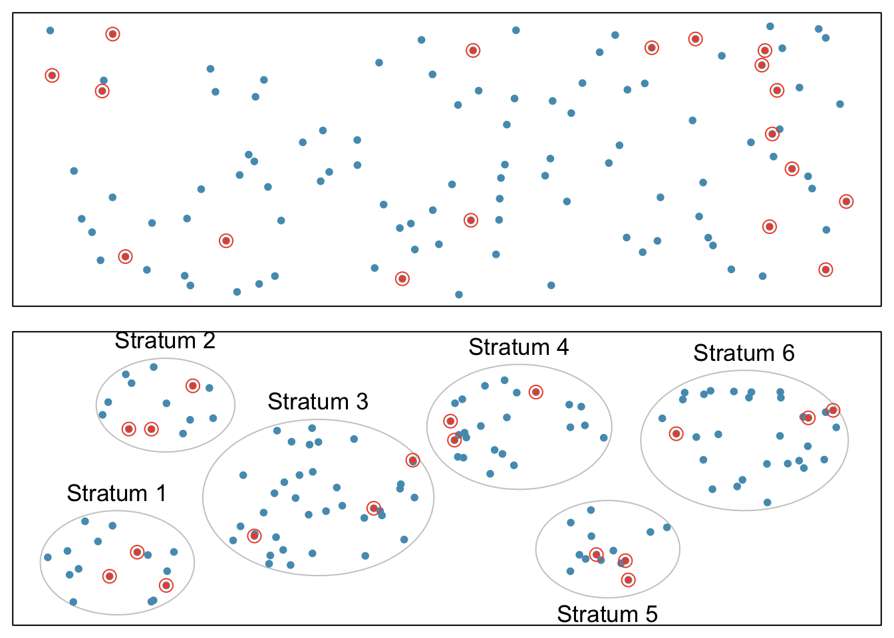
<p class="caption">(\#fig:simplestratified)Examples of simple random and stratified sampling. In the top panel, simple random sampling is used to randomly select 18 cases (circled orange dots) out of the total population (all dots). The bottom panel illustrates stratified sampling: cases are grouped into six strata, then simple random sampling is employed within each stratum.</p>
</div>


In a **cluster sample**, the population is first divided into many groups, called **clusters**. Then, a fixed number of clusters is sampled and all observations from each of those clusters are included in the sample (Figure \@ref(fig:clustermultistage), top panel). A **multistage sample** is similar to a cluster sample, but rather than keeping all observations in each cluster, a random sample is collected within each selected cluster (Figure \@ref(fig:clustermultistage), bottom panel).


<div class="figure">
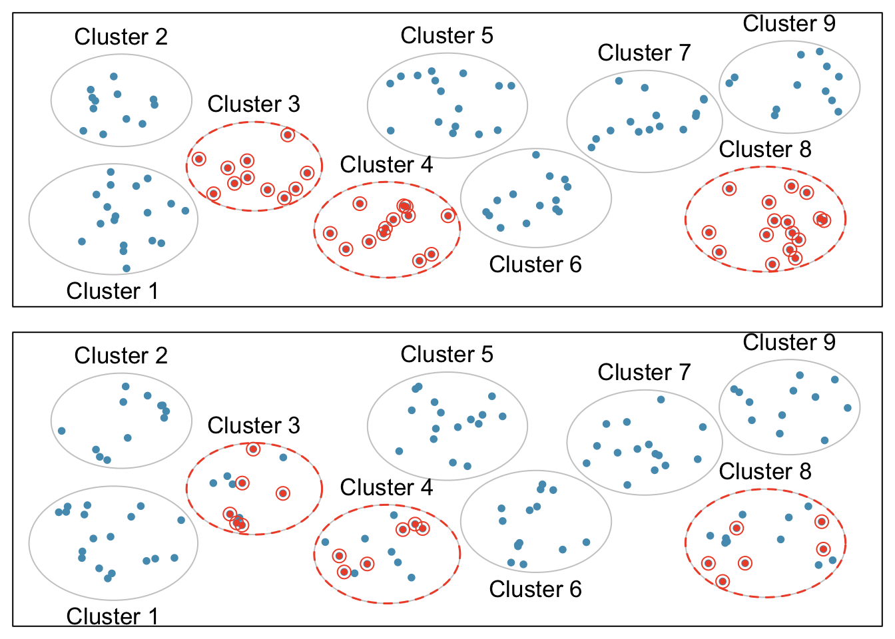
<p class="caption">(\#fig:clustermultistage)Examples of cluster cluster sampling and multistage sampling. The top panel illustrates cluster sampling: data are binned into nine clusters, three of which are sampled, and all observations within these clusters are sampled. The bottom panel illustrates multistage sampling, which differs from cluster sampling in that only a subset from each of the three selected clusters are sampled.</p>
</div>


Unlike with stratified sampling, cluster and multistage sampling are most helpful when there is high case-to-case variability within a cluster, but the clusters themselves are similar to one another. For example, if neighborhoods in a city represent clusters, cluster and multistage sampling work best when the population within each neighborhood is very diverse, but neighborhoods are relatively similar.

Applying stratified, cluster, or multistage sampling can often be more economical than only drawing random samples. However, analysis of data collected using such methods is more complicated than when using data from a simple random sample; this text will only discuss analysis methods for simple random samples. 


### Introducing experiments and observational studies

The two primary types of study designs used to collect data are experiments and observational studies.

In an **experiment**, researchers directly influence how data arise, such as by assigning groups of individuals to different treatments and assessing how the outcome varies across treatment groups. The LEAP study is an example of an experiment with two groups, an experimental group that received the intervention (peanut consumption) and a control group that received a standard approach (peanut avoidance). In studies assessing effectiveness of a new drug, individuals in the control group typically receive a **placebo**, an inert substance with the appearance of the experimental intervention. The study is designed such that on average, the only difference between the individuals in the treatment groups is whether or not they consumed peanut protein. This allows for observed differences in experimental outcome to be directly attributed to the intervention and constitute evidence of a causal relationship between intervention and outcome. 

In an **observational study**, researchers merely observe and record data, without interfering with how the data arise. For example, to investigate why certain diseases develop, researchers might collect data by conducting surveys, reviewing medical records, or following a **cohort** of many similar individuals. Observational studies can provide evidence of an association between variables, but cannot by themselves show a causal connection. However, there are many instances where randomized experiments are unethical, such as to explore whether lead exposure in young children is associated with cognitive impairment. 

### Experiments

Experimental design is based on three principles: control, randomization, and replication.

**Control**: When selecting participants for a study, researchers work to **control** for extraneous variables and choose a sample of participants that is representative of the population of interest. For example, participation in a study might be restricted to individuals who have a condition that suggests they may benefit from the intervention being tested. Infants enrolled in the LEAP study were required to be between 4 and 11 months of age, with severe eczema and/or allergies to eggs.  

**Randomization**: Randomly assigning patients to treatment groups ensures that groups are balanced with respect to both variables that can and cannot be controlled. For example, randomization in the LEAP study ensures that the proportion of males to females is approximately the same in both groups. Additionally, perhaps some infants were more susceptible to peanut allergy because of an undetected genetic condition; under randomization, it is reasonable to assume that such infants were present in equal numbers in both groups. Randomization allows differences in outcome between the groups to be reasonably attributed to the treatment rather than inherent variability in patient characteristics, since the treatment represents the only systematic difference between the two groups.  
	
In situations where researchers suspect that variables other than the intervention may influence the response, individuals can be first grouped into **blocks** according to a certain attribute and then randomized to treatment group within each block; this technique is referred to as **blocking** or **stratification**. The team behind the LEAP study stratified infants into two cohorts based on whether or not the child developed a red, swollen mark (a wheal) after a skin test at the time of enrollment; afterwards, infants were randomized between peanut consumption and avoidance groups. Figure \@ref(fig:leapBlocking) illustrates the blocking scheme used in the study.  

**Replication**: The results of a study conducted on a larger number of cases are generally more reliable than smaller studies; observations made from a large sample are more likely to be representative of the population of interest. In a single study, **replication** is accomplished by collecting a sufficiently large sample. The LEAP study randomized a total of 640 infants.


Randomized experiments are an essential tool in research. The US Food and Drug Administration typically requires that a new drug can only be marketed after two independently conducted randomized trials confirm its safety and efficacy; the European Medicines Agency has a similar policy. Large randomized experiments in medicine have provided the basis for major public health initiatives. In 1954, approximately 750,000 children participated in a randomized study comparing polio vaccine with a placebo [@meier1972biggest]. In the United States, the results of the study quickly led to the widespread and successful use of the vaccine for polio prevention.


<div class="figure">

<p class="caption">(\#fig:leapBlocking)A simplified schematic of the blocking scheme used in the LEAP study, depicting 640 patients that underwent randomization. Patients are first divided into blocks based on response to the initial skin test, then each block is randomized between the avoidance and consumption groups. This strategy ensures an even representation of patients in each group who had positive and negative skin tests.</p>
</div>


### Observational studies

In observational studies, researchers simply observe selected potential explanatory and response variables. Participants who differ in important explanatory variables may also differ in other ways that influence response; as a result, it is not advisable to make causal conclusions about the relationship between explanatory and response variables based on observational data. For example, while observational studies of obesity have shown that obese individuals tend to die sooner than individuals with normal weight, it would be misleading to conclude that obesity causes shorter life expectancy. Instead, underlying factors are probably involved; obese individuals typically exhibit other health behaviors that influence life expectancy, such as reduced exercise or unhealthy diet.

Suppose that an observational study tracked sunscreen use and incidence of skin cancer, and found that the more sunscreen a person uses, the more likely they are to have skin cancer. These results do not mean that sunscreen causes skin cancer. One important piece of missing information is sun exposure -- if someone is often exposed to sun, they are both more likely to use sunscreen and to contract skin cancer (Figure \@ref(fig:confounding)). Sun exposure is a **confounding variable**: a variable associated with both the explanatory and response variables (also called a **lurking variable**, **confounding factor**, or a **confounder**). There is no guarantee that all confounding variables can be examined or measured; as a result, it is not advisable to draw causal conclusions from observational studies. 

<div class="figure">

<p class="caption">(\#fig:confounding)Confounding triangle example.</p>
</div>


Confounding is not limited to observational studies. For example, consider a randomized study comparing two treatments (varenicline and buproprion) against a placebo as therapies for aiding smoking cessation [@jorenby2006efficacy]. At the beginning of the study, participants were randomized into groups: 352 to varenicline, 329 to buproprion, and 344 to placebo. Not all participants successfully completed the assigned therapy: 259, 225, and 215 patients in each group did so, respectively. If an analysis were based only on the participants who completed therapy, this could introduce confounding; it is possible that there are underlying differences between individuals who complete the therapy and those who do not. Including all randomized participants in the final analysis maintains the original randomization scheme and controls for differences between the groups. This strategy, commonly used for analyzing clinical trial data, is referred to as an intention-to-treat analysis.

Observational studies may reveal interesting patterns or associations that can be further investigated with follow-up experiments. Several observational studies based on dietary data from different countries showed a strong association between dietary fat and breast cancer in women. These observations led to the launch of the Women's Health Initiative (WHI), a large randomized trial sponsored by the US National Institutes of Health (NIH).  In the WHI, women were randomized to standard versus low fat diets, and the previously observed association was not confirmed.  

Observational studies can be either prospective or retrospective. A **prospective study** identifies participants and collects information at scheduled times or as events unfold. For example, in the [Nurses' Health Study](https://nurseshealthstudy.org/), researchers recruited registered nurses beginning in 1976 and collected data through administering biennial surveys; data from the study have been used to investigate risk factors for major chronic diseases in women. **Retrospective studies** collect data after events have taken place, such as from medical records. Some datasets may contain both retrospectively- and prospectively-collected variables. The Cancer Care Outcomes Research and Surveillance Consortium (CanCORS) enrolled participants with lung or colorectal cancer, collected information about diagnosis, treatment, and previous health behavior, but also maintained contact with participants to gather data about long-term outcomes [@ayanian2004understanding]. 


## Numerical data

This section discusses techniques for exploring and summarizing numerical variables, using the `frog` data from the parental investment study introduced in Section \@ref(dataBasics).

### Measures of center: mean and median

The **mean**, sometimes called the average, is a measure of center for a **distribution** of data. To find the average clutch volume for the observed egg clutches, add all the clutch volumes and divide by the total number of clutches. For computational convenience, the volumes are rounded to the first~decimal.

$$
\overline{y} = \frac{177.8 + 257.0 + \cdots + 933.3}{431} = 882.5\ \textrm{mm}^{3}.
$$
The sample mean is often labeled $\overline{y}$, to distinguish it from $\mu$, the mean of the entire population from which the sample is drawn. The letter $y$ is being used as a generic placeholder for the variable of interest, `clutch.volume`.

::: {.definition name="Mean"}
The sample mean of a numerical variable is the sum of the values of all observations divided by the number of observations:
$$\overline{y} = \frac{y_1+y_2+\cdots+y_n}{n},$$
where $y_1, y_2, \dots, y_n$ represent the $n$ observed values.
:::


The **median** is another measure of center; it is the middle number in a distribution after the values have been ordered from smallest to largest. If the distribution contains an even number of observations, the median is the average of the middle two observations. There are 431 clutches in the dataset, so the median is the clutch volume of the $216^{th}$ observation in the sorted values of `clutch.volume`: $831.8\ \textrm{mm}^{3}$.


### Measures of spread: standard deviation and interquartile range

The spread of a distribution refers to how similar or varied the values in the distribution are to each other; i.e., whether the values are tightly clustered or spread over a wide range.  

The standard deviation for a set of data describes the typical distance between an observation and the mean. The distance of a single observation from the mean is its **deviation**. Below are the deviations for the $1^{st}$, $2^{nd}$, $3^{rd}$, and $431^{st}$ observations in the `clutch.volume` variable.

\begin{align*}
y_1-\overline{y} &= 177.8 - 882.5 = -704.7 \hspace{5mm}\text{ } \\
y_2-\overline{y} &= 257.0 - 882.5 = -625.5 \\
y_3-\overline{y} &= 151.4 - 882.5 = -731.1 \\
&\ \vdots \\
y_{431}-\overline{y} &= 933.2 - 882.5 = 50.7
\end{align*}


The sample **variance**, the average of the squares of these deviations, is denoted by $s^2$:

\begin{align*}
s^2 &= \frac{(-704.7)^2 + (-625.5)^2 + (-731.1)^2 + \cdots + (50.7)^2}{431-1} \\
&= \frac{496,602.09 + 391,250.25 + 534,507.21 + \cdots + 2570.49}{430} \\
&= 143,680.9.
\end{align*}

The denominator is $n-1$ rather than $n$; this mathematical nuance accounts for the fact that sample mean has been used to estimate the population mean in the calculation. Details on the statistical theory can be found in more advanced texts. 

The sample **standard deviation** $s$ is the square root of the variance:
$$s=\sqrt{143,680.9} = 379.05 \textrm{mm}^{3}.$$

Like the mean, the population values for variance and standard deviation are denoted by Greek letters:
$\sigma_{}^2$ for the variance and $\sigma$ for the standard deviation.


::: {.definition name="Standard Deviation"}
The sample standard deviation of a numerical variable is computed as the square root of the variance, which is the sum of squared deviations divided by the number of observations minus 1.
\begin{eqnarray}
s = \sqrt{\frac{({y_1 - \overline{y})}^{2}+({y_2 - \overline{y})}^{2}+\cdots+({y_n - \overline{y})}^{2}}{n-1}},
\label{SDEquation}
\end{eqnarray}
where $y_1, y_2, \dots, y_n$ represent the $n$ observed values.
:::

Variability can also be measured using the **interquartile range** (IQR). The IQR for a distribution is the difference between the first and third quartiles: $Q_3 - Q_1$. The first quartile ($Q_1$) is equivalent to the 25$^{th}$ percentile; i.e., 25% of the data fall below this value. The third quartile ($Q_3$) is equivalent to the 75$^{th}$ percentile. By definition, the median represents the second quartile, with half the values falling below it and half falling above. The IQR for `clutch.volume` is $1096.0 - 609.6 = 486.4\ \textrm{mm}^{3}$.  

Measures of center and spread are ways to summarize a distribution numerically. Using numerical summaries allows for a distribution to be efficiently described with only a few numbers. Numerical summaries are also known as summary statistics. For example, the calculations for `clutch.volume` indicate that the typical egg clutch has volume of about 880 mm$^3$, while the middle $50\%$ of egg clutches have volumes between approximately $600\ \textrm{mm}^{3}$ and $1100.0\ \textrm{mm}^{3}$.


### Robust estimates

Figure \@ref(fig:frogClutchVolDotPlot) shows the values of `clutch.volume` as points on a single axis. There are a few values that seem extreme relative to the other observations: the four largest values, which appear distinct from the rest of the distribution. How do these extreme values affect the value of the numerical summaries?

<div class="figure">

<p class="caption">(\#fig:frogClutchVolDotPlot)Dot plot of clutch volumes from the `frog` from the `oibiostat` package data.</p>
</div>


Figure \@ref(fig:frogRobustOrNotTable) shows the summary statistics calculated under two scenarios, one with and one without the four largest observations. For these data, the median does not change, while the IQR differs by only about 6 $\textrm{mm}^{3}$. In contrast, the mean and standard deviation are much more affected, particularly the standard deviation.

<div class="figure">

<p class="caption">(\#fig:frogRobustOrNotTable)A comparison of how the median, IQR, mean ($\overline{y}$), and standard deviation ($s$) change when extreme observations are present.</p>
</div>


The median and IQR are referred to as **robust estimates** because extreme observations have little effect on their values. For distributions that contain extreme values, the median and IQR will provide a more accurate sense of the center and spread than the mean and standard deviation. 


### Visualizing distributions of data: histograms and boxplots

Graphs show important features of a distribution that are not evident from numerical summaries, such as asymmetry or extreme values. While dot plots show the exact value of each observation, histograms and boxplots graphically summarize distributions.

In a **histogram**, observations are grouped into bins and plotted as bars. Figure \@ref(fig:frogBinnedClutchVolTable) shows the number of clutches with volume between 0 and 200 $\textrm{mm}^{3}$, 200 and 400 $\textrm{mm}^{3}$, etc. up until 2,600 and 2,800 $\textrm{mm}^{3}$. Note: By default in `R`, the bins are left-open and right-closed; i.e., the intervals are of the form (a, b]. Thus, an observation with value 200 would fall into the 0-200 bin instead of the 200-400 bin.} These binned counts are plotted in Figure \@ref(fig:frogHist).


<div class="figure">

<p class="caption">(\#fig:frogBinnedClutchVolTable)The counts for the binned ar{clutch.volume} data.</p>
</div>


<div class="figure">

<p class="caption">(\#fig:frogHist)A histogram of `clutch.volume`.</p>
</div>


Histograms provide a view of the **data density**. Higher bars indicate more frequent observations, while lower bars represent relatively rare observations. Figure \@ref(fig:frogHist) shows that most of the egg clutches have volumes between 500-1,000 mm$^3$, and there are many more clutches with volumes smaller than 1,000 mm$^{3}$ than clutches with larger volumes. 

Histograms show the **shape** of a distribution. The tails of a **symmetric** distribution are roughly equal, with data trailing off from the center roughly equally in both directions. Asymmetry arises when one tail of the distribution is longer than the other. A distribution is said to be **right skewed** when data trail off to the right, and **left skewed** when data trail off to the left. Other ways to describe data that are skewed to the right/left: skewed to the right/left or skewed to the positive/negative end. Figure \@ref(fig:frogHist) shows that the distribution of clutch volume is right skewed; most clutches have relatively small volumes, and only a few clutches have high volumes. 


A **mode** is represented by a prominent peak in the distribution. Another definition of mode, which is not typically used in statistics, is the value with the most occurrences. It is common that a dataset contains no observations with the same value, which makes this other definition impractical for many datasets. Figure \@ref(fig:singleBiMultiModalPlots) shows histograms that have one, two, or three major peaks. Such distributions are called **unimodal**, **bimodal**, and **multimodal**, respectively. Any distribution with more than two prominent peaks is called multimodal. Note that the less prominent peak in the unimodal distribution was not counted since it only differs from its neighboring bins by a few observations. Prominent is a subjective term, but it is usually clear in a histogram where the major peaks are.  


<div class="figure">

<p class="caption">(\#fig:singleBiMultiModalPlots)From left to right: unimodal, bimodal, and multimodal distributions.</p>
</div>


A **boxplot** indicates the positions of the first, second, and third quartiles of a distribution in addition to extreme observations. Boxplots are also known as box-and-whisker plots. Figure \@ref(fig:frogBoxPlot) shows a boxplot of `clutch.volume` alongside a vertical dot plot.

<div class="figure">

<p class="caption">(\#fig:frogBoxPlot)A boxplot and dot plot of `clutch.volume`. The horizontal dashes indicate the bottom 50% of the data and the open circles represent the top 50%.</p>
</div>


In a boxplot, the interquartile range is represented by a rectangle extending from the first quartile to the third quartile, and the rectangle is split by the median (second quartile). Extending outwards from the box, the **whiskers** capture the data that fall between $Q_1 - 1.5\times IQR$ and $Q_3 + 1.5\times IQR$. The whiskers must end at data points; the values given by adding or subtracting $1.5\times IQR$ define the maximum reach of the whiskers. For example, with the `clutch.volume` variable, $Q_3 + 1.5 \times IQR = 1,096.5 + 1.5\times 486.4 = 1,826.1\ \textrm {mm}^{3}$. However, there was no clutch with volume 1,826.1\ $\textrm {mm}^{3}$; thus, the upper whisker extends to 1,819.7 $\textrm {mm}^{3}$, the largest observation that is smaller than $Q_3 + 1.5\times IQR$.

Any observation that lies beyond the whiskers is shown with a dot; these observations are called outliers. An **outlier** is a value that appears extreme relative to the rest of the data. For the `clutch.volume` variable, there are several large outliers and no small outliers, indicating the presence of some unusually large egg clutches.

The high outliers in Figure \@ref(fig:frogBoxPlot) reflect the right-skewed nature of the data. The right skew is also observable from the position of the median relative to the first and third quartiles; the median is slightly closer to the first quartile. In a symmetric distribution, the median will be halfway between the first and third quartiles.


### Transforming data


When working with strongly skewed data, it can be useful to apply a **transformation**, and rescale the data using a function. A natural log transformation is commonly used to clarify the features of a variable when there are many values clustered near zero and all observations are positive.


<div class="figure">
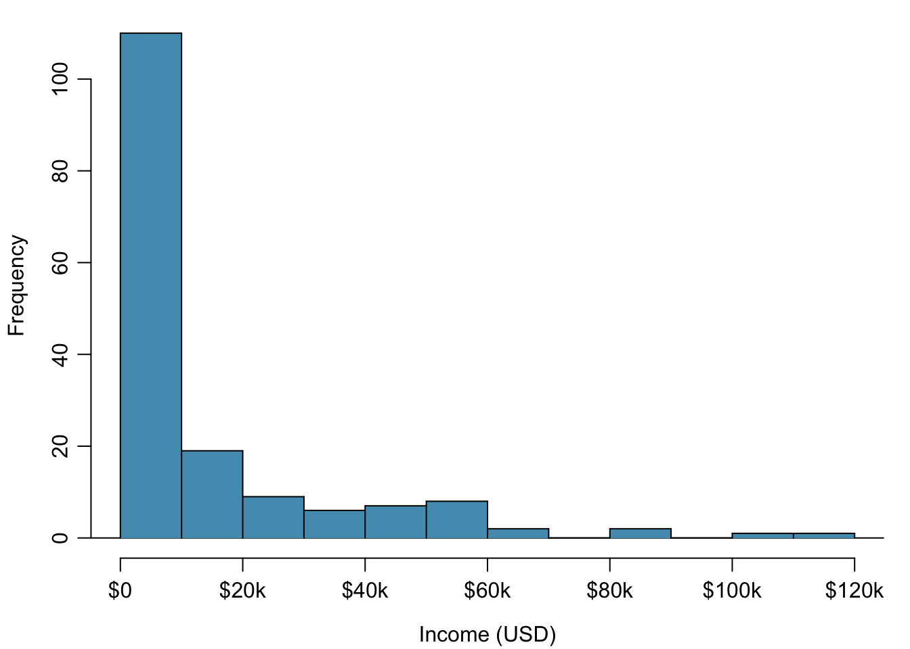
<p class="caption">(\#fig:incomeHistReg)Histogram of per capita income.</p>
</div>


<div class="figure">
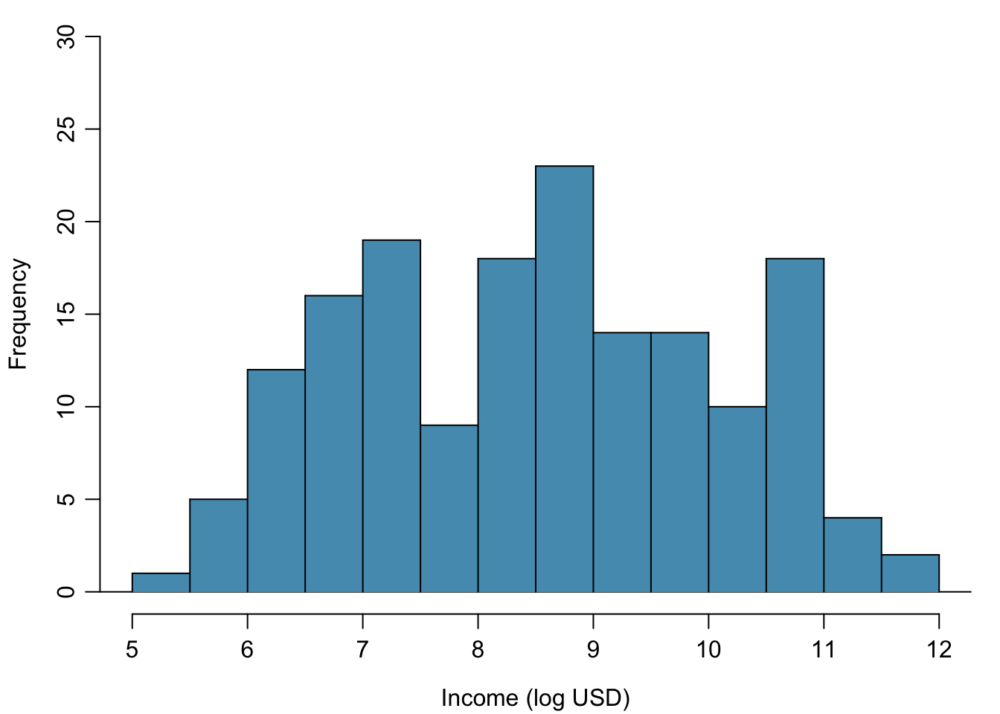
<p class="caption">(\#fig:incomeHistLog)Histogram of the log-transformed per capita income.</p>
</div>


For example, income data are often skewed right; there are typically large clusters of low to moderate income, with a few large incomes that are outliers. Figure \@ref(fig:incomeHistReg) shows a histogram of average yearly per capita income measured in US dollars for 165 countries in 2011. The data are available as `wdi.2011` in the `R` package `oibiostat`. The data are heavily right skewed, with the majority of countries having average yearly per capita income lower than $10,000. Once the data are log-transformed, the distribution becomes roughly symmetric (Figure \@ref(fig:incomeHistLog)). In statistics, the natural logarithm is usually written $\log$. In other settings it is sometimes written as  $\ln$. 

For symmetric distributions, the mean and standard deviation are particularly informative summaries. If a distribution is symmetric, approximately 70% of the data are within one standard deviation of the mean and 95% of the data are within two standard deviations of the mean; this guideline is known as the **empirical rule**.

:::{.example}
On the log-transformed scale, mean $\log$ income is 8.50, with standard deviation 1.54. Apply the empirical rule to describe the distribution of average yearly per capita income among the 165 countries.  

According to the empirical rule, the middle 70% of the data are within one standard deviation of the mean, in the range (8.50 - 1.54, 8.50 + 1.54) = (6.96, 10.04) log(USD). 95% of the data are within two standard deviations of the mean, in the range (8.50 - 2(1.54), 8.50 + 2(1.54)) = (5.42, 11.58) log(USD). 	

Undo the log transformation. The middle 70% of the data are within the range 
$$ (e^{6.96}, e^{10.04}) = (1054, 22925)$$. The middle 95% of the data are within the range 
$$(e^{5.42}, e^{11.58}) = (226, 106937).$$	
:::

Functions other than the natural log can also be used to transform data, such as the square root and inverse.  


## Categorical data

This section introduces tables and plots for summarizing categorical data, using the `famuss` dataset from the `oibiostat` package. 

A table for a single variable is called a **frequency table**. Table \@ref(tab:famussFrequencyTable) is a frequency table for the \var{actn3.r577x} variable, showing the distribution of genotype at location r577x on the ACTN3 gene for the FAMuSS study participants.

In a **relative frequency table** like Table \@ref(tab:famussRelFrequencyTable}, the proportions per each category are shown instead of the counts.


<table class="table" style="margin-left: auto; margin-right: auto;">
<caption>(\#tab:famussFrequencyTable)A frequency table for the actn3.r577x variable.</caption>
 <thead>
  <tr>
   <th style="text-align:left;">   </th>
   <th style="text-align:right;"> CC </th>
   <th style="text-align:right;"> CT </th>
   <th style="text-align:right;"> TT </th>
   <th style="text-align:right;"> Sum </th>
  </tr>
 </thead>
<tbody>
  <tr>
   <td style="text-align:left;"> Counts </td>
   <td style="text-align:right;"> 173 </td>
   <td style="text-align:right;"> 261 </td>
   <td style="text-align:right;"> 161 </td>
   <td style="text-align:right;"> 595 </td>
  </tr>
</tbody>
</table>


<table class="table" style="margin-left: auto; margin-right: auto;">
<caption>(\#tab:famussRelFrequencyTable)A relative frequency table for the actn3.r577x variable.</caption>
 <thead>
  <tr>
   <th style="text-align:left;">   </th>
   <th style="text-align:right;"> CC </th>
   <th style="text-align:right;"> CT </th>
   <th style="text-align:right;"> TT </th>
   <th style="text-align:right;"> Sum </th>
  </tr>
 </thead>
<tbody>
  <tr>
   <td style="text-align:left;"> Proportions </td>
   <td style="text-align:right;"> 0.291 </td>
   <td style="text-align:right;"> 0.439 </td>
   <td style="text-align:right;"> 0.271 </td>
   <td style="text-align:right;"> 1 </td>
  </tr>
</tbody>
</table>


A bar plot is a common way to display a single categorical variable. The left panel of Figure \@ref(fig:famussBarPlot) shows a **bar plot** of the counts per genotype for the `actn3.r577x` variable. The plot in the right panel shows the proportion of observations that are in each level (i.e. in each genotype).


<div class="figure">

<p class="caption">(\#fig:famussBarPlot)Two bar plots of `actn3.r577x`. The left panel shows the counts, and the right panel shows the proportions for each genotype.</p>
</div>


## Relationships between two variables

This section introduces numerical and graphical methods for exploring and summarizing relationships between two variables. Approaches vary depending on whether the two variables are both numerical, both categorical, or whether one is numerical and one is categorical.

### Two numerical variables

#### Scatterplots

In the frog parental investment study, researchers used clutch volume as a primary variable of interest rather than egg size because clutch volume represents both the eggs and the protective gelatinous matrix surrounding the eggs. The larger the clutch volume, the higher the energy required to produce it; thus, higher clutch volume is indicative of increased maternal investment. Previous research has reported that larger body size allows females to produce larger clutches; is this idea supported by the `frog` data?

A **scatterplot** provides a case-by-case view of the relationship between two numerical variables. Figure \@ref(fig:frogClutchVolBodySize) shows clutch volume plotted against body size, with clutch volume on the $y$-axis and body size on the $x$-axis. Each point represents a single case. For this example, each case is one egg clutch for which both volume and body size (of the female that produced the clutch) have been recorded.

<div class="figure">

<p class="caption">(\#fig:frogClutchVolBodySize)A scatterplot showing `clutch.volume` (vertical axis) vs. `body.size` (horizontal axis). </p>
</div>


The plot shows a discernible pattern, which suggests an **association**, or relationship,  between clutch volume and body size; the points tend to lie in a straight line, which is indicative of a **linear association**. Two variables are **positively associated** if increasing values of one tend to occur with increasing values of the other; two variables are **negatively associated** if increasing values of one variable occurs with decreasing values of the other. If there is no evident relationship between two variables, they are said to be **uncorrelated** or **independent**.

As expected, clutch volume and body size are positively associated; larger frogs tend to produce egg clutches with larger volumes. These observations suggest that larger females are capable of investing more energy into offspring production relative to smaller females.


The National Health and Nutrition Examination Survey (NHANES) consists of a set of surveys and measurements conducted by the US CDC to assess the health and nutritional status of adults and children in the United States. The following example uses data from a sample of 500 adults (individuals ages 21 and older) from the **NHANES** dataset. The sample is available as `nhanes.samp.adult.500` in the `oibiostat` package.

:::{.example}
Body mass index (BMI) is a measure of weight commonly used by health agencies to assess whether someone is overweight, and is calculated from height and weight. Describe the relationships shown in Figures \@ref(fig:nhanesHeightWeight) and \@ref(fig:nhanesHeightBMI). Why is it helpful to use BMI as a measure of obesity, rather than weight?
$$BMI = \dfrac{weight_{kg}}{height^{2}_m} = \dfrac{weight_{lb}}{height^{2}_{in}} \times 703$$

Figure \@ref(fig:nhanesHeightWeight)	shows a positive association between height and weight; taller individuals tend to be heavier. Figure \@ref(fig:nhanesHeightBMI) shows that height and BMI do not seem to be associated; the range of BMI values observed is roughly consistent across height. 

Weight itself is not a good measure of whether someone is overweight; instead, it is more reasonable to consider whether someone's weight is unusual relative to other individuals of a comparable height. An individual weighing 200 pounds who is 6 ft tall is not necessarily an unhealthy weight; however, someone who weighs 200 pounds and is 5 ft tall is likely overweight. It is not reasonable to classify individuals as overweight or obese based only on weight.

BMI acts as a relative measure of weight that accounts for height. Specifically, BMI is used as an estimate of body fat. According to US National Institutes of Health (US NIH) and the World Health Organization (WHO), a BMI between 25.0 - 29.9 is considered overweight and a BMI over 30 is considered obese.
:::

<div class="figure">

<p class="caption">(\#fig:nhanesHeightWeight)A scatterplot showing height versus weight from the 500 individuals in the sample from `NHANES`. One participant 163.9 cm tall (about 5 ft, 4 in) and weighing 144.6 kg (about 319 lb) is highlighted.</p>
</div>


<div class="figure">

<p class="caption">(\#fig:nhanesHeightBMI)A scatterplot showing height versus BMI from the 500 individuals in the sample from `NHANES`. The same individual highlighted in Figure \@ref(fig:nhanesHeightWeight) is marked here, with BMI 53.83.</p>
</div>


:::{.example}
Figure \@ref(fig:incomeLifeExpectancy) is a scatterplot of life expectancy versus annual per capita income for 165 countries in 2011. Life expectancy is measured as the expected lifespan for children born in 2011 and income is adjusted for purchasing power in a country. Describe the relationship between life expectancy and annual per capita income; do they seem to be linearly associated?

Life expectancy and annual per capita income are positively associated; higher per capita income is associated with longer life expectancy. However, the two variables are not linearly associated. When income is low, small increases in per capita income are associated with relatively large increases in life expectancy. However, once per capita income exceeds approximately $20,000 per year, increases in income are associated with smaller gains in life expectancy. 

In a linear association, change in the $y$-variable for every unit of the $x$-variable is consistent across the range of the $x$-variable; for example, a linear association would be present if an increase in income of $10,000 corresponded to an increase in life expectancy of 5 years, across the range of income.
:::

<div class="figure">

<p class="caption">(\#fig:incomeLifeExpectancy)A scatterplot of life expectancy (years) versus annual per capita income (US dollars) in the `wdi.2011` dataset from the oibiostat package.</p>
</div>


#### Correlation

Correlation is a numerical summary statistic that measures the strength of a linear relationship between two variables. It is denoted by $r$, which takes on values between -1 and 1.

If the paired values of two variables lie exactly on a line, $r = \pm 1$; the closer the correlation coefficient is to $\pm 1$, the stronger the linear association. When two variables are positively associated, with paired values that tend to lie on a line with positive slope, $r > 0$. If two variables are negatively associated, $r < 0$. A value of $r$ that is 0 or approximately 0 indicates no apparent association between two variables.If paired values lie perfectly on either a horizontal or vertical line, there is no association and $r$ is mathematically undefined.

The correlation coefficient quantifies the strength of a linear trend. Prior to calculating a correlation, it is advisable to confirm that the data exhibit a linear relationship. Although it is mathematically possible to calculate correlation for any set of paired observations, such as the life expectancy versus income data in Figure \@ref(fig:incomeLifeExpectancy), correlation cannot be used to assess the strength of a nonlinear relationship.


<div class="figure">
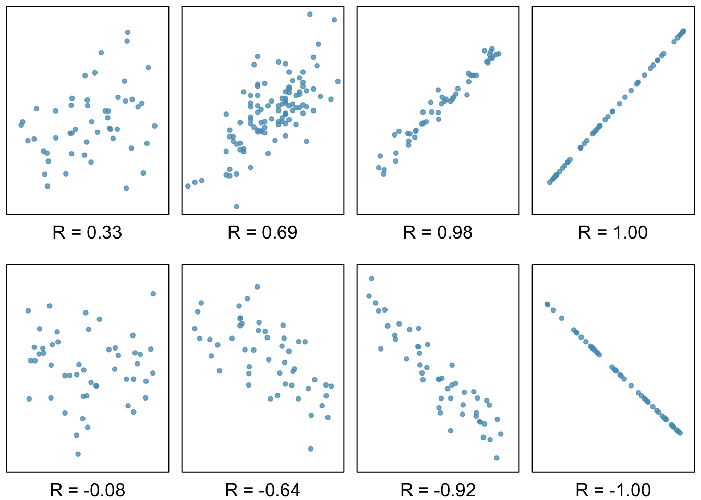
<p class="caption">(\#fig:posNegCorPlots)Scatterplots and their correlation coefficients. The first row shows positive associations and the second row shows negative associations. From left to right, strength of the linear association between $x$ and $y$ increases.</p>
</div>


::: {.definition name="Correlation"}
The correlation between two variables $x$ and $y$ is given by:
$$r =  \frac{1}{n-1}\sum^{n}_{i=1}
\left(\frac{x_{i}-\overline{x}}
{s_{x}}\right)\left(\frac{y_{i}-\overline{y}}{s_{y}}\right),$$
where $(x_1,y_1), (x_2,y_2), \ldots, (x_n, y_n)$ are the $n$ paired values of $x$ and $y$, and $s_x$ and $s_y$ are the sample standard deviations of the $x$ and $y$ variables, respectively.
:::


:::{.example}
Calculate the correlation coefficient of $x$ and $y$, plotted in Figure \@ref(fig:corCalcSimple). Calculate the mean and standard deviation for $x$ and $y$: $\overline{x} = 2$, $\overline{y} = 3$, $s_x = 1$, and $s_y = 2.65$. 

\begin{align*}
r &=  \frac{1}{n-1}\sum^{n}_{i=1}
\left(\frac{x_{i}-\overline{x}}
{s_{x}}\right)\left(\frac{y_{i}-\overline{y}}{s_{y}}\right) \\
&= \frac{1}{3 - 1} \left[\left(\frac{1 - 2}
{1}\right)\left(\frac{5 - 3}{2.65}\right) + \left(\frac{2 - 2}
{1}\right)\left(\frac{4 - 3}{2.65}\right) + \left(\frac{3 - 2}
{1}\right)\left(\frac{0 - 3}{2.65}\right)  \right] \\
&= -0.94.
\end{align*}

The correlation is -0.94, which reflects the negative association visible from the scatterplot in Figure \@ref(fig:corCalcSimple).
:::


<div class="figure">
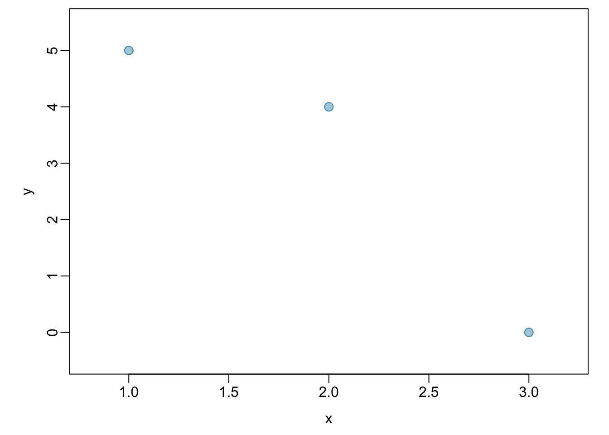
<p class="caption">(\#fig:corCalcSimple)A scatterplot showing three points: (1, 5), (2, 4), and (3, 0)</p>
</div>


:::{.example}
Is it appropriate to use correlation as a numerical summary for the relationship between life expectancy and income after a log transformation is applied to both variables? Refer to Figure \@ref(fig:incomeLifeExpectancyLog).
	
Figure \@ref(fig:incomeLifeExpectancyLog) shows an approximately linear relationship; a correlation coefficient is a reasonable numerical summary of the relationship. As calculated from statistical software, $r = 0.79$, which is indicative of a strong linear relationship.
:::


<div class="figure">

<p class="caption">(\#fig:incomeLifeExpectancyLog)A scatterplot showing `log(income)` (horizontal axis) vs.  `log(life.expectancy)` (vertical axis).</p>
</div>


### Two categorical variables

#### Contingency tables

A **contingency table** summarizes data for two categorical variables, with each value in the table representing the number of times a particular combination of outcomes occurs. Contingency tables are also known as **two-way tables**. Table \@ref(tab:famussContingencyTable) summarizes the relationship between race and genotype in the `famuss` data.

The **row totals** provide the total counts across each row and the **column totals** are the total counts for each column; collectively, these are the **marginal totals**.


<table class="table" style="margin-left: auto; margin-right: auto;">
<caption>(\#tab:famussContingencyTable)A contingency table for race and actn3.r577x.</caption>
 <thead>
  <tr>
   <th style="text-align:left;">   </th>
   <th style="text-align:right;"> CC </th>
   <th style="text-align:right;"> CT </th>
   <th style="text-align:right;"> TT </th>
   <th style="text-align:right;"> Sum </th>
  </tr>
 </thead>
<tbody>
  <tr>
   <td style="text-align:left;"> African Am </td>
   <td style="text-align:right;"> 16 </td>
   <td style="text-align:right;"> 6 </td>
   <td style="text-align:right;"> 5 </td>
   <td style="text-align:right;"> 27 </td>
  </tr>
  <tr>
   <td style="text-align:left;"> Asian </td>
   <td style="text-align:right;"> 21 </td>
   <td style="text-align:right;"> 18 </td>
   <td style="text-align:right;"> 16 </td>
   <td style="text-align:right;"> 55 </td>
  </tr>
  <tr>
   <td style="text-align:left;"> Caucasian </td>
   <td style="text-align:right;"> 125 </td>
   <td style="text-align:right;"> 216 </td>
   <td style="text-align:right;"> 126 </td>
   <td style="text-align:right;"> 467 </td>
  </tr>
  <tr>
   <td style="text-align:left;"> Hispanic </td>
   <td style="text-align:right;"> 4 </td>
   <td style="text-align:right;"> 10 </td>
   <td style="text-align:right;"> 9 </td>
   <td style="text-align:right;"> 23 </td>
  </tr>
  <tr>
   <td style="text-align:left;"> Other </td>
   <td style="text-align:right;"> 7 </td>
   <td style="text-align:right;"> 11 </td>
   <td style="text-align:right;"> 5 </td>
   <td style="text-align:right;"> 23 </td>
  </tr>
  <tr>
   <td style="text-align:left;"> Sum </td>
   <td style="text-align:right;"> 173 </td>
   <td style="text-align:right;"> 261 </td>
   <td style="text-align:right;"> 161 </td>
   <td style="text-align:right;"> 595 </td>
  </tr>
</tbody>
</table>


Like relative frequency tables for the distribution of one categorical variable, contingency tables can also be converted to show proportions. Since there are two variables, it is necessary to specify whether the proportions are calculated according to the row variable or the column variable. 

Table \@ref(tab:famussRowPropTable) shows the row proportions for Table \@ref(tab:famussContingencyTable); these proportions indicate how genotypes are distributed within each race. For example, the value of 0.593 in the upper left corner indicates that of the African Americans in the study, 59.3% have the CC genotype.


<table class="table" style="margin-left: auto; margin-right: auto;">
<caption>(\#tab:famussRowPropTable)A contingency table with row proportions for the race and actn3.r577x variables.</caption>
 <thead>
  <tr>
   <th style="text-align:left;">   </th>
   <th style="text-align:right;"> CC </th>
   <th style="text-align:right;"> CT </th>
   <th style="text-align:right;"> TT </th>
   <th style="text-align:right;"> Sum </th>
  </tr>
 </thead>
<tbody>
  <tr>
   <td style="text-align:left;"> African Am </td>
   <td style="text-align:right;"> 0.5925926 </td>
   <td style="text-align:right;"> 0.2222222 </td>
   <td style="text-align:right;"> 0.1851852 </td>
   <td style="text-align:right;"> 1 </td>
  </tr>
  <tr>
   <td style="text-align:left;"> Asian </td>
   <td style="text-align:right;"> 0.3818182 </td>
   <td style="text-align:right;"> 0.3272727 </td>
   <td style="text-align:right;"> 0.2909091 </td>
   <td style="text-align:right;"> 1 </td>
  </tr>
  <tr>
   <td style="text-align:left;"> Caucasian </td>
   <td style="text-align:right;"> 0.2676660 </td>
   <td style="text-align:right;"> 0.4625268 </td>
   <td style="text-align:right;"> 0.2698073 </td>
   <td style="text-align:right;"> 1 </td>
  </tr>
  <tr>
   <td style="text-align:left;"> Hispanic </td>
   <td style="text-align:right;"> 0.1739130 </td>
   <td style="text-align:right;"> 0.4347826 </td>
   <td style="text-align:right;"> 0.3913043 </td>
   <td style="text-align:right;"> 1 </td>
  </tr>
  <tr>
   <td style="text-align:left;"> Other </td>
   <td style="text-align:right;"> 0.3043478 </td>
   <td style="text-align:right;"> 0.4782609 </td>
   <td style="text-align:right;"> 0.2173913 </td>
   <td style="text-align:right;"> 1 </td>
  </tr>
</tbody>
</table>


Table \@ref(tab:famussColPropTable) shows the column proportions for Table \@ref(tab:famussContingencyTable); these proportions indicate the distribution of races within each genotype category. For example, the value of 0.092 indicates that of the CC individuals in the study, 9.2% are African American. 

<table class="table" style="margin-left: auto; margin-right: auto;">
<caption>(\#tab:famussColPropTable)A contingency table with column proportions for the `race` and `actn3.r577x` variables.</caption>
 <thead>
  <tr>
   <th style="text-align:left;">   </th>
   <th style="text-align:right;"> CC </th>
   <th style="text-align:right;"> CT </th>
   <th style="text-align:right;"> TT </th>
  </tr>
 </thead>
<tbody>
  <tr>
   <td style="text-align:left;"> African Am </td>
   <td style="text-align:right;"> 0.092 </td>
   <td style="text-align:right;"> 0.023 </td>
   <td style="text-align:right;"> 0.031 </td>
  </tr>
  <tr>
   <td style="text-align:left;"> Asian </td>
   <td style="text-align:right;"> 0.121 </td>
   <td style="text-align:right;"> 0.069 </td>
   <td style="text-align:right;"> 0.099 </td>
  </tr>
  <tr>
   <td style="text-align:left;"> Caucasian </td>
   <td style="text-align:right;"> 0.723 </td>
   <td style="text-align:right;"> 0.828 </td>
   <td style="text-align:right;"> 0.783 </td>
  </tr>
  <tr>
   <td style="text-align:left;"> Hispanic </td>
   <td style="text-align:right;"> 0.023 </td>
   <td style="text-align:right;"> 0.038 </td>
   <td style="text-align:right;"> 0.056 </td>
  </tr>
  <tr>
   <td style="text-align:left;"> Other </td>
   <td style="text-align:right;"> 0.040 </td>
   <td style="text-align:right;"> 0.042 </td>
   <td style="text-align:right;"> 0.031 </td>
  </tr>
  <tr>
   <td style="text-align:left;"> Sum </td>
   <td style="text-align:right;"> 1.000 </td>
   <td style="text-align:right;"> 1.000 </td>
   <td style="text-align:right;"> 1.000 </td>
  </tr>
</tbody>
</table>


::: {.example}
For African Americans in the study, CC is the most common genotype and TT is the least common genotype. Does this pattern hold for the other races in the study? Do the observations from the study suggest that distribution of genotypes at r577x vary between populations? 

The pattern holds for Asians, but not for other races. For the Caucasian individuals sampled in the study, CT is the most common genotype at 46.3%. CC is the most common genotype for Asians, but in this population, genotypes are more evenly distributed: 38.2% of Asians sampled are CC, 32.7% are CT, and 29.1% are TT. The distribution of genotypes at r577x seems to vary by population.
:::


::: {.exercise}
As shown in Table \@ref(tab:famussColPropTable), 72.3% of CC individuals in the study are Caucasian. Do these data suggest that in the general population, people of CC genotype are highly likely to be Caucasian?

No, this is not a reasonable conclusion to draw from the data. The high proportion of Caucasians among CC individuals primarily reflects the large number of Caucasians sampled in the study -- 78.5% of the people sampled are Caucasian. The uneven representation of different races is one limitation of the `famuss` data.
:::


#### Segmented bar plots

A **segmented bar plot** is a way of visualizing the information from a contingency table. Figures \@ref(fig:famussSegBarA) and \@ref(fig:famussSegBarStaA) graphically displays the data from Table \@ref(tab:famussContingencyTable); each bar represents a level of `actn3.r577x` and is divided by the levels of `race`. Figure \@ref(fig:famussSegBarStaA) uses the row proportions to create a standardized segmented bar plot. 


<div class="figure">
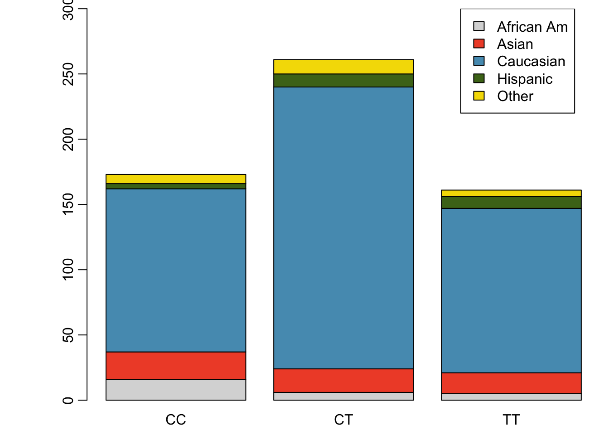
<p class="caption">(\#fig:famussSegBarA)Segmented bar plot for individuals by genotype, with bars divided by race</p>
</div>


<div class="figure">
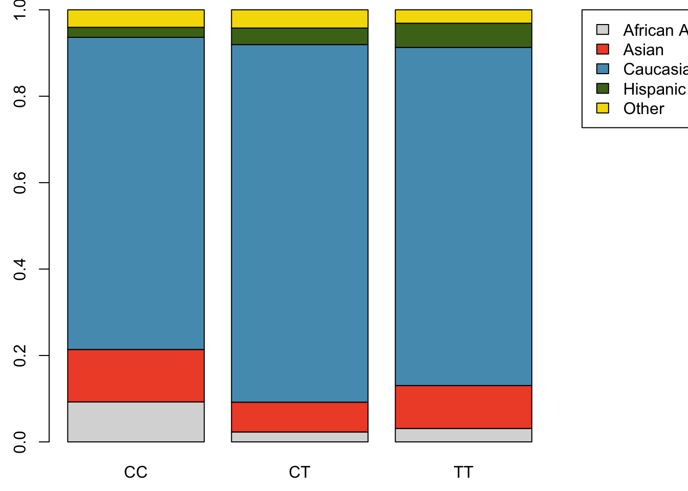
<p class="caption">(\#fig:famussSegBarStaA)Standardized version of Figure \@ref(fig:famussSegBarA)</p>
</div>


Alternatively, the data can be organized as shown in Figures \@ref(fig:famussSegBarB) and \@ref(fig:famussSegBarStaB), with each bar representing a level of `race`. The standardized plot is particularly useful in this case, presenting the distribution of genotypes within each race more clearly than in Figure \@ref(fig:famussSegBarB).


<div class="figure">
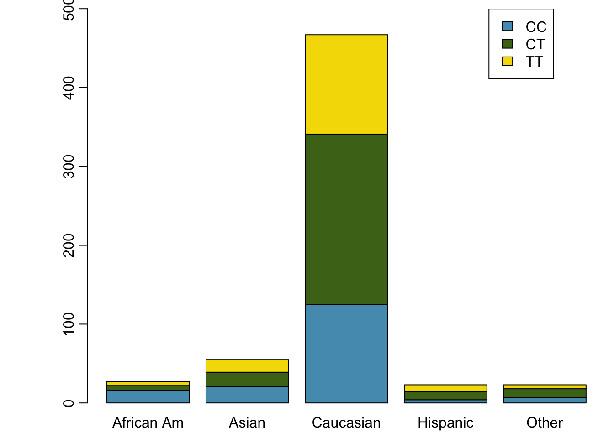
<p class="caption">(\#fig:famussSegBarB)Segmented bar plot for individuals by race, with bars divided by genotype</p>
</div>


<div class="figure">
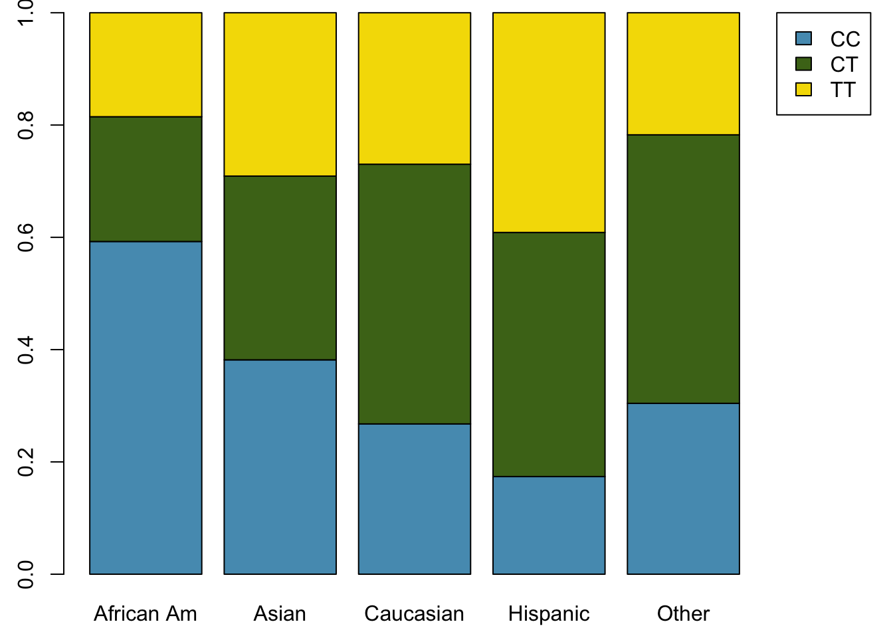
<p class="caption">(\#fig:famussSegBarStaB)Standardized version of Figure \@ref(fig:famussSegBarB)</p>
</div>


