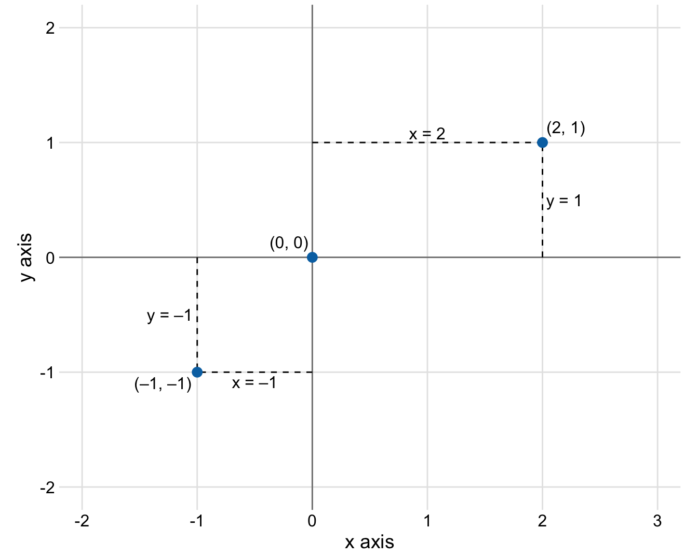
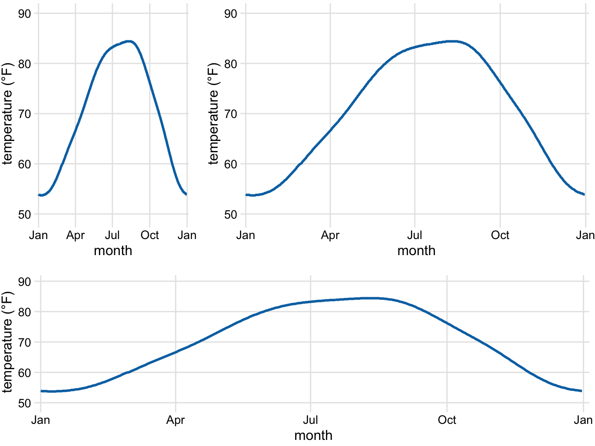
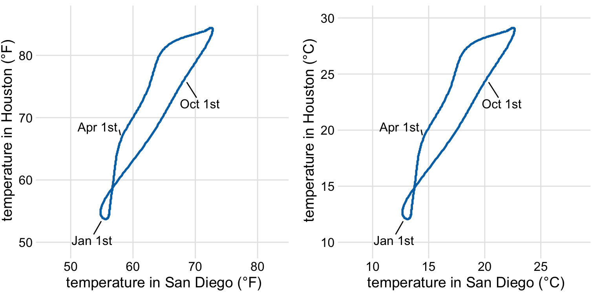
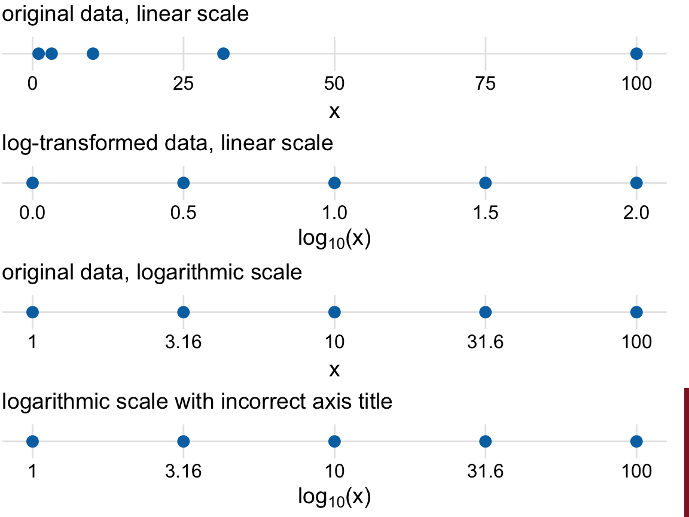
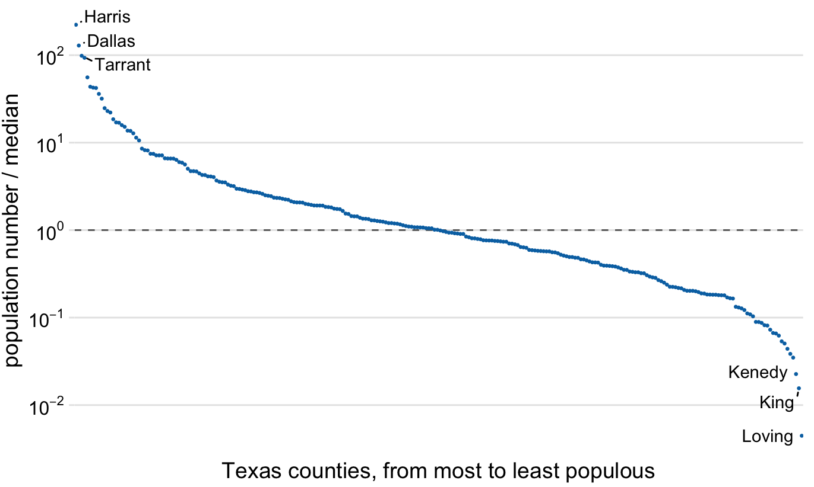
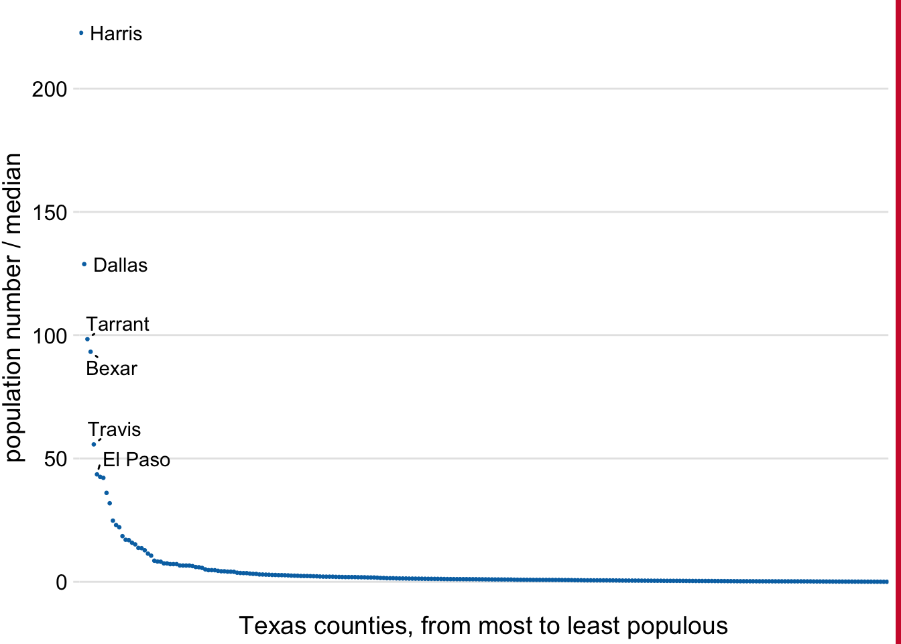
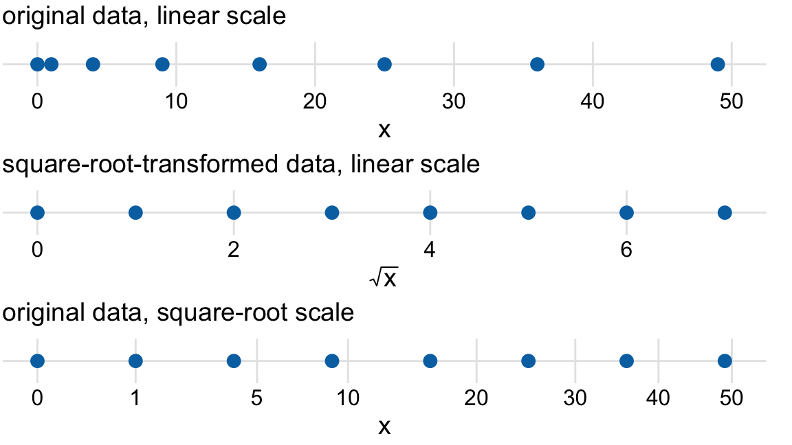
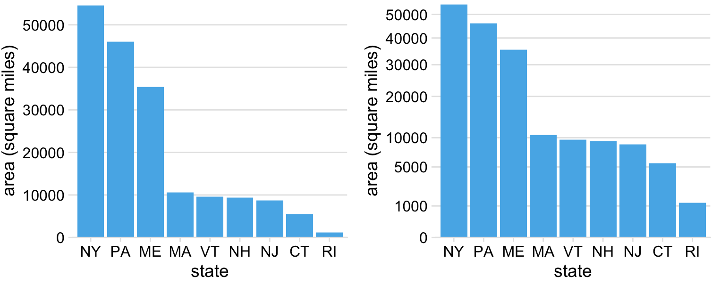

# Coordinate systems and axes {#coordinate-systems-axes}

::: {.rmdnote}
This section is reproduced from the book Fundamentals of Data Visualization [@wilke]
:::


**Packages used in this Section**


```r
pacman::p_load(
  cowplot,
  colorspace,
  colorblindr, # devtools::install_github("clauswilke/colorblindr")
  dviz.supp, #   devtools::install_github("clauswilke/dviz.supp")
  forcats,
  patchwork,
  lubridate,
  tidyr, 
  ggrepel
)
```


To make any sort of data visualization, we need to define position scales, which determine where in a graphic different data values are located. We cannot visualize data without placing different data points at different locations, even if we just arrange them next to each other along a line. For regular 2d visualizations, two numbers are required to uniquely specify a point, and therefore we need two position scales. These two scales are usually but not necessarily the *x* and *y* axis of the plot. We also have to specify the relative geometric arrangement of these scales. Conventionally, the *x* axis runs horizontally and the *y* axis vertically, but we could choose other arrangements. For example, we could have the *y* axis run at an acute angle relative to the *x* axis, or we could have one axis run in a circle and the other run radially. The combination of a set of position scales and their relative geometric arrangement is called a *coordinate system.*


## Cartesian coordinates

The most widely used coordinate system for data visualization is the 2d *Cartesian coordinate system*, where each location is uniquely specified by an *x* and a *y* value. The *x* and *y* axes run orthogonally to each other, and data values are placed in an even spacing along both axes (Figure \@ref(fig:cartesian-coord)). The two axes are continuous position scales, and they can represent both positive and negative real numbers. To fully specify the coordinate system, we need to specify the range of numbers each axis covers. In Figure \@ref(fig:cartesian-coord), the *x* axis runs from -2.2 to 3.2 and the *y* axis runs from -2.2 to 2.2. Any data values between these axis limits are placed at the respective location in the plot. Any data values outside the axis limits are discarded. 

(ref:cartesian-coord) Standard cartesian coordinate system. The horizontal axis is conventionally called *x* and the vertical axis *y*. The two axes form a grid with equidistant spacing. Here, both the *x* and the *y* grid lines are separated by units of one. The point (2, 1) is located two *x* units to the right and one *y* unit above the origin (0, 0). The point (-1, -1) is located one *x* unit to the left and one *y* unit below the origin. 

<div class="figure">

<p class="caption">(\#fig:cartesian-coord)(ref:cartesian-coord)</p>
</div>

Data values usually aren't just numbers, however. They come with units. For example, if we're measuring temperature, the values may be measured in degrees Celsius or Fahrenheit. Similarly, if we're measuring distance, the values may be measured in kilometers or miles, and if we're measuring duration, the values may be measured in minutes, hours, or days. In a Cartesian coordinate system, the spacing between grid lines along an axis corresponds to discrete steps in these data units. In a temperature scale, for example, we may have a grid line every 10 degrees Fahrenheit, and in a distance scale, we may have a grid line every 5 kilometers.

A Cartesian coordinate system can have two axes representing two different units. This situation arises quite commonly whenever we're mapping two different types of variables to *x* and *y*. For example, in Figure \@ref(fig:temp-normals-vs-time), we plotted temperature vs. days of the year. The *y* axis of Figure \@ref(fig:temp-normals-vs-time) is measured in degrees Fahrenheit, with a grid line every at 20 degrees, and the *x* axis is measured in months, with a grid line at the first of every third month. Whenever the two axes are measured in different units, we can stretch or compress one relative to the other and maintain a valid visualization of the data (Figure \@ref(fig:temperature-normals-Houston)). Which version is preferable may depend on the story we want to convey. A tall and narrow figure emphasizes change along the *y* axis and a short and wide figure does the opposite. Ideally, we want to choose an aspect ratio that ensures that any important differences in position are noticeable.

(ref:temperature-normals-Houston) Daily temperature normals for Houston, TX. Temperature is mapped to the *y* axis and day of the year to the *x* axis. Parts (a), (b), and (c) show the same figure in different aspect ratios. All three parts are valid visualizations of the temperature data. Data source: NOAA.

<div class="figure">

<p class="caption">(\#fig:temperature-normals-Houston)(ref:temperature-normals-Houston)</p>
</div>

On the other hand, if the *x* and the *y* axes are measured in the same units, then the grid spacings for the two axes should be equal, such that the same distance along the *x* or *y* axis corresponds to the same number of data units. As an example, we can plot the temperature in Houston, TX against the temperature in San Diego, CA, for every day of the year (Figure \@ref(fig:temperature-normals-Houston-San-Diego)a). Since the same quantity is plotted along both axes, we need to make sure that the grid lines form perfect squares, as is the case in Figure \@ref(fig:temperature-normals-Houston-San-Diego).

(ref:temperature-normals-Houston-San-Diego) Daily temperature normals for Houston, TX, plotted versus the respective temperature normals of San Diego, CA. The first days of the months January, April, July, and October are highlighted to provide a temporal reference. (a) Temperatures are shown in degrees Fahrenheit. (b) Temperatures are shown in degrees Celsius. Data source: NOAA.

<div class="figure">

<p class="caption">(\#fig:temperature-normals-Houston-San-Diego)(ref:temperature-normals-Houston-San-Diego)</p>
</div>

You may wonder what happens if you change the units of your data. After all, units are arbitrary, and your preferences might be different from somebody else's. A change in units is a linear transformation, where we add or subtract a number to or from all data values and/or multiply all data values with another number. Fortunately, Cartesian coordinate systems are invariant under such linear transformations. Therefore, you can change the units of your data and the resulting figure will not change as long as you change the axes accordingly. As an example, compare Figures \@ref(fig:temperature-normals-Houston-San-Diego)a and \@ref(fig:temperature-normals-Houston-San-Diego)b. Both show the same data, but in part (a) the temperature units are degrees Fahrenheit and in part (b) they are degrees Celsius. Even though the grid lines are in different locations and the numbers along the axes are different, the two data visualizations look exactly the same.


## Nonlinear axes

In a Cartesian coordinate system, the grid lines along an axis are spaced evenly both in data units and in the resulting visualization. We refer to the position scales in these coordinate systems as *linear*. While linear scales generally provide an accurate representation of the data, there are scenarios where nonlinear scales are preferred. In a nonlinear scale, even spacing in data units corresponds to uneven spacing in the visualization, or conversely even spacing in the visualization corresponds to uneven spacing in data units.

The most commonly used nonlinear scale is the *logarithmic scale* or *log scale* for short. Log scales are linear in multiplication, such that a unit step on the scale corresponds to multiplication with a fixed value. To create a log scale, we need to log-transform the data values while exponentiating the numbers that are shown along the axis grid lines. This process is demonstrated in Figure \@ref(fig:linear-log-scales), which shows the numbers 1, 3.16, 10, 31.6, and 100 placed on linear and log scales. The numbers 3.16 and 31.6 may seem a strange choice, but they were chosen because they are exactly half-way between 1 and 10 and between 10 and 100 on a log scale. We can see this by observing that $10^{0.5} = \sqrt{10} \approx 3.16$ and equivalently $3.16 \times 3.16 \approx 10$. Similarly, $10^{1.5} = 10\times10^{0.5} \approx 31.6$.

(ref:linear-log-scales) Relationship between linear and logarithmic scales. The dots correspond to data values 1, 3.16, 10, 31.6, 100, which are evenly-spaced numbers on a logarithmic scale. We can display these data points on a linear scale, we can log-transform them and then show on a linear scale, or we can show them on a logarithmic scale. Importantly, the correct axis title for a logarithmic scale is the name of the variable shown, not the logarithm of that variable.

<div class="figure">

<p class="caption">(\#fig:linear-log-scales)(ref:linear-log-scales)</p>
</div>

Mathematically, there is no difference between plotting the log-transformed data on a linear scale or plotting the original data on a logarithmic scale (Figure \@ref(fig:linear-log-scales)). The only difference lies in the labeling for the individual axis ticks and for the axis as a whole. In most cases, the labeling for a logarithmic scale is preferable, because it places less mental burden on the reader to interpret the numbers shown as the axis tick labels. There is also less of a risk of confusion about the base of the logarithm. When working with log-transformed data, we can get confused about whether the data were transformed using the natural logarithm or the logarithm to base 10. And it's not uncommon for labeling to be ambiguous, e.g. "log(x)", which doesn't specify a base at all. I recommend that you always verify the base when working with log-transformed data. When plotting log-transformed data, always specify the base in the labeling of the axis.

Because multiplication on a log scale looks like addition on a linear scale, log scales are the natural choice for any data that have been obtained by multiplication or division. In particular, ratios should generally be shown on a log scale. As an example, I have taken the number of inhabitants in each county in Texas and have divided it by the median number of inhabitants across all Texas counties. The resulting ratio is a number that can be larger or smaller than 1. A ratio of exactly 1 implies that the corresponding county has the median number of inhabitants. When visualizing these ratios on a log scale, we can see clearly that the population numbers in Texas counties are symmetrically distributed around the median, and that the most populous counties have over 100 times more inhabitants than the median while the least populous counties have over 100 times fewer inhabitants (Figure \@ref(fig:texas-counties-pop-ratio-log)). By contrast, for the same data, a linear scale obscures the differences between a county with median population number and a county with a much smaller population number than median (Figure \@ref(fig:texas-counties-pop-ratio-lin)).

(ref:texas-counties-pop-ratio-log) Population numbers of Texas counties relative to their median value. Select counties are highlighted by name. The dashed line indicates a ratio of 1, corresponding to a county with median population number. The most populous counties have approximately 100 times more inhabitants than the median county, and the least populous counties have approximately 100 times fewer inhabitants than the median county. Data source: 2010 Decennial U.S. Census.

<div class="figure">

<p class="caption">(\#fig:texas-counties-pop-ratio-log)(ref:texas-counties-pop-ratio-log)</p>
</div>

(ref:texas-counties-pop-ratio-lin) Population sizes of Texas counties relative to their median value. By displaying a ratio on a linear scale, we have overemphasized ratios > 1 and have obscured ratios < 1. As a general rule, ratios should not be displayed on a linear scale. Data source: 2010 Decennial U.S. Census.

<div class="figure">

<p class="caption">(\#fig:texas-counties-pop-ratio-lin)(ref:texas-counties-pop-ratio-lin)</p>
</div>

On a log scale, the value 1 is the natural midpoint, similar to the value 0 on a linear scale. We can think of values greater than 1 as representing multiplications and values less than 1 divisions. For example, we can write $10 = 1\times 10$ and $0.1 = 1/10$. The value 0, on the other hand, can never appear on a log scale. It lies infinitely far from 1. One way to see this is to consider that $\log(0) = -\infty$. Or, alternatively, consider that to go from 1 to 0, it takes either an infinite number of divisions by a finite value (e.g., $1/10/10/10/10/10/10\dots = 0$) or alternatively one division by infinity (i.e., $1/\infty = 0$).

Log scales are frequently used when the data set contains numbers of very different magnitudes. For the Texas counties shown in Figures \@ref(fig:texas-counties-pop-ratio-log) and \@ref(fig:texas-counties-pop-ratio-lin), the most populous one (Harris) had 4,092,459 inhabitants in the 2010 U.S. Census while the least populous one (Loving) had 82. So a log scale would be appropriate even if we hadn't divided population numbers by their median to turn them into ratios. But what would we do if there was a county with 0 inhabitants? This county could not be shown on the logarithmic scale, because it would lie at minus infinity. In this situation, the recommendation is sometimes to use a square-root scale, which uses a square root transformation instead of a log transformation (Figure \@ref(fig:sqrt-scales)). Just like a log scale, a square-root scale compresses larger numbers into a smaller range, but unlike a log scale, it allows for the presence of 0.

(ref:sqrt-scales) Relationship between linear and square-root scales. The dots correspond to data values 0, 1, 4, 9, 16, 25, 36, 49, which are evenly-spaced numbers on a square-root scale, since they are the squares of the integers from 0 to 7. We can display these data points on a linear scale, we can square-root-transform them and then show on a linear scale, or we can show them on a square-root scale. 

<div class="figure">

<p class="caption">(\#fig:sqrt-scales)(ref:sqrt-scales)</p>
</div>

I see two problems with square-root scales. First, while on a linear scale one unit step corresponds to addition or subtraction of a constant value and on a log scale it corresponds to multiplication with or division by a constant value, no such rule exists for a square-root scale. The meaning of a unit step on a square-root scale depends on the scale value at which we're starting. Second, it is unclear how to best place axis ticks on a square-root scale. To obtain evenly spaced ticks, we would have to place them at squares, but axis ticks at, for example, positions 0, 4, 25, 49, 81 (every second square) would be highly unintuitive. Alternatively, we could place them at linear intervals (10, 20, 30, etc), but this would result in either too few axis ticks near the low end of the scale or too many near the high end. In Figure \@ref(fig:sqrt-scales), I have placed the axis ticks at positions 0, 1, 5, 10, 20, 30, 40, and 50 on the square-root scale. These values are arbitrary but provide a reasonable covering of the data range.

Despite these problems with square-root scales, they are valid position scales and I do not discount the possibility that they have appropriate applications. For example, just like a log scale is the natural scale for ratios, one could argue that the square-root scale is the natural scale for data that come in squares. One scenario in which data are naturally squares are in the context of geographic regions. If we show the areas of geographic regions on a square-root scale, we are highlighting the regions' linear extent from East to West or North to South. These extents could be relevant, for example, if we are wondering how long it might take to drive across a region. Figure \@ref(fig:northeast-state-areas) shows the areas of states in the U.S. Northeast on both a linear and a square-root scale. Even though the areas of these states are quite different (Figure \@ref(fig:northeast-state-areas)a), the time it will take to drive across each state will more closely resemble the figure on the square-root scale (Figure \@ref(fig:northeast-state-areas)b) than the figure on the linear scale (Figure \@ref(fig:northeast-state-areas)a).

(ref:northeast-state-areas) Areas of Northeastern U.S. states. (a) Areas shown on a linear scale. (b) Areas shown on a square-root scale. Data source: Google. 

<div class="figure">

<p class="caption">(\#fig:northeast-state-areas)(ref:northeast-state-areas)</p>
</div>

