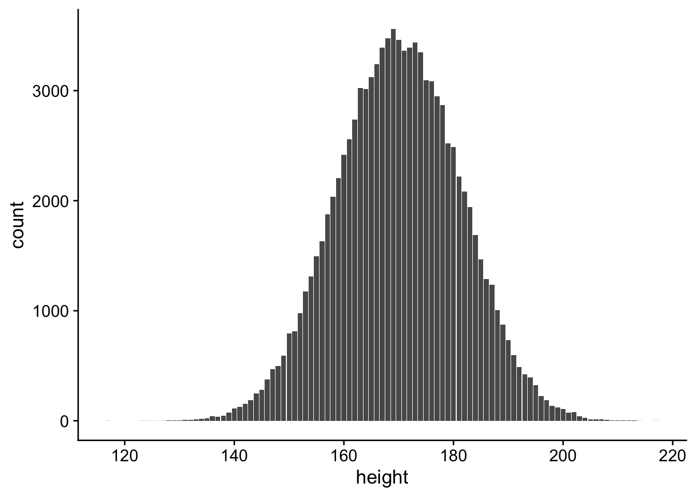

# Probability {#ChapProbability}

\newcommand{\Var}{\operatorname{Var}}
\newcommand{\Expec}{\operatorname{E}}
\newcommand{\Prob}{\operatorname{P}}

::: {.rmdnote}
This section is adapted from the book Introduction to Statistical Thinking (With R, Without Calculus) [@yakir]
:::


## Student Learning Objective

This section extends the notion of variability that was introduced in
the context of data to other situations. The variability of the entire
*population* and the concept of a *random variable* is discussed. These
concepts are central for the development and interpretation of
statistical inference. By the end of the chapter the student should:

-   Consider the distribution of a variable in a population and compute
    parameters of this distribution, such as the mean and the standard
    deviation.

-   Become familiar with the concept of a random variable.

-   Understand the relation between the distribution of the population
    and the distribution of a random variable produced by sampling a
    random subject from the population.

-   Identify the distribution of the random variable in simple settings
    and compute its expectation and variance.

## Different Forms of Variability

In Section \@ref(introdata) we examined the variability in data. In the
statistical context, data is obtained by selecting a sample from the
target population and measuring the quantities of interest for the
subjects that belong to the sample. Different subjects in the sample may
obtain different values for the measurement, leading to variability in
the data.

This variability may be summarized with the aid of a *frequency table*,
a table of *relative frequency*, or via the *cumulative relative
frequency*. A graphical display of the variability in the data may be
obtained with the aid of the *bar plot*, the *histogram*, or the *boxplot*. For example, Figure \@ref(fig:frogBoxPlot2) shows a boxplot of `clutch.volume`  (from the [`frog`](#frogDataExample) dataset in the `oibiostat` package) alongside a vertical dot plot.


<div class="figure">

<p class="caption">(\#fig:frogBoxPlot2)A boxplot and dot plot of `clutch.volume`. The horizontal dashes indicate the bottom 50% of the data and the open circles represent the top 50%.</p>
</div>

Numerical summaries may be computed in order to characterize the main
features of the variability. We used the *mean* and the *median* in
order to identify the location of the distribution. The *sample
variance*, or better yet the *sample standard deviation*, as well as the
*inter-quartile range* were all described as tools to quantify the
overall spread of the data.

The aim of all these graphical representations and numerical summaries
is to investigate the variability of the data.

The subject of this chapter is to introduce two other forms of
variability, variability that is not associated, at least not directly,
with the data that we observe. The first type of variability is the
**population variability**. The other type of variability is the
variability of a **random variable**.

The notions of variability that will be presented are abstract, they are
not given in terms of the data that we observe, and they have a
mathematical-theoretical flavor to them. At first, these abstract
notions may look to you as a waste of your time and may seem to be
unrelated to the subject matter of the course. The opposite is true. The
very core of statistical thinking is relating observed data to
theoretical and abstract models of a phenomena. Via this comparison, and
using the tools of statistical inference that are presented in the
second half of the book, statisticians can extrapolate insights or make
statements regarding the phenomena on the basis of the observed data.
Thereby, the abstract notions of variability that are introduced in this
chapter, and are extended in the subsequent chapters, are the essential foundations for the practice of
statistics.


The first notion of variability is the variability that is associated
with the population. It is similar in its nature to the variability of
the data. The difference between these two types of variability is that
the former corresponds to the variability of the quantity of interest
across all members of the population and not only for those that were
selected to the sample.

We will examine the data set [`heights_sample.csv`](https://github.com/sahirbhatnagar/EPIB607/blob/master/inst/data/heights_sample.csv) which contains data on the sex and height of a sample of
100 observations. We will also consider the sex and height of
*all* the members of the population from which the sample was selected.
The size of the relevant population is 100,000, including the 100
subjects that composed the sample. When we examine the values of the
height across the entire population we can see that different people may
have different heights. This variability of the heights is the
**population variability**.

The other abstract type of variability, the **variability of a random variable**, is a mathematical concept. The aim of this concept is to model
the notion of randomness in measurements or the uncertainty regarding
the outcome of a measurement. In particular we will initially consider
the variability of a random variable in the context of selecting one
subject at random from the population.

Imagine we have a population of size 100,000 and we are about to select
at random one subject from this population. We intend to measure the
height of the subject that will be selected. Prior to the selection and
measurement we are not certain what value of height will be obtained.
One may associate the notion of variability with uncertainty — different
subjects to be selected may obtain different evaluations of the
measurement and we do not know before hand which subject will be
selected. The resulting variability is the variability of a random
variable.

Random variables can be defined for more abstract settings. Their aim is
to provide models for randomness and uncertainty in measurements. Simple
examples of such abstract random variables will be provided in this
chapter. More examples will be introduced in the subsequent chapters.
The more abstract examples of random variables need not be associated
with a specific population. Still, the same definitions that are used
for the example of a random variable that emerges as a result of
sampling a single subject from a population will apply to the more
abstract constructions.

All types of variability, the variability of the data we dealt with
before as well as the other two types of variability, can be displayed
using graphical tools and characterized with numerical summaries.
Essentially the same type of plots and numerical summaries, possibly
with some modifications, may and will be applied.

A point to remember is that the variability of the data relates to a
concrete list of data values that is presented to us. In contrary to the
case of the variability of the data, the other types of variability are
not associated with quantities we actually get to observe. The data for
the sample we get to see but not the data for the rest of the
population. Yet, we can still discuss the variability of a population
that is out there, even though we do not observe the list of
measurements for the entire population. (The example that we give in
this chapter of a population was artificially constructed and serves for
illustration only. In the actual statistical context one does not obtain
measurements from the entire population, only from the subjects that
went into the sample.) The discussion of the variability in this context
is theoretical in its nature. Still, this theoretical discussion is
instrumental for understanding statistics.

## Variability of a population

In this section we introduce the variability of a population and present
some numerical summaries that characterizes this variability. Before
doing so, let us review with the aid of an example some of the numerical
summaries that were used for the characterization of the variability of
data.

Recall the file `heights_sample.csv` that contains data on the height and sex of
100 subjects (the data file can be obtained [here](https://github.com/sahirbhatnagar/EPIB607/blob/master/inst/data/heights_sample.csv)). We read the
content of the file into a data frame by the name `heights_sample` and apply the
function `summary` to the data frame:


```r
library(dplyr)
library(rio)
heights_sample <- rio::import(here::here("inst/data/heights_sample.csv"))
heights_sample <- heights_sample %>% 
  dplyr::mutate(sex = factor(sex))
summary(heights_sample)
#>        id              sex         height     
#>  Min.   :1538611   FEMALE:54   Min.   :117.0  
#>  1st Qu.:3339583   MALE  :46   1st Qu.:158.0  
#>  Median :5105620               Median :171.0  
#>  Mean   :5412367               Mean   :170.1  
#>  3rd Qu.:7622236               3rd Qu.:180.2  
#>  Max.   :9878130               Max.   :208.0
```

When applied to a numeric sequence,
the function `summary` produces the smallest and largest values in the
sequence, the three quartiles (including the median) and the mean. If
the input of the same function is a factor then the outcome is the
frequency in the data of each of the levels of the factor. Here `sex`
is a factor with two levels. From the summary we can see that 54 of the
subjects in the sample are female and 46 are male.

Notice that when the input to the function `summary` is a data frame,
as is the case in this example, then the output is a summary of each of
the variables of the data frame. In this example two of the variables
are numeric (`id` and `height`) and one variable is a factor
(`sex`).

Recall that the mean is the arithmetic average of the data which is
computed by summing all the values of the variable and dividing the
result by the number of observations. Hence, if $n$ is the number of
observations ($n=100$ in this example) and $y_i$ is the value of the
variable for subject $i$, then one may write the mean in a formula form
as

$$\bar y = \frac{\mbox{Sum of all values in the data}}{\mbox{Number of values in the data}} = \frac{\sum_{i=1}^n y_i}{n}\;,$$

where $\bar y$ corresponds to the mean of the data and the symbol
$\sum_{i=1}^n y_i$ corresponds to the sum of all values in the data.

The median is computed by ordering the data values and selecting a value
that splits the ordered data into two equal parts. The first and third
quartile are obtained by further splitting each of the halves into two
quarters.

Let us discuss the variability associated with an entire target
population. The file `heights_population.csv` that contains the population data can
be obtained [here](https://github.com/sahirbhatnagar/EPIB607/blob/master/inst/data/heights_sample.csv>). It is a
CSV file that contains the information on sex and height of an entire
adult population of some imaginary city. (The data in `heights_sample`
corresponds to a sample from this city.) Read the population data into
`R` and examine it:


```r
heights_population <- rio::import(here::here("inst/data/heights_population.csv"))
heights_population <- heights_population %>% 
  dplyr::mutate(sex = factor(sex))
summary(heights_population)
#>        id              sex            height   
#>  Min.   :1000082   FEMALE:48888   Min.   :117  
#>  1st Qu.:3254220   MALE  :51112   1st Qu.:162  
#>  Median :5502618                  Median :170  
#>  Mean   :5502428                  Mean   :170  
#>  3rd Qu.:7757518                  3rd Qu.:178  
#>  Max.   :9999937                  Max.   :217
```

The object `heights_population` is a data frame of the same structure as the data
frame `heights_sample`. It contains three variables: a unique identifier of each
subject (`id`), the sex of the subject (`sex`), and its height
(`height`). Applying the function `summary` to the data frame produces
the summary of the variables that it contains. In particular, for the
variable `sex`, which is a factor, it produces the frequency of its
two categories – 48,888 female and 51,112 – a total of 100,000 subjects.
For the variable `height`, which is a numeric variable, it produces
the extreme values, the quartiles, and the mean.


```r
library(ggplot2)
library(cowplot)
ggplot2::theme_set(cowplot::theme_cowplot())
p <- ggplot(data = heights_population, 
            mapping = aes(x = height))
p + geom_bar()
```

<div class="figure" style="text-align: center">

<p class="caption">(\#fig:Prob1)Bar Plot of Height</p>
</div>

Let us concentrate on the variable `height`. A bar plot of the
distribution of the heights in the entire population is given in
Figure \@ref(fig:Prob1). Recall that a vertical bar is placed
above each value of height that appears in the population, with the
height of the bar representing the frequency of the value in the
population. One may read out of the graph or obtain from the numerical
summaries that the variable takes integer values in the range between
117 and 217 (heights are rounded to the nearest centimeter). The
distribution is centered at 170 centimeter, with the central 50% of the
values spreading between 162 and 178 centimeters.

The mean of the height in the entire population is equal to 170
centimeter. This mean, just like the mean for the distribution of data,
is obtained by the summation of all the heights in the population
divided by the population size. Let us denote the size of the entire
population by $N$. In this example $N = 100,000$. (The size of the
sample for the data was called $n$ and was equal to $n=100$ in the
parallel example that deals with the data of a sample.) The mean of an
entire population is denoted by the Greek letter $\mu$ and is read
“*mew*". (The average for the data was denoted $\bar y$). The formula of
the population mean is:

$$\mu = \frac{\mbox{Sum of all values in the population}}{\mbox{Number of values in the population}}= \frac{\sum_{i=1}^N y_i}{N}\;.$$

Observe the similarity between the definition of the mean for the data
and the definition of the mean for the population. In both cases the
arithmetic average is computed. The only difference is that in the case
of the mean of the data the computation is with respect to the values
that appear in the sample whereas for the population all the values in
the population participate in the computation.

::: {.rmdwarning}
In actual life, we will not have all the values of a variable in the
entire population. Hence, we will not be able to compute the actual
value of the population mean. 
:::

However, it is still meaningful to talk
about the population mean because this number exists, even though we do
not know what its value is. As a matter of fact, *one of the issues in statistics is to try to estimate this unknown quantity on the basis of the data we do have in the sample*.

A characteristic of the distribution of an entire population is called a
**parameter**. Hence, $\mu$, the population average, is a parameter. Other
examples of parameters are the population median and the population
quartiles. These parameters are defined exactly like their data
counterparts, but with respect to the values of the entire population
instead of the observations in the sample alone. See Section \@ref(paras) for more details on statistical parameters.

Another example of a parameter is the population variance. Recall that
the sample variance was defined with the aid of the deviations
$y_i - \bar y$, where $y_i$ is the value of the measurement for the
$i$th subject and $\bar y$ is the mean for the data. In order to compute
the sample variance these deviations were squared to produce the squared
deviations. The squares were summed up and then divided by the sample
size minus one ($n-1$). The sample variance, computed from the data, was
denoted $s^2$.

The population variance is defined in a similar way. First, the
deviations from the population mean $y_i - \mu$ are considered for each
of the members of the population. These deviations are squared and the
average of the squares is computed. We denote this parameter by
$\sigma^2$ (read “*sigma square*"). A minor difference between the
sample variance and the population variance is that for the latter we
should divide the sum of squared deviations by the population size ($N$)
and not by the population size minus one ($N-1$): 

$$\begin{aligned}
\sigma^2 =& \mbox{The average square deviation in the population}\\
         =& \frac{\mbox{Sum of the squares of the deviations in the population}}{\mbox{Number of values in the population}}\\
         =& \frac{\sum_{i=1}^N (y_i-\mu)^2}{N}\;.\end{aligned}$$

The standard deviation of the population, yet another parameter, is
denoted by $\sigma$ and is equal to the square root of the variance. The
standard deviation summarizes the overall variability of the measurement
across the population. Again, the typical situation is that we do not
know what the actual value of the standard deviation of the population
is. Yet, we may refer to it as a quantity and we may try to estimate its
value based on the data we do have from the sample.

For the height of the subjects in our imaginary city we get that the
variance is equal to $\sigma^2 =126.1576$. The standard deviation is
equal to $\sigma = \sqrt{126.1576} = 11.23199$. These quantities can be
computed in this example from the data frame `heights_population` with the aid of
the functions `var` and `sd`, respectively[^4_2].

## Variability of a random variable

In the previous section we dealt with the variability of the population.
Next we consider the variability of a random variable. As an example,
consider taking a sample of size $n=1$ from the population (a single
person) and measuring his/her height. We will apply the function `dplyr::sample_n` to sample one row from the data frame:


```r
heights_population %>% 
  dplyr::sample_n(size = 1)
#>        id  sex height
#> 1 7984250 MALE    186
```

The first entry to the function is the data frame. When
we set the second argument to `size = 1` then the function selects one of the
entries of the data frame at random, with each entry having the same
likelihood of being selected. Let us run the function again:


```r
heights_population %>% 
  dplyr::sample_n(size = 1)
#>        id    sex height
#> 1 5407059 FEMALE    166
```

In this instance an entry with a different value was selected. Try to
run the command several times yourself and see what you get. Would you
necessarily obtain a different value in each run?

Now let us enter the same command without pressing the return key:


```r
heights_population %>% 
  dplyr::sample_n(size = 1)
```


Can you tell, before pressing the key, what value will you get?

The answer to this question is of course *“No"*. There are 100,000
entries. In principle, any of the
values may be selected and there is no way of telling in advance which
of the values will turn out as an outcome.

A random variable is the future outcome of a measurement, [**before**]{}
the measurement is taken. It does not have a specific value, but rather
a collection of potential values with a distribution over these values.

::: {.rmdnote}
After the measurement is taken and the specific value is revealed then
the random variable ceases to be a random variable! Instead, it becomes
data.
:::

Although one is not able to say what the outcome of a random variable
will turn out to be. Still, one may identify patterns in this potential
outcome. For example, knowing that the distribution of heights in the
population ranges between 117 and 217 centimeter one may say in advance
that the outcome of the measurement must also be in that interval.
Moreover, since there is a total of 3,476 subjects with height equal to
168 centimeters and since the likelihood of each subject to be selected
is equal then the likelihood of selecting a subject of this height is
3,476/100,000 = 0.03476. In the context of random variables we call this
likelihood **probability**. In the same vain, the frequency of subjects
with hight 192 centimeter is 488, and therefore the probability of
measuring such a height is 0.00488. The frequency of subjects with
height 200 centimeter or above is 393, hence the probability of
obtaining a measurement in the range between 200 and 217 centimeter is
0.00393.

### Sample Space and Distribution


::: {.definition name="Random Variable"}
A random variable refer to numerical values, typically the outcome of an
observation, a measurement, or a function thereof.
:::

A random variable is characterized via the collection of potential
values it may obtain, known as the **sample space** and the likelihood of
obtaining each of the values in the sample space (namely, the
probability of the value). In the given example, the sample space
contains the 94 integer values that are marked in
Figure \@ref(fig:Prob1). The probability of each value is the height
of the bar above the value, divided by the total frequency of 100,000
(namely, the relative frequency in the population).

We will denote random variables with capital Latin letters such as $X$,
$Y$, and $Z$. Values they may obtain will be marked by small Latin
letters such as $x$, $y$, $z$. For the probability of values we will use
the letter “$\Prob$". Hence, if we denote by $Y$ the measurement of
height of a random individual that is sampled from the given population
then: 

$$\Prob(Y = 168) = 0.03476$$ and 
$$\Prob(Y \geq 200) = 0.00393\;.$$

Consider, as yet another example, the probability that the height of a
random person sampled from the population differs from 170 centimeter by
no more than 10 centimeters. (In other words, that the height is between
160 and 180 centimeters.) Denote by $Y$ the height of that random
person. We are interested in the probability
$\Prob(|Y -170| \leq 10)$.[^4_3]

The random person can be any of the subjects of the population with
equal probability. Thus, the sequence of the heights of the 100,000
subjects represents the distribution of the random variable $Y$:


```r
Y <- heights_population$height
```

Notice that the object `Y` is a sequence of length 100,000 that stores
all the heights of the population. The probability we seek is the
relative frequency in this sequence of values between 160 and 180. First
we compute the probability and then explain the method of computation:


```r
mean(abs(Y-170) <= 10)
#> [1] 0.64541
```

We get that the height of a person randomly sampled from the population
is between 160 and 180 centimeters with probability 0.64541.

Let us produce a small example that will help us explain the computation
of the probability. We start by forming a sequence with 10 numbers:


```r
Y <- c(6.3, 6.9, 6.6, 3.4, 5.5, 4.3, 6.5, 4.7, 6.1, 5.3)
```

The goal is to compute the proportion of numbers that are in the range
$[4,6]$ (or, equivalently, $\{|Y-5| \leq 1\}$).

The function `abs` computes the absolute number of its input argument.
When the function is applied to the sequence `Y-5` it produces a
sequence of the same length with the distances between the components of
`Y` and the number 5:


```r
abs(Y-5)
#>  [1] 1.3 1.9 1.6 1.6 0.5 0.7 1.5 0.3 1.1 0.3
```

Compare the resulting output to the original sequence. The first value
in the input sequence is 6.3. Its distance from 5 is indeed 1.3. The
fourth value in the input sequence is 3.4. The difference 3.4 - 5 is
equal to -1.6, and when the absolute value is taken we get a distance of
1.6.

The function `<=` expects an argument to the right and an argument to
the left. It compares each component to the left with the parallel
component to the right and returns a logical value, `TRUE` or
`FALSE`, depending on whether the relation that is tested holds or
not:


```r
abs(Y - 5) <= 1
#>  [1] FALSE FALSE FALSE FALSE  TRUE  TRUE FALSE  TRUE FALSE
#> [10]  TRUE
```

Observe the in this example the function `<=` produced 10 logical
values, one for each of the elements of the sequence to the left of it.
The first input in the sequence `Y` is 6.3, which is more than one
unit away from 5. Hence, the first output of the logical expression is
`FALSE`. On the other hand, the last input in the sequence `Y` is
5.3, which is within the range. Therefore, the last output of the
logical expression is `TRUE`.

Next, we compute the proportion of `TRUE` values in the sequence:


```r
mean(abs(Y - 5) <= 1)
#> [1] 0.4
```

When a sequence with logical values is entered into the function
`mean` then the function replaces the `TRUE`’s by 1 and the `FALSE`’s
by 0. The average produces then the relative frequency of `TRUE`’s in
the sequence as required. Specifically, in this example there are 4
`TRUE`’s and 6 `FALSE`’s. Consequently, the output of the final
expression is $4/10 = 0.4$.

The computation of the probability that the sampled height falls within
10 centimeter of 170 is based on the same code. The only differences are
that the input sequence `Y` is replaced by the sequence of population
heights `Y` as input. the number `5` is replaced by the number
`170` and the number `1` is replaced by the number `10`. In both
cases the result of the computation is the relative proportion of the
times that the values of the input sequence fall within a given range of
the indicated number.

The probability function of a random variable is defined for any value
that the random variable may obtain and produces the **distribution** of
the random variable. The probability function may emerge as a relative
frequency as in the given example or it may be a result of theoretical
modeling. Examples of theoretical random variables are presented in subsequent chapters.

Consider an example of a random variable. The sample space and the
probability function specify the distribution of the random variable.
For example, assume it is known that a random variable $Y$ may obtain
the values 0, 1, 2, or 3. Moreover, imagine that it is known that
$\Prob(Y=1) = 0.25$, $\Prob(Y=2) = 0.15$, and $\Prob(Y=3)= 0.10$. What
is $\Prob(Y=0)$, the probability that $Y$ is equal to 0?

The sample space, the collection of possible values that the random
variable may obtain is the collection $\{0,1,2,3\}$. Observe that the
sum over the positive values is:

$$\Prob(Y > 0) = \Prob(Y=1) + \Prob(Y=2) + \Prob(Y=3) = 0.25 + 0.15 + 0.10 = 0.50\;.$$
It follows, since the sum of probabilities over the entire sample space
is equal to 1, that $\Prob(Y=0) = 1- 0.5 = 0.5$.


Table: (\#tab:Probability1)The Distribution of $Y$

| Value| Probability| Cum.Prob|
|-----:|-----------:|--------:|
|     0|        0.50|     0.50|
|     1|        0.25|     0.75|
|     2|        0.15|     0.90|
|     3|        0.10|     1.00|

Table \@ref(tab:Probability1) summarizes the distribution of the random
variable $Y$. Observe the similarity between the probability function
and the notion of relative frequency that was discussed in
Section \@ref(introdata). Both quantities describe distribution. Both are
non-negative and sum to 1. Likewise, notice that one may define the
cumulative probability the same way cumulative relative frequency is
defined: Ordering the values of the random variable from smallest to
largest, the cumulative probability at a given value is the sum of
probabilities for values less or equal to the given value.

Knowledge of the probabilities of a random variable (or the cumulative
probabilities) enables the computation of other probabilities that are
associated with the random variable. For example, considering the random
variable $Y$ of Table \@ref(tab:Probability1), we may calculate the
probability of $Y$ falling in the interval $[0.5, 2.3]$. Observe that
the given range contains two values from the sample space, 1 and 2,
therefore:

$$\Prob(0.5 \leq Y \leq 2.3) = \Prob(Y=1) + \Prob(Y = 2) = 0.25 + 0.15 = 0.40\;.$$
Likewise, we may produce the probability of $Y$ obtaining an odd value:

$$\Prob(Y = \mbox{odd}) = \Prob(Y=1) + \Prob(Y=3) = 0.25 + 0.10 = 0.35\;.$$
Observe that both $\{0.5 \leq Y \leq 2.3\}$ and $\{Y = \mbox{odd}\}$
refer to subsets of values of the sample space. Such subsets are denoted
**events**. In both examples the probability of the event was computed by
the summation of the probabilities associated with values that belong to
the event.

### Expectation and Standard Deviation

We may characterize the center of the distribution of a random variable
and the spread of the distribution in ways similar to those used for the
characterization of the distribution of data and the distribution of a
population.

The **expectation** marks the center of the distribution of a random
variable. It is equivalent to the data average $\bar y$ and the
population average $\mu$, which was used in order to mark the location
of the distribution of the data and the population, respectively.

The average of the data can be computed as the weighted average of the values that are present
in the data, with weights given by the relative frequency. Specifically,
for the data

$$1,\; 1,\; 1,\; 2,\; 2,\; 3,\; 4,\; 4,\; 4,\; 4,\; 4,$$ the mean can be calculated via

$$\frac{1 + 1 + 1 + 2 + 2 + 3 + 4 + 4 + 4 + 4 + 4}{11} =
1\times \frac{3}{11} + 2 \times \frac{2}{11} + 3 \times \frac{1}{11} + 4 \times \frac{5}{11}\;,$$
producing the value of $\bar y =2.727$ in both representations. Using a
formula, the equality between the two ways of computing the mean is
given in terms of the equation:

$$\bar y = \frac{\sum_{i=1}^n y_i}{n} = \sum_y \big(y \times (f_y/n)\big)\;,$$
where $f_y/n$ represents the frequency of $y$ in the data. 
In the first representation of the arithmetic mean, the average is
computed by the summation of all data points and dividing the sum by the
sample size. In the second representation, that uses a weighted sum, the
sum extends over all the unique values that appear in the data. For each
unique value the value is multiplied by the relative frequency of the
value in the data. These multiplications are summed up to produce the
mean.

The expectation of a random variable is computed in the spirit of the
second formulation. The expectation of a random variable is marked with
the letter “$\Expec$" and is define via the equation:

$$\Expec(Y) = \sum_y \big(y \times \Prob(y)\big)\;.$$ In this definition
all the unique values of the sample space are considered. For each value
a product of the value and the probability of the value is taken. The
expectation is obtained by the summation of all these products. In this
definition the probability $\Prob(y)$ replaces the relative frequency
$f_y/n$ but otherwise, the definition of the expectation and the second
formulation of the mean are identical to each other.

Consider the random variable $Y$ with distribution that is described in
Table \@ref(tab:Probability1). In order to obtain its expectation we
multiply each value in the sample space by the probability of the value.
Summation of the products produces the expectation (see
Table \@ref(tab:Probability1):

$$\Expec(Y) = 0 \times 0.5 + 1 \times 0.25 + 2 \times 0.15 + 3\times 0.10 = 0.85\;.$$

Table: (\#tab:Probability2)The Expectation of $X$

| Value| Probability| Value * Probability|
|-----:|-----------:|-------------------:|
|     0|        0.50|                0.00|
|     1|        0.25|                0.25|
|     2|        0.15|                0.30|
|     3|        0.10|                0.30|


```r
y <- c(0,1,2,3)
p <- c(.5,.25,.15,.1)
sum(p*y)
#> [1] 0.85
```


In the example of height we get that the expectation is equal to 170.035
centimeter. Notice that this expectation is equal to $\mu$, the mean of
the population[^4_4]. This is no accident. The expectation of a potential
measurement of a randomly selected subject from a population is equal to
the average of the measurement across all subjects.

The sample variance ($s^2$) is obtained as the sum of the squared
deviations from the average, divided by the sample size ($n$) minus 1:

$$s^2 = \frac{\sum_{i=1}^n (y_i - \bar y)^2}{n-1}\;.$$ A second
formulation for the computation of the same quantity is via the use of
relative frequencies. The formula for the sample variance takes the form

$$s^2 = \frac{n}{n-1}\sum_y \big((y - \bar y)^2\times (f_y/n)\big)\;.$$
In this formulation one considers each of the unique value that are
present in the data. For each value the deviation between the value and
the average is computed. These deviations are then squared and
multiplied by the relative frequency. The products are summed up.
Finally, the sum is multiplied by the ratio between the sample size $n$
and $n-1$ in order to correct for the fact that in the sample variance
the sum of squared deviations is divided by the sample size minus 1 and
not by the sample size.

In a similar way, the variance of a random variable may be defined via
the probability of the values that make the sample space. For each such
value one computes the deviation from the expectation. This deviation is
then squared and multiplied by the probability of the value. The
multiplications are summed up in order to produce the variance:

$$\Var(Y) = \sum_y\big( (y-\Expec(Y))^2 \times \Prob(y)\big)\;.$$ Notice
that the formula for the computation of the variance of a random
variable is very similar to the second formulation for the computation
of the sample variance. Essentially, the mean of the data is replaced by
the expectation of the random variable and the relative frequency of a
value is replaced by the probability of the value. Another difference is
that the correction factor is not used for the variance of a random
variable.


Table: (\#tab:tab3)The Variance of $Y$

| $y$| $P(Y=y)$| $y - E[Y]$| $(y - E[Y])^2$| $P(Y=y)*(y - E[Y])^2$|
|---:|--------:|----------:|--------------:|---------------------:|
|   0|     0.50|      -0.85|         0.7225|              0.361250|
|   1|     0.25|       0.15|         0.0225|              0.005625|
|   2|     0.15|       1.15|         1.3225|              0.198375|
|   3|     0.10|       2.15|         4.6225|              0.462250|


```r
y <- c(0,1,2,3)
p <- c(0.5,0.25,0.15,0.1)
sum(p * (y - sum(p*y))^2 )
#> [1] 1.0275
```


As an example consider the variance of the random variable $Y$. The
computation of the variance of this random variable is carried out in
Table \@ref(tab:tab3). The sample space, the values that the
random variable may obtain, are given in the first column and the
probabilities of the values are given in the second column. In the third
column the deviation of the value from the expectation
$\Expec(Y) = 0.85$ is computed for each value. The 4th column contains
the square of these deviations and the 5th and last column involves the
product of the square deviations and the probabilities. The variance is
obtained by summing up the products in the last column. In the given
example: 

$$\begin{aligned}
\Var(Y) = & (0-0.85)^2 \times 0.5  + (1-0.85)^2 \times 0.25 \\ &+ (2-0.85)^2\times 0.15 + (3-0.85)^2\times 0.10= 1.0275\;.\end{aligned}$$

The standard deviation of a random variable is the square root of the
variance. The standard deviation of $Y$ is
$\sqrt{\Var(Y)} = \sqrt{1.0275} = 1.013657$.

In the example that involves the height of a subject selected from the
population at random we obtain that the variance is $126.1576$, equal to
the population variance, and the standard deviation is 11.23199, the
square root of the variance.

Other characterization of the distribution that were computed for data,
such as the median, the quartiles, etc., may also be defined for random
variables.

## Probability and Statistics

Modern science may be characterized by a systematic collection of
empirical measurements and the attempt to model laws of nature using
mathematical language. The drive to deliver better measurements led to
the development of more accurate and more sensitive measurement tools.
Nonetheless, at some point it became apparent that measurements may not
be perfectly reproducible and any repeated measurement of presumably the
exact same phenomena will typically produce variability in the outcomes.
On the other hand, scientists also found that there are general laws
that govern this variability in repetitions. For example, it was
discovered that the average of several independent repeats of the
measurement is less variable and more reproducible than each of the
single measurements themselves.

Probability was first introduced as a branch of mathematics in the
investigation of uncertainty associated with gambling and games of
chance. During the early 19th century probability began to be used in
order to model variability in measurements. This application of
probability turned out to be very successful. Indeed, one of the major
achievements of probability was the development of the mathematical
theory that explains the phenomena of reduced variability that is
observed when averages are used instead of single measurements. In
the following chapters we discuss the conclusions of this theory.

Statistics study methods for inference based on data. Probability serves
as the mathematical foundation for the development of statistical
theory. In this chapter we introduced the probabilistic concept of a
random variable. This concept is key for understanding statistics. We will next discuss the probability theory that is used for statistical inference. Statistical inference itself is
discussed later on in the course.

## Exercises


Table: (\#tab:tab4)The Distribution of $Y$

| Value|Probability |
|-----:|:-----------|
|     0|1p          |
|     1|2p          |
|     2|3p          |
|     3|4p          |
|     4|5p          |
|     5|6p          |


Table \@ref(tab:tab4) presents the probabilities of the random variable $Y$. 

These probabilities are a function of the number $p$, the probability of the value "0". Answer the following questions:

1.  What is the value of $p$?[^exercise-7-1-1]

[^exercise-7-1-1]: Denote possible outcome as y, we have $\sum_{y}\Prob(y) = 1p + 2p + \dots + 6p = 1$.  Thus p = $\frac{1}{21}$

2.  $\Prob(Y <3 )$ = ?[^exercise-7-1-2]

[^exercise-7-1-2]:$\Prob(Y < 3) = \Prob(Y = 0) + \Prob(Y = 1) + \Prob(Y = 2) = 1p + 2p + 3p = 6p = \frac{2}{7}$

3.  $\Prob(Y = \mbox{odd})$ = ?[^exercise-7-1-3]

[^exercise-7-1-3]:$\Prob(Y = \mbox{odd}) = \Prob(Y = 1) + \Prob(Y = 3) + \Prob(Y = 5) = 2p + 4p + 6p = \frac{4}{7}$

4.  $\Prob(1 \leq Y < 4)$ = ?[^exercise-7-1-4]

[^exercise-7-1-4]:$\Prob(1 \leq Y < 4) = \Prob(Y = 1) + \Prob(Y = 2) + \Prob(Y = 3) = 2p + 3p + 4p = \frac{3}{7}$

5.  $\Prob(|Y -3| < 1.5)$ = ?[^exercise-7-1-5]

[^exercise-7-1-5]:$\Prob(|Y -3| < 1.5) = \Prob(Y = 3) + \Prob(Y = 2) + \Prob(Y = 4) = 4p + 3p + 5p = \frac{4}{7}$

6.  $\Expec(Y)$ = ?[^exercise-7-1-6]

[^exercise-7-1-6]:$\Expec(Y) = \sum_{y}(y \times \Prob(y)) = 0 \times p + 1 \times 2p + \dots + 5 \times 6p = \frac{10}{3}$

7.  $\Var(Y)$ = ?[^exercise-7-1-7]

[^exercise-7-1-7]:$\Var(Y) = \sum_{y}((y - \Expec(Y))^2 \times \Prob(Y)) = (0-\frac{10}{3})^2 \times \frac{1}{21} + \dots + (5-\frac{10}{3})^2 \times \frac{6}{21} = 2.22$

8.  What is the standard deviation of $Y$? [^exercise-7-1-8]

[^exercise-7-1-8]:$sd(Y) = \sqrt{\Var(Y)} = 1.49$

------------------------------------------------------------------


One invests \$2 to participate in a game of chance. In this game a coin is tossed three times. If all tosses end up "Head" then the player wins \$10. Otherwise, the player losses the investment.

1.  What is the probability of winning the game?[^exercise-7-2-1]

[^exercise-7-2-1]:P(Winning) = $\prod^{3}_{i=1}$P($Toss_i$ = Head)= $\frac{1}{2}^{3}$ = $\frac{1}{8}$ 
  
2.  What is the probability of losing the game?[^exercise-7-2-2]

[^exercise-7-2-2]:Since we either win or lose, P(Losing) = 1 - P(Winning) = \frac{7}{8}
  
3.  What is the expected gain for the player that plays this game?[^exercise-7-2-3]

[^exercise-7-2-3]:Let Y denote the outcome of the game, $\Expec(Y)$ = $\sum_y (y \times P(y))$
= $10 \times \frac{1}{8} + 0 \times \frac{7}{8}$ = \$1.25;  $\Expec(Gain) = \Expec(Y)$ - Investment = \$1.25 - \$2 = -\$0.75


## Glossary {#glossary}

Random Variable:

:   The probabilistic model for the value of a measurement, before the
    measurement is taken.

Sample Space:

:   The set of all values a random variable may obtain.

Probability:

:   A number between 0 and 1 which is assigned to a subset of the sample
    space. This number indicates the likelihood of the random variable
    obtaining a value in that subset.

Expectation:

:   The central value for a random variable. The expectation of the
    random variable $Y$ is marked by $\Expec(Y)$.

Variance:

:   The (squared) spread of a random variable. The variance of the
    random variable $Y$ is marked by $\Var(Y)$. The standard deviation
    is the square root of the variance.


## Summary of Formulas {#summary-of-formulas}

Population Size:

:    $N$ = the number of people, things, etc. in the population.

Population Average:

:    $\mu = (1/N)\sum_{i=1}^N y_i$

Expectation of a Random Variable:

:    $\Expec(Y) = \sum_y \big(y \times \Prob(y)\big)$

Population Variance:

:    $\sigma^2 = (1/N)\sum_{i=1}^N (y_i-\mu)^2$

Variance of a Random Variable:

:    $\Var(Y) = \sum_y\big( (y-\Expec(Y))^2 \times \Prob(y)\big)$


[^4_2]: Observe that the function `var` computes the sample variance.
    Consequently, the sum of squares is divided by $N-1$. We can correct
    that when computing the population variance by multiplying the
    result by $N-1$ and dividing by $N$. Notice that the difference
    between the two quantities is negligible for a large population.
    Henceforth we will use the functions `var` and `sd` to compute
    the variance and standard deviations of populations without the
    application of the correction.

[^4_3]: The expression $\{|Y -170| \leq 10\}$ reads as “the absolute value
    of the difference between $Y$ and 170 is no more that 10". In other
    words, $\{-10 \leq Y - 170 \leq 10\}$, which is equivalent to the
    statement that $\{160 \leq Y \leq 180\}$. It follows that
    $\Prob(|Y-170|\leq 10) = \Prob(160\leq Y \leq 180)$.

[^4_4]: The mean of the population can be computed with the expression
    `mean(heights_population$height)`
