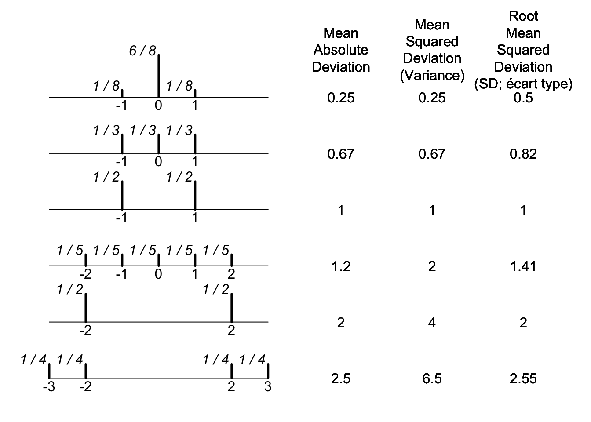
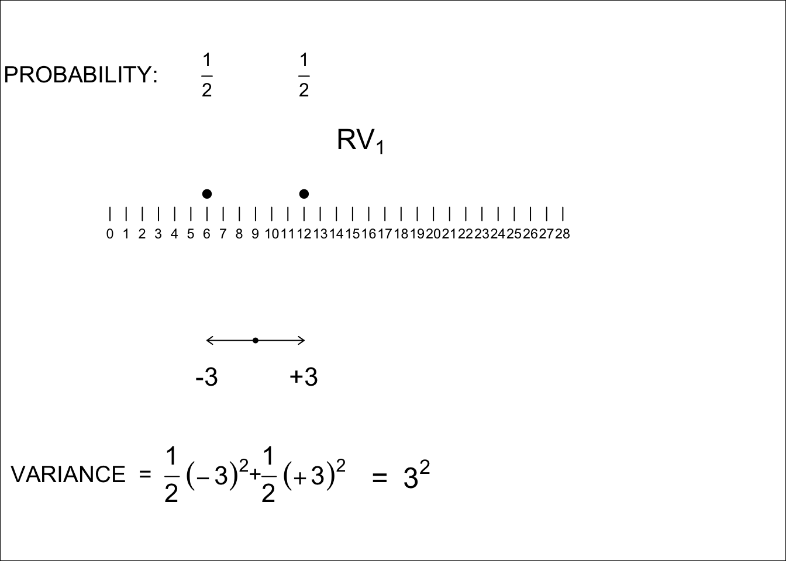

# Random Variables {#randomVariables}

\newcommand{\Var}{\operatorname{Var}}
\newcommand{\Expec}{\operatorname{E}}
\newcommand{\Prob}{\operatorname{P}}


## Objectives

::: {.rmdnote}
This **central** chapter addresses a **fundamental concept**, namely the **variance of a random variable**. It gives the laws governing the variance of a sum of 2, or (especially) $n$ random variables  -- and even more importantly -- the laws governing **the variance of a difference of two random variables.** The latter is  central, not just to simple contrasts involving 2 sample means or proportions, but also in the much wider world of regression, since the variance (sampling variability) of any regression slope can be viewed as the **variance of a linear combination of** random errors, or random deviations, or **random variables**.   So, if there is one master formula to pay attention to and to own, it is the one for the variance of a linear combination of random variables. All others are special cases of this.
:::


So, the **specific objectives** are to truly understand

* the concept of  a random variable.

* the concept of the expectation and variance of a random variable.

* why it is that, when dealing with the sum  of two or more independent random variables, it is not their standard deviations that sum (add), but rather their variances.

* likewise, when dealing with the **difference**  of two independent random variables, or some **linear combination** of $n$ independent random variables involving positive and negative weights, why it is that **the component variances add**, and **with what weights**. 

## Random Variables

Recall the definition of a random variable:

:::{.definition name="Random variable"}
A random variable refer to numerical values, typically the outcome of an observation, a measurement, or a function thereof.
::: 

<br>


Let's review the two types of random variables that we will focus on in this course. 

:::{.definition name="Discrete Random Variable"}
A random variable that assumes only a finite (or countably infinite) number of distinct values. Discrete random variables have a finite or countably infinite number of possible values, each with positive or zero probability.
:::


<br>

:::{.definition name="Probability mass function"}
The probability mass function (PMF) of a discrete random variable $Y$ provides the possible values $y$ and their associated probabilities by $\Prob(Y=y)$. The sum of all probabilities must sum to 1, i.e. $\sum_{y} \Prob(Y=y) = 1$. 
:::

<br>
  
 
:::{.definition name="Continuous Random Variable"}
A random variable is continuous if both of the following apply:  
1. Its set of possible values consists either of all numbers in a single interval on the number line (possibly infinite in extent, e.g., from $-\infty$ to $\infty$) or all numbers in a disjoint union of such intervals (e.g., [0,10] ${\displaystyle \cup }$ [20, 30]).  
2. No possible value of the variable has positive probability, that is, $\Prob(X = c)$ = 0 for any possible value $c$.
:::

<br>


:::{.definition name="Probability density function"}
Let $Y$ be a continuous random variable. Then a probability distribution or probability density function (pdf) of $Y$ is a function $f(y)$ such that for any two numbers $a$ and $b$ with $a \leq b$,

$$ \Prob(a \leq Y \leq b) = \int_a^b f(y) \partial y\;.$$
That is, the probability that $Y$ takes on a value in the interval $[a, b]$ is the area
above this interval and under the graph of the density function, as illustrated
in Figure \@ref(fig:dens). The graph of $f(y)$ is often referred to as the density curve.

<div class="figure">

<p class="caption">(\#fig:dens)$\Prob(a \leq Y \leq b)$ = the area under the density curve between $a$ and $b$.</p>
</div>
:::


<br>

Although any interval on the number line contains an infinite number of numbers, it can be shown that there is no way to create an infinite listing of all these values - there are just too many of them. The second condition describing a continuous random variable is perhaps counterintuitive, since it would seem to imply a total probability of zero for all possible values. As we will see in the Chapter on specific types of continous random variables, intervals of values have positive probability; the probability of an interval will decrease to zero as the width of the interval shrinks to zero.

One might argue that although in principle variables such as height, weight,
and temperature are continuous, in practice the limitations of our measuring
instruments restrict us to a discrete (though sometimes very finely subdivided)
world. However, continuous models often approximate real-world situations very
well, and continuous mathematics (the calculus) is frequently easier to work with
than the mathematics of discrete variables and distributions.


## Expectation of a Random Variable

### Discrete Random Variable

:::{.definition name="Expected value of a discrete random variable"}
Let $Y$ be a discrete random variable with set of possible values $D=\left\lbrace y_1, y_2, \ldots,y_k  \right\rbrace$ and corresponding probabilities for each value, e.g., $y_1$ with probability $\Prob(y_1)$, $y_2$ with probability $\Prob(y_2)$, $y_3$ with probability $\Prob(y_3)$, $\ldots$, $y_k$ with probability $\Prob(y_k)$, then the expected value of the random variable $Y$ is:

$$\operatorname{E}(Y) =  \sum_{y \in D} y \times \operatorname{P}(y)\;.$$
This expected value will exist provided that $\sum_{y \in D} |y| \cdot \Prob(y) < \infty$.
:::

$\Expec(Y)$ is a mean that uses expected (i.e. unobservable or theoretical or long run) relative frequencies $\Prob(\cdot)$. Whereas $\bar{y}$ uses observed relative frequencies. You can think of $\Expec(Y)$ as center of mass of $\Prob(\cdot)$.

### Continuous Random Variable

:::{.definition name="Expected value of a continuous random variable"}
The expected value of a continuous random variable $Y$ with probability density function $f(y)$ is 
$$ \Expec(Y) = \int_{-\infty}^\infty y \cdot f(y) \partial y \;.$$
This expected value will exist provided that $\int_{-\infty}^\infty |y| \cdot f(y) \partial y < \infty$.
:::

<br>

### Why should we care about the expectation?

The expectation acts as a mean for a variable that has a conception repetition or an infinite sample size. The expected value of a random variable will usually be in terms of population parameters. We present some examples of where the expected value of a random variable is a quantity of interest.

:::{.example}
Suppose, for example, that the death rate in any year is 1 out of every 1000 people,
and that another 2 out of 1000 suffer some kind of disability. Then we can display the
probability model for this insurance policy as shown in Table \@ref(tab:probs-example)

To see what the insurance company can expect, imagine that it insures exactly 1000
people. Further imagine that, in perfect accordance with the probabilities, 1 of the
policyholders dies, 2 are disabled, and the remaining 997 survive the year unscathed.
The company would pay $10,000 to one client and $5000 to each of 2 clients. That's
a total of $20,000, or an average of 20000/1000 = $20 per policy.  Since it is charging people $50 for the policy, the company expects to make a profit of $30 per customer. Not bad!

We can't predict what will happen during any given year, but we can say what we expect to happen. To do this, we (or, rather, the insurance company) need the probability model (PMF). The expected value of a policy is a parameter of this model. In fact, it's the mean. This isn't an average of some data values, so we won't estimate it. Instead, we assume that the probabilities are known and simply calculate the expected value from them. How did we come up with $20 as the expected value of a policy payout?
:::

<table class="table" style="margin-left: auto; margin-right: auto;">
<caption>(\#tab:probs-example)Probability mass function for insurance policy</caption>
 <thead>
  <tr>
   <th style="text-align:left;"> Policyholder outcome </th>
   <th style="text-align:right;"> Payout y </th>
   <th style="text-align:left;"> Probability P(Y=y) </th>
  </tr>
 </thead>
<tbody>
  <tr>
   <td style="text-align:left;"> Death </td>
   <td style="text-align:right;"> 10000 </td>
   <td style="text-align:left;"> 1/1000 </td>
  </tr>
  <tr>
   <td style="text-align:left;"> Disability </td>
   <td style="text-align:right;"> 5000 </td>
   <td style="text-align:left;"> 2/1000 </td>
  </tr>
  <tr>
   <td style="text-align:left;"> Neither </td>
   <td style="text-align:right;"> 0 </td>
   <td style="text-align:left;"> 997/1000 </td>
  </tr>
</tbody>
</table>


<br>


:::{.example name="Expected number of children in a household"}
For the table shown below, the expected value is 2.49 children per household
:::

<table class="table" style="margin-left: auto; margin-right: auto;">
 <thead>
  <tr>
   <th style="text-align:right;"> Number of children </th>
   <th style="text-align:right;"> Proportion of households </th>
   <th style="text-align:right;"> Product </th>
  </tr>
 </thead>
<tbody>
  <tr>
   <td style="text-align:right;"> 1 </td>
   <td style="text-align:right;"> 0.335 </td>
   <td style="text-align:right;"> 0.335 </td>
  </tr>
  <tr>
   <td style="text-align:right;"> 2 </td>
   <td style="text-align:right;"> 0.245 </td>
   <td style="text-align:right;"> 0.490 </td>
  </tr>
  <tr>
   <td style="text-align:right;"> 3 </td>
   <td style="text-align:right;"> 0.180 </td>
   <td style="text-align:right;"> 0.540 </td>
  </tr>
  <tr>
   <td style="text-align:right;"> 4 </td>
   <td style="text-align:right;"> 0.126 </td>
   <td style="text-align:right;"> 0.504 </td>
  </tr>
  <tr>
   <td style="text-align:right;"> 5 </td>
   <td style="text-align:right;"> 0.072 </td>
   <td style="text-align:right;"> 0.360 </td>
  </tr>
  <tr>
   <td style="text-align:right;"> 6 </td>
   <td style="text-align:right;"> 0.031 </td>
   <td style="text-align:right;"> 0.186 </td>
  </tr>
  <tr>
   <td style="text-align:right;"> 7 </td>
   <td style="text-align:right;"> 0.009 </td>
   <td style="text-align:right;"> 0.063 </td>
  </tr>
  <tr>
   <td style="text-align:right;"> 8 </td>
   <td style="text-align:right;"> 0.002 </td>
   <td style="text-align:right;"> 0.016 </td>
  </tr>
</tbody>
</table>

<br>


:::{.example name="Unbiased Estimator"}
A point estimator $\widehat{\theta}$ is said to be an unbiased estimator of $\theta$ if 
$$\Expec(\widehat{\theta}) = \theta\;,$$ for every possible value of $\theta$.  

For example, let $\hat{p}$ be the proportion of successes in a sample of $n$ individuals. Then $\Expec(\hat{p}) = \pi$ where $\pi$ is the population proportion of successes. Therefore, $\hat{p}$ is an unbiased estimator of $\pi$.
:::


## Expected value of a function of a random variable

:::{.definition name="Expected value of a function of a discrete random variable"}
Let $Y$ be a discrete random variable with set of possible values $D=\left\lbrace y_1, y_2, \ldots,y_k  \right\rbrace$ and corresponding probabilities for each value, e.g., $y_1$ with probability $\Prob(y_1)$, $y_2$ with probability $\Prob(y_2)$, $y_3$ with probability $\Prob(y_3)$, $\ldots$, $y_k$ with probability $\Prob(y_k)$. Furthermore, let $g(Y)$ be some real-valued function of $Y$. Then the expected value of $g(Y)$ is:

$$\operatorname{E}(g(Y)) =  \sum_{y \in D} g(y) \times \operatorname{P}(y)\;.$$
i.e. it is a weighted mean of the $g(y)$'s, with $\Prob(y)$'s as weights.
:::


:::{.rmdnote}
In some instances, the expectation of $g(Y)$ is $g(\Expec(Y))$, while in others it is more complex. Can you figure out when it is/is not in each of the following instances?
:::

### Examples

   + $Y$ = Noon Temperature (C) in Montreal on a randomly selected day of the year;  
$g(Y)$ = Temperature (F) = 32 + (9/5) $Y$

   + $Y$ = Weight in Kg (or Height in cm) of a randomly selected person;  
g(Y) = Weight in Kg (or Height in inches)

   + $Y_1$ and $Y_2$ are two random variables that might or might not be related;  
.  
if $g(Y_1, Y_2) = Y_1 + Y_2,$ then  $E[g(Y_1, Y_2)] = E[Y_1] + E[Y_2].$  
.  
if $g(Y_1, Y_2) = \frac{Y_1 + Y_2}{2},$  then $E[g(Y_1, Y_2)] = \frac{E[Y_1] + E[Y_2]}{2},$  
.  
and, by analogy, for a sum or mean of $n$ related or unrelated random variables.

   + $Y$ = diameter of a randomly chosen sphere;  
$g(Y)$ = Volume of sphere = $\frac{\pi}{6}  Y^3.$

   + $Y$ = fuel consumption, in liters/100km, of  a randomly selected make of car;  
$g(Y)$ =  miles per gallon or Km per liter (reciprocal)

   + $Y$ =  which of 3 [**unequally spaced elevators**](http://www.medicine.mcgill.ca/epidemiology/hanley/Reprints/median-elevator.pdf) shows up next.  
$\Prob$(it is #1) = $\Prob$(it is #2) = $\Prob$(it's #3) = 1/3.  
.  
$g(Y)$ = Distance to elevator. How to mimimize E(distance)?  
.  
$g(Y)$ = **Squared Distance** to elevator. How to mimimize E($g(Y)$)?  


   + Random Variable Y with Expectation or Mean $\mu$  
$g(Y) = (Y - \mu)^2$, the **squared deviation from the mean**


## Variance (and thus, SD) of a random variable

### Definitions

:::{.definition name="Variance"}
The variance of the random variable $Y$ is given by $$\Expec[(Y - \mu)^2].$$ 
It is usually shortened to $\Var(Y)$.

It, and its positive square root, called the _standard deviation_ of $Y$, or SD($Y$), are two of the most commonly used measures of variability or spread or uncertainty.
:::

*  Computationally, $\Var(Y) = \Expec[(Y - \mu)^2]$ = $\sum(y - \mu)^2 \times f(y),$ or **Mean Squared Deviation**, and

* Standard Deviation, SD($Y) = \sqrt{(\Var(Y)}= \sqrt{\Expec[ (Y — \mu)^2]},$ or **Root Mean Squared Deviation**

* In **French**, the Standard Deviation is called [**écart type**](https://fr.wikipedia.org/wiki/Écart_type).  
This [French->English dictionary](http://www.french-linguistics.co.uk/dictionary/type.html) translates (the noun) `écart` as space, gap, distance between objects, interval, gap between dates, difference between numbers. The adjective `type` translates as typical, standard. This adjective better describes the meaning than 'standard' does. See here for the **history of the term** [`standard` deviation](https://en.wikipedia.org/wiki/Standard_deviation#History). 

In Figure \@ref(fig:ecart), graphically and numerically illustrated, are three (of the many) ways to measure the variability of a random variable.

<div class="figure" style="text-align: center">

<p class="caption">(\#fig:ecart)6 symmetrically distributed random variables, and 3  ways of measuring their spreads about a common mean. [After Mosteller, Rourke and Thomas. Probability with statistical applications 2nd Ed, p205] </p>
</div>

In practice, the mean absolute deviation is often quite close to the SD, and certainly easier to explain to explain to non-statisticians. However, when computing was by hand and laborious, it took two passes through the data to compute it, whereas, the SD could be computed in one.  


:::{.example name="Variance and SD of number of children <= 12 years in households with at least 1 such child"}
The calculation are shown in the Table below
:::

<table class="table" style="margin-left: auto; margin-right: auto;">
 <thead>
  <tr>
   <th style="text-align:right;"> # children </th>
   <th style="text-align:right;"> deviation </th>
   <th style="text-align:right;"> deviation^2 </th>
   <th style="text-align:right;"> P(y) </th>
   <th style="text-align:right;"> product </th>
  </tr>
 </thead>
<tbody>
  <tr>
   <td style="text-align:right;"> 1 </td>
   <td style="text-align:right;"> -1.494 </td>
   <td style="text-align:right;"> 2.232036 </td>
   <td style="text-align:right;"> 0.335 </td>
   <td style="text-align:right;"> 0.7477321 </td>
  </tr>
  <tr>
   <td style="text-align:right;"> 2 </td>
   <td style="text-align:right;"> -0.494 </td>
   <td style="text-align:right;"> 0.244036 </td>
   <td style="text-align:right;"> 0.245 </td>
   <td style="text-align:right;"> 0.0597888 </td>
  </tr>
  <tr>
   <td style="text-align:right;"> 3 </td>
   <td style="text-align:right;"> 0.506 </td>
   <td style="text-align:right;"> 0.256036 </td>
   <td style="text-align:right;"> 0.180 </td>
   <td style="text-align:right;"> 0.0460865 </td>
  </tr>
  <tr>
   <td style="text-align:right;"> 4 </td>
   <td style="text-align:right;"> 1.506 </td>
   <td style="text-align:right;"> 2.268036 </td>
   <td style="text-align:right;"> 0.126 </td>
   <td style="text-align:right;"> 0.2857725 </td>
  </tr>
  <tr>
   <td style="text-align:right;"> 5 </td>
   <td style="text-align:right;"> 2.506 </td>
   <td style="text-align:right;"> 6.280036 </td>
   <td style="text-align:right;"> 0.072 </td>
   <td style="text-align:right;"> 0.4521626 </td>
  </tr>
  <tr>
   <td style="text-align:right;"> 6 </td>
   <td style="text-align:right;"> 3.506 </td>
   <td style="text-align:right;"> 12.292036 </td>
   <td style="text-align:right;"> 0.031 </td>
   <td style="text-align:right;"> 0.3810531 </td>
  </tr>
  <tr>
   <td style="text-align:right;"> 7 </td>
   <td style="text-align:right;"> 4.506 </td>
   <td style="text-align:right;"> 20.304036 </td>
   <td style="text-align:right;"> 0.009 </td>
   <td style="text-align:right;"> 0.1827363 </td>
  </tr>
  <tr>
   <td style="text-align:right;"> 8 </td>
   <td style="text-align:right;"> 5.506 </td>
   <td style="text-align:right;"> 30.316036 </td>
   <td style="text-align:right;"> 0.002 </td>
   <td style="text-align:right;"> 0.0606321 </td>
  </tr>
</tbody>
</table>


**Which is primary, Standard Deviation or Variance?**

* Although we first define variance and then take the square root to reach the SD, we should think of the SD as primary, at least for descriptive purposes. For example, the Total Fertility Rate which measures the average number of children per woman is just below 2.5 children per woman. Suppose the variation from country to country had a standard deviation of 1.2 and a variance of 1.44. It would be awkward to say the variance was 1.44 square children per square woman.

However, there are _good mathematical reasons_ to work with variance.

### Why use the variance?

#### Additivity

The variance of the sum of two independent random variables is the sum of their variances, and even when the two variables are dependent the variability of their sum has a simple formula. SD's dont add; their squares do. Or to quote the physicists, errors '**Errors add in quadrature**, like the lengths of the sides of Pythagoras' triangle. It took mathematicians a long time to discover, this, and some of the blunders along the way are told in a fascinating chapter in this very readable book [The Seven Pillars of 
Statistical Wisdom](https://www-degruyter-com.proxy3.library.mcgill.ca/view/title/521193).  


#### The Central Limit Theorem

The limiting behavior of a random variable that is the sum of a large number of independent random variables depends on the variances of these random variables.


## Variance and SD of a function of a random variable

If we go back to some of the  examples listed above we can reason out what the law must be:

   + $Y$ = Noon Temperature (C) in Mtl on a randomly selected day of the year;  $g(Y)$ = Temperature (F) = 32 + (9/5) $Y$  
If the SD was say 10 C, then surely the SD is 18 F. After all, Temperature is Temperature, so you are not changing the fundamental variable, but rather changing the scale of the temperature variable. So, the SD scales up by 9/5, and so, being an average square, the variance scales up by $(9/5)^2$. If you are going the other way, from the larger F scale to the smaller C scale, the scalings are (5/9) for the SD, and $(5/9)^2$ for the variance. More generally,  
$$SD[constant  \times RV] = constant  \times SD[RV] $$  
$$Var[constant  \times RV] = constant^2  \times Var[RV]$$

This example also shows another law related to spread: shifting left or by a constant amount (eg. suppose the conversion was $F = 10 + (9/5)C$ instead of was $F = 32 + (9/5)C,$ it would not alter the spread. Thus,

$$SD[ RV + constant ] = SD[RV]$$  
$$Var[ RV + constant ] = Var[RV]$$

   + $Y$ = Weight in Kg (or Height in cm) of a randomly selected person;  g(Y) = Weight in Kg (or Height in inches). This involves just a scaling, with no shift. So if the SD were 10 Kg, it would be 22 lbs, and the variances in the 2 scales would be $100 \ Kg^2$ and $484 \ lb^2$.

   + $Y$ = Years of publication of all the books in the McGill Library, with Years measured from AD (Anno Dominini, 'in the year of the Lord'). The SD would be the same if we measured the Year from 1439 AD ($W = Y$ - 1439) when Gutenberg  was the first European to use movable type, or from 1492 AD when Christopher Columbus reached North America.  What if, instead, we calculated the age of each book in the year 2020, i.e. as $W = 2020 - Y$?  The scale would now be reversed. Instead of being at the extreme left, the older books would not be at the right hand of the scale, and vice versa. But the spread would still be the same, even though the shape of the new distribution would be the mirror image of the old one. What if we measured age in decades, i.e., $W = \frac{2020 - Y}{10}$ or centuries i.e., $W = \frac{2020 - Y}{100}$? The SDs would be scaled down by 10 and by 100, and the variances by $10^2$ and $100^2.$

   + $Y$ = Ocean Depth at a randomly chosen location, measured in metres. If the origin is the ocean floor, all depths will be positive; if it is the surface of the ocean, they will all be negative. The spread, the SD and the Variance stay the same, but the shapes of the distributions are mirror images of each other. 

   + $Y$ = diameter of a randomly chosen sphere; $g(Y)$ = Volume of sphere = $\frac{\pi}{6}  Y^3.$  This one is more complicated -- as you might have guessed from just trying to compute the expectation. The fact that the scaling is different at different values of $Y$ complicates matters. There is an approximate formula, that depends on the scaling at some 'representative' value of $Y$, typically the mean or mode. For more on this, see the examples in this [expository piece](http://www.medicine.mcgill.ca/epidemiology/hanley/Reprints/jh_dt_tas_2006.pdf).  

   + $Y$ = fuel consumption, in liters/100km, of  a randomly selected make of car; $g(Y)$ =  Km per liter (reciprocal). There is no exact closed form, but the approximation works well because the values are well away from zero, and not too spread out.

## Sums, means, differences of random variables

### A sum of 2 or $n$ random variables

To keep it simple, and to allow us to see what is going on, let's consider two very simple random variables (RV's), each taking just 2 values, and with equal probabilities. You can check for yourself later that the same law applies to random variables that take on more than 2 values, and with uneven probability distributions. The key is that the 2 variables are _independent_ of each other.

Figures \@ref(fig:var1) and \@ref(fig:var2) show the two RV's.  $RV_1$ \ (6 \ or \ 12) \ and \ $RV_2$ \ (8 \ or \ 16)

$$Sum = RV_1 \ (6 \ or \ 12) \ + \ RV_2 \ (8 \ or \ 16) \ = \ 14 \ or \ 20 \ or \ 22 \ or \ 28.$$  
We will come back much later to the choices of the specific values for each of the random variables; for our purposes here, the main point is that both equally-likely values are an even number apart, so the SDs are integers, and all calculations involve integers. Note that an RV with equally likely values 1 and 7 (or 3 and 9, or -1 and + 5) has the same SD as the RV with equally likely values 6 and 12: it is the _distance between them_ that determines the SD. Note also, that with half of the values at one extreme and half at the other, all values are exactly one SD from the mean. 


<div class="figure" style="text-align: center">

<p class="caption">(\#fig:var1)Variance of RV1</p>
</div>

<div class="figure" style="text-align: center">

<p class="caption">(\#fig:var2)Variance of RV2</p>
</div>

We now imagine taking a random value of $RV_1$ and  a random value of $RV_2$ and summing them. There are 4 possible sums, and in this case they are all distinct (this isn't always   be the case, but the values of the two RV's in _this example_ were deliberately chosen to make them all distinct, and to avoid grouping RV combinations with the same sum.) A probability tree (next panel) helps to see the 4 possibilities, but here we add an extra feature: we let the lengths of the branches denote the values of the RVs. 

In our example, the 4 equally likely sums are 14, 20, 22 and 28, and their mean is $\frac{14+20+22+28}{4} = 21.$ That the mean (expected value) of the sum equals the sum of the 2 individual means or expected values, is hardly surprising (it is even true if the 2 RV's were not independent). The 4 equally likely deviations from this 21 are -7, -1, +1, and +7, and so, from 1st principles, the Variance of the sum of the 2 RVs is 
$$\frac{(-7)^2 + (-1)2 +  (+1)^2 +  (+7)^2}{4} = \frac{100}{4} = 25.$$  
Thus, the SD of the sum of the 2 RVs is $\sqrt{25}$ = 5.

Fortunately, we don't have to go back to 1st principles to calculate the SD of the sum of 2 RVs -- but we do NOT do so by adding the 2 SDs. It is the **variances** that add.


<div class="figure" style="text-align: center">

<p class="caption">(\#fig:unnamed-chunk-6)Variance (and thus SD) of the SUM of the two independent random variables, RV1 and RV2, shown above. Each of the 4 equally likely deviations of the sum from its expectation is decomposed into its 2 components. This, (by the expansion rule for (a+b) squared that you learned in high school), each squared deviation becomes a sum of 2 squares, and a 'cross-product'. But the 4 cross-products cancel each other, and you are left with the sums of two squares, the original 3-squared and the  original 4-squared, i.e. the variances of RV1 and RV2.</p>
</div>


Whereas one numerical example doesn't prove the the variances of a sum of independent RVs is the sum of their variances rule, you can check out other more complicated examples with more values, and uneven distributions -- or use simulation -- and satisfy yourself that it is a general rule. Indeed, the formal mathematical statistics proof uses the exact same method as that used in the panel, except that it replaces each number by a symbol. So we can sum up the forgoing numerical example by saying:

$$ SD_1 = 3; SD_2 =4;\  but \ SD[Sum] \ \ne \ 3 + 4. \ \ \  SD[Sum] \ = \ \sqrt{3^2 + 4^2} = 5.$$  

Now you can see why mathematical statisticians like to work with squared SD's. And you can see why we chose the nice variance values 3 and 4. Just like for the right-angled triangles in Pythagoras' theorem, where the length of the hypotenuse is the square root of the squares of the lengths of the sides, so it is also with orthogonal or independent random variables: the SD of their sum is the square root of the sum of the squared SD's of the individual RVs.

Since the theorem works for the sum of 2 independent RV's, it also works for the sum of 3, and for the sum of $n$ such RVs.

### Measurement Errors

These are an important issue in the non-experimental -- and even the experimental -- sciences. The simplest case (called the **'classical' error model**) is where the errors are independent of the true value, so that the **variance in the observed (error-containing) values is the sum of the variance of the 'true' (errorless) values, and the variance of the errors.**

Even though many people think that random measurement errors **cancel out**, especially in large datasets, **they do not**. Even when they affect the $Y$ on the left side side of a regression model, they add 'noise' to the slope estimates. But when they affect an $X$ on the right hand side of a regression model, or even a correlation, their effects are  more  insidious. See for example, pages 19-21 of [these Notes](http://www.medicine.mcgill.ca/epidemiology/hanley/bios601/hw_measurement2019.pdf#page=19) and exercises 6, 8, 9, 18 and 21 that follow.

The other measurement error model, called 'Berkson' error, described [here:](http://www.medicine.mcgill.ca/epidemiology/hanley/bios601/Surveys/EffectsXerrorsNotesFromALM.pdf), is less common, and has less nasty effects.

The following diagram shows the classical error model, and one of the important metrics to measure the extent of the error, namely the **intra-class correlation coefficient**. The 'ICC' is relevant no matter whether the variable is on the left or right had side of the regression model. Even though we named the random variable $Y$, it does not mean that measurement issues apply only to $Y$ variables. In fact, errors in $X$ variables have nastier effects. We chose the name $Y$ because we don't treat an errorless $X$ in a regression model as a random variable, and we are seldom interested in inferences regarding it!


<div class="figure" style="text-align: center">

<p class="caption">(\#fig:unnamed-chunk-7)Random Measurement Error (E) added to a Random Variable. On the left is the distribution of a Random Variable Y, with each stickfigure representing a very large number of individuals. On the right is the distribution of the Random Variable Y', where Y' = Y + E, and E is independent of Y, and has a 2-point distribution, namely -0.5 and +0.5, with equal probabilities. (Here, the provenance/origin of each Y' value is shown by its colour, but in practice we would not have that luxury of knowing what the 'true' [errorless] value was). This is the variation we get to observe/measure. Of the variance of 1.93, some  1.68 of it is 'real'/'genuine', and the remainder, 0.25 is measurement error. The genuine variance of interest, 1.68, expressed as a proportion of the observable variance 1.93, namely 1.68/(1.68 + 0.25) = 0.87 or 87%. The proportion that is real is called the INTRA-CLASS CORRELATION (ICC) or intra-class correlation coefficient, and is an important indicator of the quality of the measurement of Y.</p>
</div>

**The concept of an ICC depends on the law that 'variances add.'**


### Mean of 2 or $n$ random variables

AND, if we know how to compute the  SD of a SUM of $n$ independent RV's, we then automatically know  how to compute the  SD of a MEAN of $n$ independent RV's. Recall from an earlier example, the SD of a set of temperatures measured in the larger degrees F scale: then the
SD of the same set of temperatures measured in the smaller degrees C scale is just 5/9ths of the one in the F scale.

Going from a **sum** of $n$ RVs to a **mean** of $n$ RVs involves going to a scale that is (1/n)-th the spread of the sum scale.

So, in the above example, with $n$ = 2, the SD of the mean of the 2 RVs is (1/2) the SD of the sum, i.e.,

$$ SD\bigg(\frac{RV_1 +RV_2}{2}\bigg) = \frac{SD(RV_1+RV_2)}{2} = \frac{5}{2}.$$


**SPECIAL CASE** (quite common) where **SDs are identical**:

Up to now, to keep things general, we used $n$ non-identical -- but independent -- random variables. If we
consider the Variance and the sum of $n$ IDENTICAL -- and independent -- random variables,  so the $n$ Variances (each abbreviated to Var) are all equal, the laws simplify

First, since the variances add, we have that

$$ \Var(RV_1 + RV_2 + \dots + RV_n) = \Var_1 + \Var_2 + \dots + \Var_n = n \times \ each \ \Var.$$

and so, taking square roots,

$$ SD( \ RV_1 + RV_2 + \dots + RV_n \ ) = \sqrt{ \ n \times \ each \ \Var} = \sqrt{n} \ \times \ each \ SD$$

When we go from **sum** of $n$ IDENTICAL independent RVs to a **mean** of $n$ IDENTICAL RVs, we go to a scale that is (1/n)-th the spread of the sum scale. So, again, just as when we went from the larger degrees F scale to the smaller degrees C scale, we have

$$ SD\bigg(\frac{RV_1 + RV_2 + \dots + RV_n}{n}\bigg) = \frac{\sqrt{n} \ \times \ each \ SD}{n} = \frac{common \ SD}{\sqrt{n}} .$$
Sometimes, we will need to work with variances. When we do, we use this law: 

$$ \Var\bigg(\frac{RV_1 + RV_2 + \dots + RV_n}{n}\bigg) = \frac{common \ \Var}{n} .$$


:::{.example name="Lengths of words in a book"}
The number of dashes in of each row in the first panel of Figure \@ref(fig:bookA) is the number of letters in a randomly selected word from the book: dashes are for better visibility. The words (rows) are sorted by length, form shortest to longest.  One cannot judge the full distribution just from this limited set, but (even though shape doesn't matter much in the big scheme of things) you get a sense of its shape. In the entire  book, the mean word length is about 4.5 letters, and the SD is
2.4 letters. (The fact that the distance between the minimum word length (1 letter) and the mean word length is less than 2 SDs hints that the full distribution has a long right tail.) 

In each row in the colored panels, some  4 (or 9) randomly sampled words are (like Galton's peas) pushed right up against each other, without spaces, and shown in  a mono-spaced font, so that where the 'line' ends indicates the total number of letters in the 4 (9) words. Since this small number of rows (possibilities) is too small to give a good sense of the sampling distribution, the smooth purple histograms were calculated exactly. 
:::

<div class="figure" style="text-align: center">

<p class="caption">(\#fig:bookA)Illustrations of SD's of Sums and Means of n = 1, 4 and 9 independent and identically distributed random variables. Each RV is the length of a randomly selected word from a certain book. [Below, we will compare the mean word length in this book with the mean in a book by a competitor]. The distributions in purple were computed theoretically, using convolutions. Each row shows 1 'realization' of each of the  n random variables, with each word in a different color. The rows are sorted according to the values of the total [or mean] numbers of letters (chars) in the sample of n words. In the panels where n is 4 or 9, the leftmost n-1 characters of the n concatenated words are cropped, but the total/mean length  is correct. The top panel lists the 'per word' variation of all of the words in the book, and its SD, sometimes called the 'unit' variability. You can also think of the length of each unit as the mean of a sample of size n = 1. The second panel shows that to reduce the sampling variation (the SD) of the mean by half, one needs to quadruple the n. The third panel shows that to reduce the sampling variation (the SD) to 1/3, one needs to multiply the n by 9. Note, in passing, that at $n$ = 9, via the Central Limit Theorem, and the fact that the original distribution is 'CLT friendly' (the mode is not at either extreme, and the tails don't extend indefinitely), the shape of the sampling distribution is already close to Gaussian.</p>
</div>

As you would have expected, the  purple **sampling distributions  narrow with increasing sample size**, but the narrowing is **not by a factor of $n$,** but by a **factor of $\sqrt{n}$.** All the billions of _possible means_ of samples of size $n$ = 4
_would have_ a SD of 2.4/$\sqrt{4}$ = 2.4/2 = 1.2. The _possible means_ of samples of size $n$ = 9 _would have_ a SD of 2.4/$\sqrt{9}$ = 2.4/3 = 0.8.
**Note the careful choice of the words** in _italics_: in reality, you will only observe **one** of the billions of possibilities, so the sampling distribution is _imaginary_ and thus the SD is also _imaginary_ and so the SD of the **conceptual** sampling distribution is (_would be_) an _imaginary_ 1.2 or 0.8. The only reason we are able to show the purple distributions is because of the laws of statistics, applied to all the words in the book, so we know the mean and the unit SD.


### Difference of 2 Random Variables


To keep it simple, let's consider the two very simple random variables (RV's), each taking just 2 values, and with equal probabilities, and independent of each other. But suppose now that we are interested in their difference


$$Difference = RV_1 \ (6 \ or \ 12) \ - \ RV_2 \ (8 \ or \ 16) \ = \ -10 \ or \ -4 \ or \ -2 \ or \ +4.$$  

Now, imagine taking a random value of $RV_1$ and  subtracting from it a random value of $RV_2$. There are 4 possible differences, and in this deliberately constricted example, they are all distinct. A probability tree (next panel) helps to see the 4 possibilities, and the lengths of the branches denote the values of the RVs.

The 4 equally likely differences are -10, -4, -2 and +4, and so their mean is $\frac{-10 -4 -2 +4}{4} = -3.$ That the mean (expected value) of the difference equals the difference of the 2 individual means or expected values, is hardly surprising (and it is even true if the 2 RV's were not independent). The 4 equally likely deviations from this -3 are -7, -1, +1, and +7, and so, **from 1st principles**, the **Variance of the difference of the 2 RVs is** 
$$\frac{(-7)^2 + (-1)2 +  (+1)^2 +  (+7)^2}{4} = \frac{100}{4} = 25.$$  
Thus, the **SD of the difference of the 2 RVs is** $\sqrt{25}$ = 5.

Fortunately, we don't have to go back to 1st principles **to calculate the SD of the differences of 2 RVs -- but we do NOT do so by adding the 2 SDs**. IT IS THE VARIANCES THAT ADD! 

<div class="figure" style="text-align: center">

<p class="caption">(\#fig:unnamed-chunk-10)Variance (and thus SD) of the DIFFERENCE, RV1 - RV2, of the two independent random variables, RV1 and RV2, shown above. Each of the 4 equally likely deviations of the difference from its expectation is decomposed into its 2 components. Each each squared deviation becomes a sum of 2 squares, and a 'cross-product'. But the 4 cross-products cancel each other, and you are left with the SUMS of two squares, the original 3-squared and the  original 4-squared, i.e. the variances of RV1 and RV2.</p>
</div>


Again one numerical example doesn't prove the 'the variances of a difference of two independent RVs is the sum of their variances' rule, but you can check out other more complicated examples with more values, and uneven distributions -- or use simulation -- and satisfy yourself that it is a general rule.

So we can sum up the forgoing numerical example by saying:

$$ SD_1 = 3; SD_2 =4;\  but \ SD[Difference] \ \ne \ 3 + 4. \ \ \  SD[Difference] \ = \ \sqrt{3^2 + 4^2} = 5.$$  
It turns out that, from what we already knew about the sum of 2 independent RVs, we have anticipated this law. We didn't need to go through all the formulae from scratch again.  The reason had to do with the 'mirror image' distributions, such as the depths of the ocean, we saw above. The spread (SD, or variance) is the same, whether one writes/reads/computes from left to right, or right to left! In other words, the variance of the random variable $-RV_2$ is the same as that of the random variable $RV_2.$ So, by writing $RV_1 - RV_2$ as a sum, and using the law for the variance of a sum, we arrive at 
$$Var[RV_1 - RV_2] = Var[RV_1 + (-RV_2)] = Var[RV_1] + Var[(-RV_2)] = Var[RV_1] + Var[RV_2].$$


:::{.example name="Difference in mean length of words in books A (in blue) and B (in red)"}

<div class="figure" style="text-align: center">

<p class="caption">(\#fig:unnamed-chunk-11)Differences in  mean lengths of  n randomly selected words from each of 2 books. The (sampling) distributions were computed theoretically, using convolutions.</p>
</div>

:::

## Linear combinations of random variables (regression slopes)

In _non-experimental_ research especially, the focus is typically on a fitted regression slope/coefficient, rather that on the simple difference 
$\bar{y}_1$ - $\bar{y}_0$ between the means of the $y$s observed at each of two investigator-chosen values ($X=1$ and $X=0$) of the determinant ($X$) being studied. 

Even if the estimator  does not have a closed form, the fitted slope(s)/coefficient(s) are linear combinations of the $y$'s and the $x$'s. Thus, since each of the $n$ $y$'s contains a random element, the slope ($\hat{\beta}$) is an $x$-based linear combination of $n$ random variables.

Thus one can view all variances (and thus all standard errors) in a unified way, and not have to learn separate laws for separate chapters. To see how this unified view avoids the typical 'silo' approach to statistical tecnniques, see [Sample Size, Precision and Power Calculations: A Unified Approach](http://www.medicine.mcgill.ca/epidemiology/hanley/Reprints/UniversalSampleSize.pdf). [Software developers who thrive on separate 'niche' markets are threatened by this parsimonious approach, just as are those who write 800-page textbooks with separate chapters for t-tests,l proportions, regression, multiple regression, logiostic regression, Cox regression, survival analysis,etc.]    

In the past, when first introduced to simple linear regression, it was common to learn the estimator formula and the Variance formula by heart, and use them to compute the fitted slope and the the standard error for a fitted slope by hand,
$$\hat{\beta} = \frac{\sum (y-\bar{y})(x-\bar{x})}{ \sum (x-\bar{x})^2} \ ; \ \ Var[ \hat{\beta} ] = \frac{\sigma_e^2}{ \sum (x-\bar{x})^2} \ ; \ SE[ \hat{\beta} ] \ = \sqrt{Var[ \hat{\beta} ]} \ .$$
In the variance formula, $\sigma_e^2$ is the variance in the 'errors' in the $y$'s. In practice, we have to estimate this quantirty, but in our example, for disdactic purposes, we will pretend to 'know' its value.

Sadly, [these formidable formulaa hide what is going on](http://www.medicine.mcgill.ca/epidemiology/hanley/Reprints/SimpleMultipleLinearRegressionSampleSize.pdf). 

To truly understand what is going on, lets consider a **very simple example** where we can _see_ what is happening. A student from a country that uses the Fahrenheit (F) system moves to Montreal, and wishes to know how to translate the outside temperature, expressed as the number of degrees Celsius (C) and shown in the Metro, and heard on radio stations, back into the F scale (s)he is familiar with. The student knows that the conversion is of the form  F = $\alpha$ + $\beta \times C$ but, rather than look them up on Google, decides to estimate $\alpha$ and $\beta$ from pairs of (C,F) readings, taking the C readings directly from the Metro screen, and the F ones from his/her own portable thermometer. Suppose that the C readings are displayed to 1 decimal place, but that the F thermometer only displays the F to the nearest integer.

Now, knowing that one it just takes 2 data points to draw a line, the student takes F measurements on two occasions, once when the displayed temperature is 12.5 C and one when it is 17.5 C.  (The student didn't know that when the real temperature  was very close to xx.5 F, it had a 50% chance of being rounded up to xx+1 F, thereby creating an error of +0.5 F, and a 50% chance of being rounded down to xx-1 F, and  producing an error of -0.5 F. Thus, the variance of each error is $(-0.5)^2 \times (1/2)$ + $(+0.5)^2 \times (1/2)$ = $0.5^2,$ and the SD is 0.5. (In the computer exercises, we will treat a broader type of  random errors in the F readings).

Given that these two C settings correspond to 54.5 F and 63.5 F, but that the true temperature may be slightly on one side or the other of thse two values, what are the possible $\beta$ estimates? And, how variable would they be?

The 4 possibilities, shown as the slopes of the 4 fitted lines shown in black below, are (64-55)/5, (64-54)/5, (63-55)/5, and (63-54)/5, or, when sorted, 1.6, 1.8, 1.8 and 2.0 degrees F per degree C, each with probability 1/4, so that the variance of the equally likely slopes is
$$Var[ \hat{\beta} ] =  \frac{(1.6 - 1.8)^2 + (1.8 - 1.8)^2  + (1.8 - 1.8)^2 + (2.0 - 1.8)^2}{4} = \frac{1}{50} \ =  \ 0.02,$$
and the SE is $\sqrt{0.02} = 0.14$ degrees F per degree C.

Also shown in the diagram is the **'anatomy' of the 'random slope'**. The possible slopes are displayed as a single expression  in which the 2 random elements (i.e the 2 random  variables, or the two 'errors' e$_1$ and e$_2$)  are isolated. The random slope is in the form of a constant (9/5) plus another constant (1/5) times the difference of two independent random errors. Applying all of the variance rules above, we have that
$$Var[random  \ slope] = (1/5)^2 \times ( Var[e_1] + Var[e_2])  \ = \ \frac{1}{50} \ .$$ 

<div class="figure" style="text-align: center">

<p class="caption">(\#fig:unnamed-chunk-12)The 4  lines (in black) fitted to the 4 possible and equally likely pairs of data points (The  <unknown to us> 'true' values are shown in blue). By algebraicly isolating the contributions of the 2 random errors in F to the variation in the 4 slopes, the variance of the (random) slopes is easily computed using the laws for the variance of a combination of 2 independent random variables.</p>
</div>

The important point of this simple regression example is that even though in practice there would be many more data points, the principle/law used to calculate the sampling variation of a slope based on any number of datapoints remains the same: the fitted slope is still an $x$-based linear combination of $y$'s, (in this case, a closed form combination)  and thus an $x$-based linear combination of random errors -- or more broadly of random deviations from the $x$-conditional means of the '$Y$' variables. We will return later to all of the factors that influence the narrowness/width of  sampling distributions generally, but you can maybe already see from the 'algebraicly isolated' representation of the slope that the more datapoints -- and the wider apart they are on the $x$ axis and the smaller the magnitudes of the errors --- the more reproducible the slope. The influence of this latter factors is less evident in the textbook formula for the Variance and the SE. This little exercise (next) should help you figure out how the factors come into it. [This piece](http://www.medicine.mcgill.ca/epidemiology/hanley/Reprints/UniversalSampleSize.pdf) also focuses on these isssues in a transparent way. See the exercise on this.


## Exercises

2. Suppose you get into the **life insurance** business in a small way, just taking on one client. The client pays you a premium of $100 at the beginning of each year for 5 years. If the client dies within the next 5 years, you will pay client's estate $20,000. Thus, at the end of 5 years, your possible earnings from this single client, along with the associated (actuarily-based) probablities are:


```r

possible.earnings = c( seq(-19900,-19500,100), 500 ) 
probability = c(183,186,189,191,193,99058)/100000 

cbind(possible.earnings,probability)
#>      possible.earnings probability
#> [1,]            -19900     0.00183
#> [2,]            -19800     0.00186
#> [3,]            -19700     0.00189
#> [4,]            -19600     0.00191
#> [5,]            -19500     0.00193
#> [6,]               500     0.99058
```

   + Compute the expected earnings
   + Compute the variance (and thus the SD) of the possible earnings (a) using the definition (b) using the computational shortcut
   + Compute the 'risk',  the SD as a percentage of the mean, as do investors ranking how risky various stocks are.
   + In statistics, and especially in applied statistics, what is the name for the SD as a percentage of the mean?

3. **Errors caused by rounding**. Suppose one has to analyze a large number of 3 digit numbers. To make the job easier, one rounds each number to the nearest 10, e.g.,  
`460 <-- 460 461 462 463 464 ; 465 466 467 468 469 --> 470.`  
If the ending numbers of the unrounded data were uniformly distributed (each ending digit has a probability of 1/10), calculate:
   + the average error per (rounded) number
   + the average absolute error per (rounded) number
   + the square root of the average squared error per (rounded)
number ['root mean squared error', or 'RMSE' for short]


4. **Correcting for guessing** on multiple choice exams.  
Suppose one wishes to estimate via a multiple choice examination [with $k$ answers to choose from for each question], what proportion $\pi$ of questions a student **knows** the answer to (excuse the dangling preposition!). Imagine that $\pi$ refers to the N (>> n)   questions in the much larger bank of questions from which the $n$ exam questions are randomly selecetd. 

   + Show that the simple proportion $p$ of correctly answered questions gives a biased (over) estimate of $\pi$ if the student simply randomly guesses among the $k$ answers on questions where (s)he doesn't know the answer. Do this by calculating the expected value of p (i.e. the average mark per question) when each answer is marked 1 if correct and 0 if not. (_Hint_: a tree diagram may help).
   + One can 'de-bias' the estimate by giving each correct answer a mark of 1 and each incorrect  answer a negative mark. What negative mark (penalty) will provide an unbiased estimate of $\pi$? Begin by finding the expected mark per question, then set it to $\pi$ and solve for the penalty. (_Hint_: If you prefer, use concrete values of $\pi$ and $k$ to see what penalty is needed.)
   
5. Half the purchases of eggs in a market are for 6 eggs and half are for 12. What percentage of purchases are for a quantity that is more than 1 SD from the mean? less than 1 SD?

6. Half the people in a population have 2 organs of a certain type and half have none. What is the standard deviation of the number of organs a randomly selecetd person has? 

7. Verify the variances displayed in the above Figure showing the distribution of a random variable, before and after measurement errors are added to it.  Then subtract the smaller variance from the larger one to estimate the error variance. Finally show, by a separate calculation, why your answer 'fits' with the details of how the error-containing variable was constructed.  

8. Consider children of parents who both carry a single copy of the CF gene. (In the absence of ..) How many of their offspring will have 0, 1 or 2 copies? 

9. Half of a large number of orders were placed on Tuesday and half on Thursday. The combined orders were all jumbled together and shipped in 3 equal sized shipments on Monday Wednesday and Friday of the following week, arriving the same day they shipped. Calculate  the mean and standard deviation of the number of days between ordering and arrival. Use a probability tree to depict the randomness, and to show the calculations.


10. Refer to the example where the student tries to estimate the scaling factor between degrees C and degrees F.
   + What if the student took the F readings at two C values that are 10 C (rather than 5 C) apart?, i.e. at 12.5 C and 22.5 C?
   + How would the Variance and the SE be altered?
   + What if the student took the F readings at four equally spaced C values 5 C apart, i.e., at 7.5 C, 12.5 C, 17.5C and 22.5 C?.
   +If you were limited to $n$ C values, how would you decide where to place them?
   + What if, rather than $0.5^2$, the 'errors' in F had a variance of $1^2$ or $2^2$?

11. Random Variable: Are the following DISCRETE or CONTINUOUS?

* _How long_ you have to wait for bus / elevator / surgery/ download to complete
* the _blood group_ of n = 1 randomly selected person
* _how many tries_ before pass a course
* _how many_ of n = 20 randomly selected persons will return questionnaire in pilot study
* _length of song_ on a CD
* _mean cholesterol level_ in sample of n = 30 randomly selected persons
* _how hot_ it is going to be today
* _how much_ snow we will get next winter
* _time_ someone called (on answering machine)
* _value of test-statistic_ if 2 populations sampled from have the same mean
* _how much_ ice McDonalds puts in soft drink 
* _how many_ calories in hamburger 
* _how many_ numbers you get correct in 6/49? 
* _where_ roulette wheel stops
* _how many_ "wrong number" calls received
* _how many_ keys you have to try before get the right one 
* _how much_ water consumed by 100 homes


## Summary 

* The concepts of a random variable, and of its expectation and variance, underpin all of statistical inference. That is why this chapter is so central, even if we don't apply the laws by hand. 

* The laws governing the variance of the sum and the mean of $n$ random variables are the basis for Standard Errors (SEs) of statistics (parameter estimates based on aggregated data).  

* When assessing the sampling variability or a sum or mean of independent random variables, it is not their standard deviations that sum (add), but rather their variances.

* This is why we have the $\sqrt{n}$ law in Statistics. The  SE of a statistic is directly proportional to $\sqrt{n}$ if we are dealing with a sum, and inversely proportional to $\sqrt{n}$ (or  proportional to 1/$\sqrt{n}$ ) if we are dealing with a mean.

*  Since proportions are means (albeit of RVs that just take on two possibvle values), the same laws apply to them as well. 

* This law was not understood/appreciated until recent centuries. Statistical historial Stephen Stigler has a very nice example, in [this article](http://www.medicine.mcgill.ca/epidemiology/hanley/c323/pyx.pdf), and retold in his book [The Seven Pillars of Statistical Wisdom](https://www-degruyter-com.proxy3.library.mcgill.ca/view/title/521193), where failure to understand it  wrong gave people quite a bit of leeway to cheat.   

* It's also why statisticians are forced to work with variances when developing the properties of estimators. But as an end user, you will typically work with the square roots of these, and speak about the number of children per parent rather than  square children per square parent.

* The law governing the variance of a difference of two random variables is even more important, since we are more often interested in contrasts than the level in a single context.  

* Whether we are add or subtract independent random variables, the result is more variable than its parts. 

* A regression slope can be represented as a linear combination (with varying positive and negative combining weights) of random variables, and so the variance and SD of the sampling distribution of a slope are gioverned by these same fundamental laws.

* Although the main focus was on Variances and SDs, along the way in these above sub-sections, you saw the Central Limit Theorem (CLT)  trying to exert itself. Although the narrowness/width of a sampling distribution is measured by a variance or SD, the _CLT focuses more on its shape_. It is not possible to give a general rule for the $n$ at which the CTL will ensure a sufficiently Gaussian shape for a sampling distribution. How 'close' to Gaussian any particular sampling distribution is depends on the 'parent' RV and the $n$, but also on what you consider is 'close enough for Government work'.        

* It is not critical that we 'do' several exercises on the theory (laws) in this chapter. After all, you will seldom have to manually do the SE calculations based on these laws -- the statistical software will do it for you. But, you do need to understand the factors that make the SE's big or small, and the concepts involved in the propagation -- and reduction -- of errors.   There are several exercises in the computing session that will allow you to 'see' the laws in action, so that you can adopt them as guiding principles for study design, and for appreciating the 'precision' with which you can chase (take a shot at) statistical parameters.


