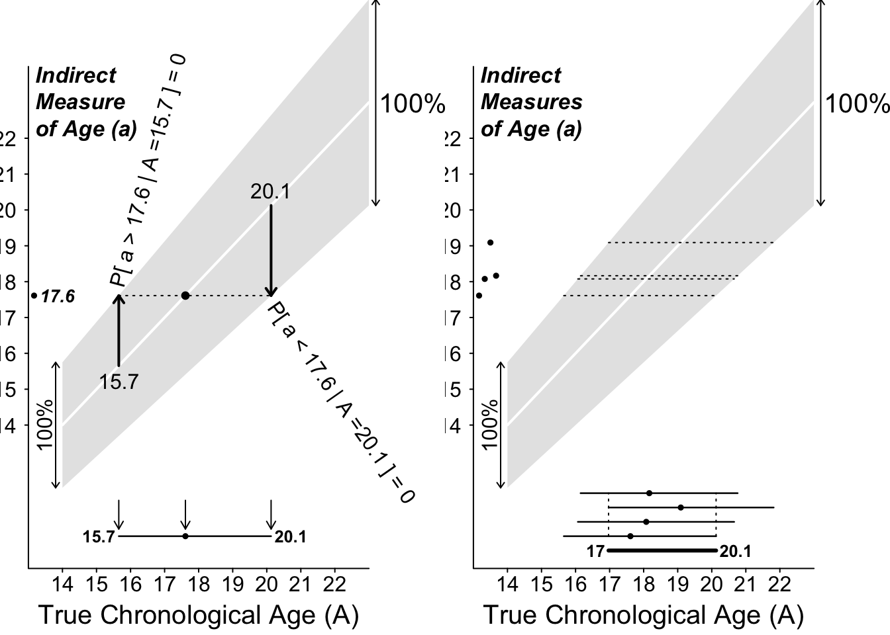
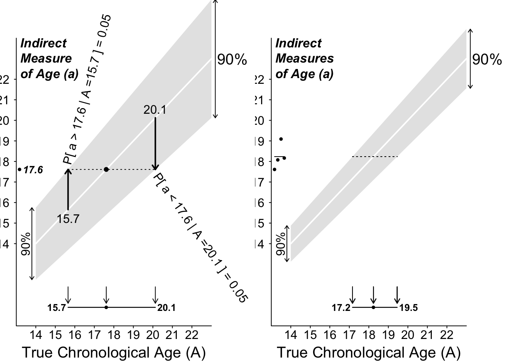

# Parameter Intervals  {#CI}

The **objective** of this section is to provide simple examples of **reverse engineering** that show some of the logic behind statistical 'confidence intervals' for parameters. We begin with '100% confidence' intervals, and then, in the following subsections, we explain why we have to move to 'less-than-100% confidence' intervals, where things get a bit more nuanced.
In both sections, we emphasize the reverse engineering, i.e, by using as our limits the worst-case or almost-worst-case scenarios involving the (unknown) values of the parameter that is being estimated.  

## '100% confidence' intervals

### Example 1

Consider a very 'particularistic' parameter, the height of a particular  building. There is nothing 'scientific' about the parameter, except maybe that we use tools of mathematical science (of trignometry) to measure it. Nevertheless, we will sometimes refer to it one of the generic symbols for a parameter, namely $\theta.$

Suppose you measure the height of this building by standing a known horizontal distance (e.g. 100 metres) from the bottom of the building and using an instrument to measure the angle between the horizontal and the top of the building. Suppose, as shown in the left panel of Figure \@ref(fig:building) below, that the instrument gives a reading of 70 degrees. 

Remembering from trigonometry that the tangent of a 70 degree angles is 2.75, the angle of 70 degrees suggests that the height of the building  is $\hat{\theta}$ = 275 metres. The 'hat' is statistical shorthand for 'estimate of.' Since it is sometimes referred to as a 'point estimate' of $\theta$, we display the value using a dot or point. 

After calculating this, you learn that the measuring instrument only displays the angle is to the nearest 10 degrees. This means that the true angle is somewhere between 65 and 75 degrees.[^9_17] 

[^9_17]: This is the same  range you would get if it was dark and you used a laser pointer or flashlight attached to a wheel that rotates in fixed 10-degree steps, i.e., 5 degrees, 15 degrees, 25 degrees, etc.  At 65 degrees, the light is visible on the building, but at 75 degrees, it goes above the building and shines into the sky.

So you **cannot say** that the true height is **exactly** 275 metres. What **can** you say? And with what certainty?

You can put **limits** on the true height by asking **what are the minimum and maximum heights that could have produced the observed reading of 70 degrees?**

To do this you need to take the limits one at a time. The **minimum** angle that could have given the (rounded) readout of 70 degrees is 65 degrees, and this corresponds to a minimum height (lower limit) height of $\theta_L$  = 214 metres. The **maximum** angle that could have given the readout of 70 degrees is 75 degrees, and this corresponds to a maximum height (upper limit) of $\theta_U$ = 373 metres. Thus, assuming that the instrument is measuring the angle correctly, and then doing what you are told it does, you are 100% confident that the true height lies in the interval (214, 373). As is clear in the graph, this does not have the typical 275 $\pm$ a single-number (or in sybols, $\hat{\theta} \pm$ ME ['margin of error']) that we typically see in reports.

(\#fig:building)Estimating the height of an building by measuring subtended angles. The '70' in the left panel signifies that the real angle was somewhere between 65 and 75 degrees; thus the real height lies between the L and U limits of 214 and 373 metres. In the righ panel, the  interval shown by the thicker black segment to the right of the 3 individual intervals is the  set of parameter values common to all 3.

***More data***

The panel on the right shows how, by obtaining 3 measurements at 3 different distances, and finding the interval they have in common (the overlap), you can narrow the interval within which the true height must lie.

**What allows us to be 100% confident in the parameter interval**

The reason is  the limited error range.  How wide the error range is, and how many measurements one makes, determine how wide the parameter interval is. 

### Example 2

This one is less artificial, and indeed is motivated by a real court case in the late 1990s in Quebec, where a defendant's age (which would determine whether he was tried in an adult or a juvenile court) was in doubt. He was adopted, while still a young child, from another country. Official birth records were not available, and his adoptive parents were able to get a cheaper airfare by claiming that he was under age 2 at the time. Bone age, and Tanner Staging, also known as Sexual Maturity Rating (SMR), an objective classification system used to track the development and sequence of secondary sex characteristics of children during puberty, were other pieces of information used by the judge.

For more on this topic of determining chronological age, see this article, entitled [Many applications for medical statistics](https://discovery.ucl.ac.uk/id/eprint/1470308/1/Tim_Cole_Intl_Innovation_140_Research_Media.pdf) and thos one, entitled [People smugglers, statistics and bone age](https://rss.onlinelibrary.wiley.com/doi/full/10.1111/j.1740-9713.2012.00568.x), by UCL statistics professor and child growth expert, [Tim Cole](https://scholar.google.com/citations?user=1P_yQocAAAAJ&hl=en).

Again, the person's correct chronological age is a  particularistic parameter, one that has nothing to do with science, or universal laws of Nature. But it can be estimated by using the laws of mathematics and statistics.

For didactic purposes, we will simplify matters, and assume that 'our' indirect method gives estimates such that if many of them were averaged, they would give the correct chronological age of the person (in statistical lingo, statisticians say that the method/estimator is 'unbiased'). However, as is seen below in Figure \ref@(fig:ciage), the individual measurements vary quite a bit around the correct age. They can be off by as much as 25% (1/4th) in either direction.[^9_2] Another unrealistic feature of our 'measurement model' is that the 'error distribution' has a **finite range**. The  **shape** of the error distribution doesn't come into the 100% 'confidence intervals' below, but it will matter a little bit -- but not a whole lot unless the sample size is small -- later on when we cut corners. 
  
[^9_2]: In practice, a measuring instrument  with this much measurement error would not be useful -- unless it was fast, safe, inexpensive, non-invasive, easily repeated, and so on -- but we make the measurement variations  this large just so we can see the patters more clearly on the graph!

Consider first a single indirect measurement of chronological age, that yielded a value of 17.6 years.

Given what you know about the sizes of the possible errors, you **cannot say** that the true age is **exactly** 17.6 years What **can** you say? And with what certainty?

You can put **limits** on the true age by asking **what are the minimum and maximum ages that could have produced the observed reading of**
17.6  years.

To do this you need to consider the limits **one scenario at a time**. The **minimum** age that could have given the estimate of 17.6 years is  /
1.125 = 
15.7 years. The **maximum** age that could have produced this reading  is 
17.6 / 0.875 = 20.1 years. Thus (assuming the error model is correct!) you are 100% confident that the true age lies in the interval (15.7 , 20.1) years. Again, as is clear in the graph, this does not have the typical 
17.6 $\pm$ a single-number margin of error that we typically see in reports. Rather, it is 17.6 **- 2.6** and 17.6  **+ 4.4** ! 

But, you can't arrive at these directly; get there this way. You have to try on various limits, until 

$$ LowerLimit + margin  = 17.6 \ = \   UpperLimit - margin  $$

(\#fig:unnamed-chunk-1)100% Confidence Intervals for a person's chronological age when error distributions (that in this example are wider at the  older ages) are 100% confined within the shaded ranges. Left: based on n = 1 measurement; right: based on n = 4 independent measurements. 

***More data***

The panel on the right shows how, by obtaining 4 independent measurements, and finding the interval they have in common, you can narrow the interval containing the true age.

Can we narrow the interval more, maybe by first averaging the 4 measurements? Should  the mean of 4 measurements  give us more information, ie., a tighter interval, that the one based on the overlap? The sad fact is that, as long we **insist on 100% confidence** in our interval (or our procedure), we can not: the mean of the 3 measurements can still -- theoretically -- be **anywhere** in the same 0.75 $\times$ True Age to 1.25 $\times$ True Age range -- just as a single measurement can.

The **only way to narrow** the interval is to **take a chance, cut corners, and accept a lower confidence level**. To do this, we need to know a bit more about where the pattern (shape) of the error distribution (**up to now we didn't use the _shape_, just the _boundaries_). In other words, we need to know how much of the error distribution is in the corners, so that we can cut them! 

In the next section, we will stick for now with Daniel Bernoulli's error distribution, but cut some corners. (Later on, we will cut some corners on Laplace's and Gauss's error distributions, but with the same standard deviation as in Bernoulli's error curve.)

## More-nuanced intervals

We will cut 5% from each corner of the distribution, and focus on the middlemost 90%. From the formula for its mathematical shape, we can calculate that this measurement range is from 
-1 $\times$ the radius of the semi-ellipse to 
+1 $\times$ the  radius. There is  only a 5% probability of observing a measurement below (to the left of) this interval, and a 5% probability of observing a measurement above (to the right of) the interval. After we observe our single measurement, we 'try it on' against all possible true-age-scenarios. We retain only those true-age-scenarios in which the observed measurement would fall within this central (90%) range. We discard ('rule out') those age scenarios in which  the measurement would be at one extreme or the other extreme, in one of the two excluded or 'cut' corners.

The left panel of Figure \@ref(fig:ciage2) shows the (now narrower, and more nuanced) **range of true-ages (rahe of parameter values) that is compatible with the observed measurement of 13.1 years**. In all other age-scenarios, the 13.1 would have been too extreme, and so these scenarios are discarded. We can think of the **'ruled in' range** as our (nuanced, compromise) **parameter interval**.  

Note again the method of constructing this **non-symmetric** parameter interval, namely one boundary at a time. It does not fit the $\pm$ mold.

It does, however, give a way of talk about such an interval:

> **The observed measurement (point-estimate) may be an underestimate of the parameter: it might have fallen short of the true parameter value. Or,  it may be an overestimate: it might have overshot the true parameter value. The plus and the minus amounts are the almost-maximal amounts by which our _shot_ might have been off-target.** (as we will see later, the maximal error can be infinite, so we have to put some probalistic limits on the error if we are to narrow the interval).

Q: Does this  **procedure** for constructing intervals  have a 90% success rate, if used up and down all of the ages, say from 10 to 30 years? We could try it out with people of known ages.[^9_6] 

[^9_6]: answer by simulation.

You will  discover in your simulations that it **might matter** whether you simulate the same number of 16 year olds as 10 years, i.e., what the **mix of real ages** is. This does not matter in the 100% intervals, but it might if you are more nuanced. For example,instead of estimating age by an indirect method, pretend you were were **estimating a person's height indirectly**, by just **measuring their arm span** (at each height, the mean armspan is very close to the height, but there is a spread of armspans (pardon the pun!)). And (just like in our example 2 where the spread increases with the mean) the spread of armspans is larger in people who are 6 feet tall than it  is in people 5 feet tall.
BUT, there aren't as many people 5 feet and 6 feet tall as there are people 5 feet 6 inches. So, the distribution of heights in people with a span of 5 feet 11 might have a different shape than that in people with a span of 5 feet 6, or  5 feet. Simulations (or even some diagrams) could settle the issue as to whether the height-mix (or, in example 2, the age mix) matters. What is your intuition as to whether it affects the perfornace of your nuanced parameter estimates? The point is that your method needs to have the same claimed performance (say 90%) at any age you throw at it.

(\#fig:ciage2)90% Confidence intervals for Chronological Age when only 90% of the error distributions lie within the shaded ranges.

When we have $n = 3$ observations (right panel), it is not so easy to say how confident we should be about the overlap of the 3 intervals.
Instead, we would be bettter off taking the mean of the 3 measurements, and 'trying on' this single mean against the various sampling distributions of the means of 3 independent measurements from a semi-circular error distribution. Again, since the range remains the same, we would again have to cut corners. 

## Summary

* If an error distribution is bounded, we can be 100% confident in our parameter interval, and we can narrow it by taking more measurements. Moreover, we don't need to specify the exact shape of the error distribution. All that matters are its bounds.

* With unbounded error distributions, a 100% parameter interval may be unacceptably wide, even if we take many measurements. Thus, we have to 'give up something' (in certainty) in order to  'get something' (a narrower interval). Moreover, we need to either (a) specify a model for the shape of the error distribution, or (b) use data-intensive techniques, such as re-sampling, to be able to 'cut the corners.'

* Either way, a logical way to determine parameter intervals is to have them consist of all the parameter-value scenarios in which the observed measurement (or summary measurement) is 'plausible'. The upper limit for the parameter is the scenario in which the measurement would be probalistically near the bottom of the corresponding sampling distribution;  the lower limit is the scenario in which the measurement would be near the top of the corresponding sampling distribution.

* If the error (or sampling) distributions have differing spreads at different parameter values, then the parameter interval will not be symmetric about the point estimate. If the error (or sampling) distributions have the same spreads at different parameter values, then the parameter interval will be symmetric about the point estimate, and thus, easier to calculate.

* It is not correct to view the parameter as 'falling' on one or other side of the measurement. The true parameter values is fixed, and isn't moving or falling anywhere. Rather, it is the observed measurement (point-estimate) that may have fallen to the left of (fallen short of), and thus provided an underestimate of, the true parameter value: Or, it may have overshot the true parameter value, and thus overestimated it. This point also explains why the +/- formula fails us

