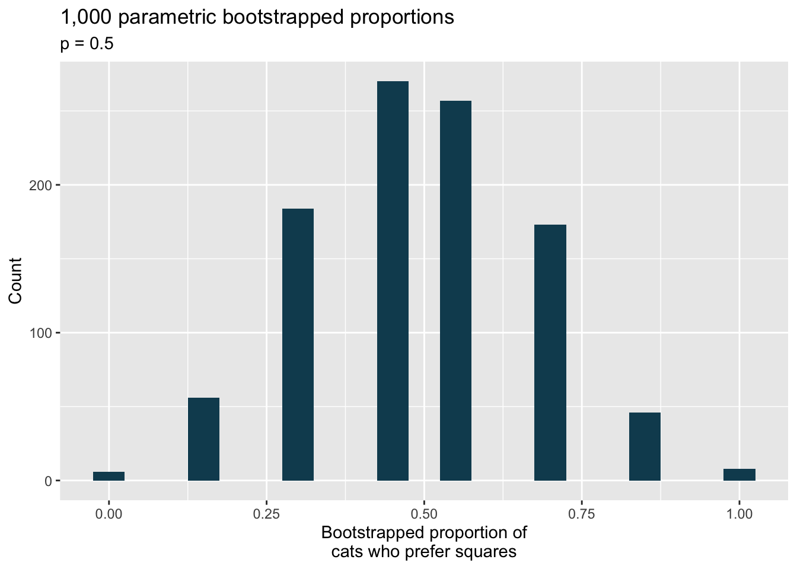
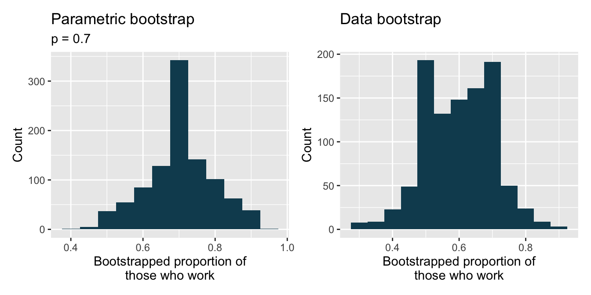

# Inference for a single proportion {#inference-one-prop}

::: {.rmdnote}
This section is adapted from the book Introduction to Modern Statistics [@ims]
:::


There is only one variable being measured in a study which focuses on one proportion.
For each observational unit, the single variable is measured as either an event or non-event (e.g., "surgical complication" vs. "no surgical complication").
Because the nature of the research question at hand focuses on only a single variable, there is not a way to randomize the variable across a different (explanatory) variable.
For this reason, we will not use randomization as an analysis tool when focusing on a single proportion.
Instead, we will apply bootstrapping techniques to test a given hypothesis, and we will also revisit the associated mathematical models.

\vspace{-4mm}

## Bootstrap test for a proportion {#one-prop-null-boot}

We will be testing a hypothesized value of $p$ (referred to as $p_0),$ using the bootstrap. 

\clearpage

### Observed data

People providing an organ for donation sometimes seek the help of a special "medical consultant".
These consultants assist the patient in all aspects of the surgery, with the goal of reducing the possibility of complications during the medical procedure and recovery.
Patients might choose a consultant based in part on the historical complication rate of the consultant's clients.
One consultant tried to attract patients by noting the average complication rate for liver donor surgeries in the US is about 10%, but her clients have only had 3 complications in the 62 liver donor surgeries she has facilitated.
She claims this is strong evidence that her work meaningfully contributes to reducing complications (and therefore she should be hired!).

::: {.workedexample data-latex=""}
Using the data, is it possible to assess the consultant's claim that her complication rate is less than 10%?

------------------------------------------------------------------------

No.
The claim is that there is a causal connection, but the data are observational.
Patients who hire this medical consultant may have lower complication rates for other reasons.

While it is not possible to assess this causal claim, it is still possible to test for an association using these data.
For this question we ask, could the low complication rate of $\hat{p} = 0.048$ have simply occurred by chance, if her complication rate does not differ from the US standard rate?
:::

::: {.guidedpractice data-latex=""}
Write out hypotheses in both plain and statistical language to test for the association between the consultant's work and the true complication rate, $p,$ for the consultant's clients.[^inference-one-prop-1]
:::

[^inference-one-prop-1]: $H_0:$ There is no association between the consultant's contributions and the clients' complication rate.
    In statistical language, $p = 0.10.$ $H_A:$ Patients who work with the consultant tend to have a complication rate lower than 10%, i.e., $p < 0.10.$

Because, as it turns out, the conditions of working with the normal distribution are not met, the uncertainty associated with the sample proportion should not be modeled using the normal distribution, as doing so would underestimate the uncertainty associated with the sample statistic.
However, we would still like to assess the hypotheses from the previous Guided Practice in absence of the normal framework.
To do so, we need to evaluate the possibility of a sample value $(\hat{p})$ as far below the null value, $p_0 = 0.10$ as what was observed.
The deviation of the sample value from the hypothesized parameter is usually quantified with a p-value.

The p-value is computed based on the null distribution, which is the distribution of the test statistic if the null hypothesis is true.
Supposing the null hypothesis is true, we can compute the p-value by identifying the probability of observing a test statistic that favors the alternative hypothesis at least as strongly as the observed test statistic.
Here we will use a bootstrap simulation to calculate the p-value.

\clearpage

### Variability of the statistic

We want to identify the sampling distribution of the test statistic $(\hat{p})$ if the null hypothesis was true.
In other words, we want to see the variability we can expect from sample proportions if the null hypothesis was true.
Then we plan to use this information to decide whether there is enough evidence to reject the null hypothesis.

Under the null hypothesis, 10% of liver donors have complications during or after surgery.
Suppose this rate was really no different for the consultant's clients (for *all* the consultant's clients, not just the 62 previously measured).
If this was the case, we could *simulate* 62 clients to get a sample proportion for the complication rate from the null distribution.
Simulating observations using a hypothesized null parameter value is often called a **parametric bootstrap simulation**\index{parametric bootstrap}.


Similar to previous applications of the bootstrap, each client can be simulated using a bag of marbles with 10% red marbles and 90% white marbles.
Sampling a marble from the bag (with 10% red marbles) is one way of simulating whether a patient has a complication *if the true complication rate is 10%*.
If we select 62 marbles and then compute the proportion of patients with complications in the simulation, $\hat{p}_{sim1},$ then the resulting sample proportion is a sample from the null distribution.

There were 5 simulated cases with a complication and 57 simulated cases without a complication, i.e., $\hat{p}_{sim1} = 5/62 = 0.081.$

::: {.workedexample data-latex=""}
Is this one simulation enough to determine whether or not we should reject the null hypothesis?

------------------------------------------------------------------------

No.
To assess the hypotheses, we need to see a distribution of many values of $\hat{p}_{sim},$ not just a *single* draw from this sampling distribution.
:::

### Observed statistic vs. null statistics

One simulation isn't enough to get a sense of the null distribution; many simulation studies are needed.
Roughly 10,000 seems sufficient.
However, paying someone to simulate 10,000 studies by hand is a waste of time and money.
Instead, simulations are typically programmed into a computer, which is much more efficient.


Figure \@ref(fig:nullDistForPHatIfLiverTransplantConsultantIsNotHelpful) shows the results of 10,000 simulated studies.
The proportions that are equal to or less than $\hat{p} = 0.048$ are shaded.
The shaded areas represent sample proportions under the null distribution that provide at least as much evidence as $\hat{p}$ favoring the alternative hypothesis.
There were 420 simulated sample proportions with $\hat{p}_{sim} \leq 0.048.$ We use these to construct the null distribution's left-tail area and find the p-value:

$$\text{left tail area} = \frac{\text{Number of observed simulations with }\hat{p}_{sim} \leq \text{ 0.048}}{10000}$$

Of the 10,000 simulated $\hat{p}_{sim},$ 420 were equal to or smaller than $\hat{p}.$ Since the hypothesis test is one-sided, the estimated p-value is equal to this tail area: 0.042.

<div class="figure">

<p class="caption">(\#fig:nullDistForPHatIfLiverTransplantConsultantIsNotHelpful)(ref:nullDistForPHatIfLiverTransplantConsultantIsNotHelpful-cap)</p>
</div>

(ref:nullDistForPHatIfLiverTransplantConsultantIsNotHelpful-cap) The null distribution for $\hat{p},$ created from 10,000 simulated studies. The left tail, representing the p-value for the hypothesis test, contains 4.2% of the simulations.

::: {.guidedpractice data-latex=""}
Because the estimated p-value is 0.042, which is smaller than the significance level 0.05, we reject the null hypothesis.
Explain what this means in plain language in the context of the problem.[^inference-one-prop-2]
:::

[^inference-one-prop-2]: There is sufficiently strong evidence to reject the null hypothesis in favor of the alternative hypothesis.
    We would conclude that there is evidence that the consultant's surgery complication rate is lower than the US standard rate of 10%.

::: {.guidedpractice data-latex=""}
Does the conclusion in the previous Guided Practice imply the consultant is good at their job?
Explain.[^inference-one-prop-3]
:::

[^inference-one-prop-3]: No.
    Not necessarily.
    The evidence supports the alternative hypothesis that the consultant's complication rate is lower, but it's not a measurement of their performance.

::: {.important data-latex=""}
**Null distribution of** $\hat{p}$ **with bootstrap simulation.**

Regardless of the statistical method chosen, the p-value is always derived by analyzing the null distribution of the test statistic.
The normal model poorly approximates the null distribution for $\hat{p}$ when the success-failure condition is not satisfied.
As a substitute, we can generate the null distribution using simulated sample proportions and use this distribution to compute the tail area, i.e., the p-value.
:::

In the previous Guided Practice, the p-value is *estimated*.
It is not exact because the simulated null distribution itself is only a close approximation of the sampling distribution of the sample statistic.
An exact p-value can be generated using the binomial distribution, but that method will not be covered in this text.

\clearpage

## Mathematical model for a proportion {#one-prop-norm}

### Conditions

We previously introduced the normal distribution and showed how it can be used as a mathematical model to describe the variability of a statistic.
There are conditions under which a sample proportion $\hat{p}$ is well modeled using a normal distribution.
When the sample observations are independent and the sample size is sufficiently large, the normal model will describe the sampling distribution of the sample proportion quite well; when the observations violate the conditions, the normal model can be inaccurate.
Particularly, it can underestimate the variability of the sample proportion.

::: {.important data-latex=""}
**Sampling distribution of** $\hat{p}.$

The sampling distribution for $\hat{p}$ based on a sample of size $n$ from a population with a true proportion $p$ is nearly normal when:

1.  The sample's observations are independent, e.g., are from a simple random sample.
2.  We expected to see at least 10 successes and 10 failures in the sample, i.e., $np\geq10$ and $n(1-p)\geq10.$ This is called the **success-failure condition**.

When these conditions are met, then the sampling distribution of $\hat{p}$ is nearly normal with mean $p$ and standard error of $\hat{p}$ as $SE = \sqrt{\frac{\ \hat{p}(1-\hat{p})\ }{n}}.$
:::

Recall that the margin of error is defined by the standard error.
The margin of error for $\hat{p}$ can be directly obtained from $SE(\hat{p}).$

::: {.important data-latex=""}
**Margin of error for** $\hat{p}.$

The margin of error is $z^\star \times \sqrt{\frac{\ \hat{p}(1-\hat{p})\ }{n}}$ where $z^\star$ is calculated from a specified percentile on the normal distribution.
:::

\index{success-failure condition} \index{standard error (SE)!single proportion}


Typically we don't know the true proportion $p,$ so we substitute some value to check conditions and estimate the standard error.
For confidence intervals, the sample proportion $\hat{p}$ is used to check the success-failure condition and compute the standard error.
For hypothesis tests, typically the null value -- that is, the proportion claimed in the null hypothesis -- is used in place of $p.$

The independence condition is a more nuanced requirement.
When it isn't met, it is important to understand how and why it is violated.
For example, there exist no statistical methods available to truly correct the inherent biases of data from a convenience sample.
On the other hand, if we took a cluster sample, the observations wouldn't be independent, but suitable statistical methods are available for analyzing the data (but they are beyond the scope of even most second or third courses in statistics).

::: {.workedexample data-latex=""}
In the examples based on large sample theory, we modeled $\hat{p}$ using the normal distribution.
Why is this not appropriate for the case study on the medical consultant?

------------------------------------------------------------------------

The independence assumption may be reasonable if each of the surgeries is from a different surgical team.
However, the success-failure condition is not satisfied.
Under the null hypothesis, we would anticipate seeing $62 \times 0.10 = 6.2$ complications, not the 10 required for the normal approximation.
:::

While this book is scoped to well-constrained statistical problems, do remember that this is just the first book in what is a large library of statistical methods that are suitable for a very wide range of data and contexts.

### Confidence interval for a proportion

\index{point estimate!single proportion}

A confidence interval provides a range of plausible values for the parameter $p,$ and when $\hat{p}$ can be modeled using a normal distribution, the confidence interval for $p$ takes the form $\hat{p} \pm z^{\star} \times SE.$ We have seen $\hat{p}$ to be the sample proportion.
The value $z^{\star}$ determines the confidence level (previously set to be 1.96) and will be discussed in detail in the examples following.
The value of the standard error, $SE,$ depends heavily on the sample size.

::: {.important data-latex=""}
**Standard error of one proportion,** $\hat{p}.$

When the conditions are met so that the distribution of $\hat{p}$ is nearly normal, the **variability** of a single proportion, $\hat{p}$ is well described by:

$$SE(\hat{p}) = \sqrt{\frac{p(1-p)}{n}}$$

Note that we almost never know the true value of $p.$ A more helpful formula to use is:

$$SE(\hat{p}) \approx \sqrt{\frac{(\mbox{best guess of }p)(1 - \mbox{best guess of }p)}{n}}$$

For hypothesis testing, we often use $p_0$ as the best guess of $p.$ For confidence intervals, we typically use $\hat{p}$ as the best guess of $p.$
:::

::: {.guidedpractice data-latex=""}
Consider taking many polls of registered voters (i.e., random samples) of size 300 asking them if they support legalized marijuana.
It is suspected that about 2/3 of all voters support legalized marijuana.
To understand how the sample proportion $(\hat{p})$ would vary across the samples, calculate the standard error of $\hat{p}.$[^inference-one-prop-4]
:::

[^inference-one-prop-4]: Because the $p$ is unknown but expected to be around 2/3, we will use 2/3 in place of $p$ in the formula for the standard error.\
    $SE = \sqrt{\frac{p(1-p)}{n}} \approx \sqrt{\frac{2/3 (1 - 2/3)} {300}} = 0.027.$
    
\clearpage

### Variability of the sample proportion

::: {.workedexample data-latex=""}
A simple random sample of 826 payday loan borrowers was surveyed to better understand their interests around regulation and costs.
70% of the responses supported new regulations on payday lenders.

1.  Is it reasonable to model the variability of $\hat{p}$ from sample to sample using a normal distribution?

2.  Estimate the standard error of $\hat{p}.$

3.  Construct a 95% confidence interval for $p,$ the proportion of payday borrowers who support increased regulation for payday lenders.

------------------------------------------------------------------------

1.  The data are a random sample, so it is reasonable to assume that the observations are independent and representative of the population of interest.

We also must check the success-failure condition, which we do using $\hat{p}$ in place of $p$ when computing a confidence interval:

$$
\begin{aligned}
  \text{Support: }
      n p &
          \approx 826 \times 0.70
      = 578\\
  \text{Not: }
      n (1 - p) &
        \approx 826 \times (1 - 0.70)
      = 248
\end{aligned}
$$

Since both values are at least 10, we can use the normal distribution to model $\hat{p}.$

2.  Because $p$ is unknown and the standard error is for a confidence interval, use $\hat{p}$ in place of $p$ in the formula.

$$SE = \sqrt{\frac{p(1-p)}{n}} \approx \sqrt{\frac{0.70 (1 - 0.70)} {826}} = 0.016.$$

3.  Using the point estimate 0.70, $z^{\star} = 1.96$ for a 95% confidence interval, and the standard error $SE = 0.016$ from the previous Guided Practice, the confidence interval is

$$ 
\begin{aligned}
\text{point estimate} \ &\pm \ z^{\star} \times \ SE \\
0.70 \ &\pm \ 1.96 \ \times \ 0.016 \\ 
(0.669 \ &, \ 0.731)
\end{aligned}
$$

We are 95% confident that the true proportion of payday borrowers who supported regulation at the time of the poll was between 0.669 and 0.731.
:::

::: {.important data-latex=""}
**Constructing a confidence interval for a single proportion.**

There are three steps to constructing a confidence interval for $p.$

1.  Check if it seems reasonable to assume the observations are independent and check the success-failure condition using $\hat{p}.$ If the conditions are met, the sampling distribution of $\hat{p}$ may be well-approximated by the normal model.
2.  Construct the standard error using $\hat{p}$ in place of $p$ in the standard error formula.
3.  Apply the general confidence interval formula.
:::

For additional one-proportion confidence interval examples, see Section \@ref(ConfidenceIntervals).

### Changing the confidence level

\index{confidence level}

Suppose we want to consider confidence intervals where the confidence level is somewhat higher than 95%: perhaps we would like a confidence level of 99%.
Think back to the analogy about trying to catch a fish: if we want to be more sure that we will catch the fish, we should use a wider net.
To create a 99% confidence level, we must also widen our 95% interval.
On the other hand, if we want an interval with lower confidence, such as 90%, we could make our original 95% interval slightly slimmer.

The 95% confidence interval structure provides guidance in how to make intervals with new confidence levels.
Below is a general 95% confidence interval for a point estimate that comes from a nearly normal distribution:

$$\text{point estimate} \ \pm \ 1.96 \ \times \ SE$$

There are three components to this interval: the point estimate, "1.96", and the standard error.
The choice of $1.96 \times SE$ was based on capturing 95% of the data since the estimate is within 1.96 standard errors of the true value about 95% of the time.
The choice of 1.96 corresponds to a 95% confidence level.

::: {.guidedpractice data-latex=""}
If $X$ is a normally distributed random variable, how often will $X$ be within 2.58 standard deviations of the mean?[^inference-one-prop-5]
:::

[^inference-one-prop-5]: This is equivalent to asking how often the $Z$ score will be larger than -2.58 but less than 2.58.
    (For a picture, see Figure \@ref(fig:choosingZForCI).) To determine this probability, look up -2.58 and 2.58 in the normal probability table (0.0049 and 0.9951).
    Thus, there is a $0.9951-0.0049 \approx 0.99$ probability that the unobserved random variable $X$ will be within 2.58 standard deviations of the mean.

<div class="figure">

<p class="caption">(\#fig:choosingZForCI)(ref:choosingZForCI-cap)</p>
</div>

(ref:choosingZForCI-cap) The area between -$z^{\star}$ and $z^{\star}$ increases as $|z^{\star}|$ becomes larger. If the confidence level is 99%, we choose $z^{\star}$ such that 99% of the normal curve is between -$z^{\star}$ and $z^{\star},$ which corresponds to 0.5% in the lower tail and 0.5% in the upper tail: $z^{\star}=2.58.$

\index{confidence interval}

To create a 99% confidence interval, change 1.96 in the 95% confidence interval formula to be $2.58.$ The previous Guided Practice highlights that 99% of the time a normal random variable will be within 2.58 standard deviations of its mean.
This approach -- using the Z scores in the normal model to compute confidence levels -- is appropriate when the point estimate is associated with a normal distribution and we can properly compute the standard error.
Thus, the formula for a 99% confidence interval is:

$$\text{point estimate} \ \pm \ 2.58 \ \times \ SE$$

The normal approximation is crucial to the precision of the $z^\star$ confidence intervals (in contrast to the bootstrap percentile confidence intervals).
When the normal model is not a good fit, we will use alternative distributions that better characterize the sampling distribution or we will use bootstrapping procedures.

::: {.guidedpractice data-latex=""}
Create a 99% confidence interval for the impact of the stent on the risk of stroke using the data from Section \@ref(case-study-stents-strokes).
The point estimate is 0.090, and the standard error is $SE = 0.028.$ It has been verified for you that the point estimate can reasonably be modeled by a normal distribution.[^inference-one-prop-6]
:::

[^inference-one-prop-6]: Since the necessary conditions for applying the normal model have already been checked for us, we can go straight to the construction of the confidence interval: $\text{point estimate} \pm 2.58 \times SE$ Which gives an interval of (0.018, 0.162).\$ We are 99% confident that implanting a stent in the brain of a patient who is at risk of stroke increases the risk of stroke within 30 days by a rate of 0.018 to 0.162 (assuming the patients are representative of the population).

::: {.important data-latex=""}
**Mathematical model confidence interval for any confidence level.**

If the point estimate follows the normal model with standard error $SE,$ then a confidence interval for the population parameter is

$$\text{point estimate} \ \pm \ z^{\star} \ \times \ SE$$

where $z^{\star}$ corresponds to the confidence level selected.
:::

Figure \@ref(fig:choosingZForCI) provides a picture of how to identify $z^{\star}$ based on a confidence level.
We select $z^{\star}$ so that the area between -$z^{\star}$ and $z^{\star}$ in the normal model corresponds to the confidence level.

::: {.guidedpractice data-latex=""}
Previously, we found that implanting a stent in the brain of a patient at risk for a stroke *increased* the risk of a stroke.
The study estimated a 9% increase in the number of patients who had a stroke, and the standard error of this estimate was about $SE = 2.8%.$ Compute a 90% confidence interval for the effect.[^inference-one-prop-7]
:::

[^inference-one-prop-7]: We must find $z^{\star}$ such that 90% of the distribution falls between -$z^{\star}$ and $z^{\star}$ in the standard normal model, $N(\mu=0, \sigma=1).$ We can look up -$z^{\star}$ in the normal probability table by looking for a lower tail of 5% (the other 5% is in the upper tail), thus $z^{\star} = 1.65.$ The 90% confidence interval can then be computed as $\text{point estimate} \pm 1.65 \times SE \to (4.4\%, 13.6\%).$ (Note: the conditions for normality had earlier been confirmed for us.) That is, we are 90% confident that implanting a stent in a stroke patient's brain increased the risk of stroke within 30 days by 4.4% to 13.6%.\
    Note, the problem was set up as 90% to indicate that there was not a need for a high level of confidence (such as 95% or 99%).
    A lower degree of confidence increases potential for error, but it also produces a more narrow interval.

### Hypothesis test for a proportion

::: {.important data-latex=""}
**The test statistic for assessing a single proportion is a Z.**

The **Z score** is a ratio of how the sample proportion differs from the hypothesized proportion as compared to the expected variability of the $\hat{p}$ values.

$$Z = \frac{\hat{p} - p_0}{\sqrt{p_0(1 - p_0)/n}}$$

When the null hypothesis is true and the conditions are met, Z has a standard normal distribution.

Conditions:

-   independent observations\
-   large samples $(n p_0 \geq 10$ and $n (1-p_0) \geq 10)$\
:::


One possible regulation for payday lenders is that they would be required to do a credit check and evaluate debt payments against the borrower's finances.
We would like to know: would borrowers support this form of regulation?

::: {.guidedpractice data-latex=""}
Set up hypotheses to evaluate whether borrowers have a majority support for this type of regulation.[^inference-one-prop-8]
:::

[^inference-one-prop-8]: $H_0:$ there is not support for the regulation; $H_0:$ $p \leq 0.50.$ $H_A:$ the majority of borrowers support the regulation; $H_A:$ $p > 0.50.$

To apply the normal distribution framework in the context of a hypothesis test for a proportion, the independence and success-failure conditions must be satisfied.
In a hypothesis test, the success-failure condition is checked using the null proportion: we verify $np_0$ and $n(1-p_0)$ are at least 10, where $p_0$ is the null value.

::: {.guidedpractice data-latex=""}
Do payday loan borrowers support a regulation that would require lenders to pull their credit report and evaluate their debt payments?
From a random sample of 826 borrowers, 51% said they would support such a regulation.
Is it reasonable to use a normal distribution to model $\hat{p}$ for a hypothesis test here?[^inference-one-prop-9]
:::

[^inference-one-prop-9]: Independence holds since the poll is based on a random sample.
    The success-failure condition also holds, which is checked using the null value $(p_0 = 0.5)$ from $H_0:$ $np_0 = 826 \times 0.5 = 413,$ $n(1 - p_0) = 826 \times 0.5 = 413.$ Recall that here, the best guess for $p$ is $p_0$ which comes from the null hypothesis (because we assume the null hypothesis is true when performing the testing procedure steps).
    $H_0:$ there is not support for the regulation; $H_0:$ $p \leq 0.50.$ $H_A:$ the majority of borrowers support the regulation; $H_A:$ $p > 0.50.$

::: {.workedexample data-latex=""}
Using the hypotheses and data from the previous Guided Practices, evaluate whether the poll on lending regulations provides convincing evidence that a majority of payday loan borrowers support a new regulation that would require lenders to pull credit reports and evaluate debt payments.

------------------------------------------------------------------------

With hypotheses already set up and conditions checked, we can move onto calculations.
The standard error in the context of a one-proportion hypothesis test is computed using the null value, $p_0:$

$$SE = \sqrt{\frac{p_0 (1 - p_0)}{n}} = \sqrt{\frac{0.5 (1 - 0.5)}{826}} = 0.017$$

A picture of the normal model is shown with the p-value represented by the shaded region.


Based on the normal model, the test statistic can be computed as the Z score of the point estimate:

$$
\begin{aligned}
Z &= \frac{\text{point estimate} - \text{null value}}{SE} \\
  &= \frac{0.51 - 0.50}{0.017} \\
  &= 0.59
\end{aligned} 
$$

The single tail area which represents the p-value is 0.2776.
Because the p-value is larger than 0.05, we do not reject $H_0.$ The poll does not provide convincing evidence that a majority of payday loan borrowers support regulations around credit checks and evaluation of debt payments.

We might have wanted to ask whether the borrows **support or oppose** the regulations (to study opinion in either direction away from the 50% benchmark), i.e., a two-sided test.
In that case, the p-value would have been doubled to 0.5552 (again, we would not reject $H_0).$ In the two-sided hypothesis setting, the appropriate conclusion would be to claim that the poll does not provide convincing evidence that a majority of payday loan borrowers support or oppose regulations around credit checks and evaluation of debt payments.

In both the one-sided or two-sided setting, the conclusion is somewhat unsatisfactory because there is no conclusion.
That is, there is no resolution one way or the other about public opinion.
We cannot claim that exactly 50% of people support the regulation, but we cannot claim a majority in either direction.
:::

::: {.important data-latex=""}
**Mathematical model hypothesis test for a proportion.**

Set up hypotheses and verify the conditions using the null value, $p_0,$ to ensure $\hat{p}$ is nearly normal under $H_0.$ If the conditions hold, construct the standard error, again using $p_0,$ and show the p-value in a drawing.
Lastly, compute the p-value and evaluate the hypotheses.
:::


### Violating conditions

We've spent a lot of time discussing conditions for when $\hat{p}$ can be reasonably modeled by a normal distribution.
What happens when the success-failure condition fails?
What about when the independence condition fails?
In either case, the general ideas of confidence intervals and hypothesis tests remain the same, but the strategy or technique used to generate the interval or p-value change.

When the success-failure condition isn't met for a hypothesis test, we can simulate the null distribution of $\hat{p}$ using the null value, $p_0,$ as seen in Section \@ref(one-prop-null-boot).
Unfortunately, methods for dealing with observations which are not independent (e.g., repeated measurements on subject, such as in studies where measurements from the same subjects are taken pre and post study) are outside the scope of this course.

\vspace{10mm}

## Chapter review {#chp16-review}

### Summary

Building on the foundational ideas from the previous few ideas, this chapter focused exclusively on the single population proportion as the parameter of interest.
Note that it is not possible to do a randomization test with only one variable, so to do computational hypothesis testing, we applied a bootstrapping framework.
The bootstrap confidence interval and the mathematical framework for both hypothesis testing and confidence intervals are similar to those applied to other data structures and parameters.
When using the mathematical model, keep in mind the success-failure conditions.
Additionally, know that bootstrapping is always more accurate with larger samples.

### Terms

We introduced the following terms in the chapter.
If you're not sure what some of these terms mean, we recommend you go back in the text and review their definitions.
We are purposefully presenting them in alphabetical order, instead of in order of appearance, so they will be a little more challenging to locate.
However you should be able to easily spot them as **bolded text**.

<table class="table table-striped table-condensed" style="margin-left: auto; margin-right: auto;">
<tbody>
  <tr>
   <td style="text-align:left;"> parametric bootstrap </td>
   <td style="text-align:left;"> success-failure condition </td>
   <td style="text-align:left;">  </td>
  </tr>
  <tr>
   <td style="text-align:left;"> SE single proportion </td>
   <td style="text-align:left;"> Z score </td>
   <td style="text-align:left;">  </td>
  </tr>
</tbody>
</table>

\clearpage

## Exercises {#chp16-exercises}


::: {.exercises data-latex=""}

1. **Do aliens exist?**
In May 2021, YouGov asked 4,839 adult Great Britain residents whether they think aliens exist, and if so, if they have or have not visited Earth.
You want to evaluate if more than a quarter (25\%) of Great Britain adults think aliens don't exist.
In the survey 22\% responded "I think they exist, and have visited Earth", 28\% responded "I think they exist, but have not visited Earth", 29% responded "I don't think they exist", and 22\% responded "Don't know".
A friend of yours offers to help you with setting up the hypothesis test and comes up with the following hypotheses.
Indicate any errors you see.

    $H_0: \hat{p} = 0.29 \quad \quad H_A: \hat{p} > 0.29$
    
    \vspace{5mm}

1. **Married at 25.**
A study suggests that the 25% of 25 year olds have gotten married.
You believe that this is incorrect and decide to collect your own sample for a hypothesis test.
From a random sample of 25 year olds in census data with size 776, you find that 24% of them are married.
A friend of yours offers to help you with setting up the hypothesis test and comes up with the following hypotheses. Indicate any errors you see.

    $H_0: \hat{p} = 0.24 \quad \quad H_A: \hat{p} \neq 0.24$
    
    \vspace{5mm}

1. **Defund the police.**
A Survey USA poll conducted in Seattle, WA in May 2021 reports that of the 650 respondents (adults living in this area), 159 support proposals to defund police departments. [@data:defundpolice]

    a. A journalist writing a news story on the poll results wants to use the headline "More than 1 in 5 adults living in Seattle support proposals to defund police departments." You caution the journalist that they should first conduct a hypothesis test to see if the poll data provide convincing evidence for this claim. Write the hypotheses for this test.
    
    b. Calculate the proportion of Seattle adults in this sample who support proposals to defund police departments.
    
    c. Describe a setup for a simulation that would be appropriate in this situation and how the p-value can be calculated using the simulation results.
    
    d. Below is a histogram showing the distribution of $\hat{p}_{sim}$ in 1,000 simulations under the null hypothesis. Estimate the p-value using the plot and use it to evaluate the hypotheses.

    
    ```r
    library(tidyverse)
    library(openintro)
    library(infer)
    
    defund_police <- tibble(opinion = c(rep("support", 159), rep("do not support", 650-159)))
    
    set.seed(47)
    null_dist <- defund_police %>%
      specify(response = opinion, success = "support") %>%
      hypothesize(null = "point", p = 0.20) %>%
      generate(reps = 1000, type = "simulate") %>%
      calculate(stat = "prop")
    
    null_dist %>%
      ggplot(aes(x = stat)) +
      geom_histogram(bins = 20, fill = IMSCOL["green", "full"]) +
      labs(
        title = "1,000 parametric bootstrapped proportions",
        subtitle = "p = 0.20",
        x = "Bootstrapped proportion of\nthose who support proposals to defund police departments",
        y = "Count"
        ) +
      scale_x_continuous(breaks = seq(0.15, 0.25, 0.02))
    ```
    
    
    
    \clearpage

1. **Assisted reproduction.**
Assisted Reproductive Technology (ART) is a collection of techniques that help facilitate pregnancy (e.g., in vitro fertilization). The 2018 ART Fertility Clinic Success Rates Report published by the Centers for Disease Control and Prevention reports that ART has been successful in leading to a live birth in 48.8% of cases where the patient is under 35 years old. [@web:art2018] A new fertility clinic claims that their success rate is higher than average for this age group. A random sample of 30 of their patients yielded a success rate of 60%. A consumer watchdog group would like to determine if this provides strong evidence to support the company's claim.

     a. Write the hypotheses to test if the success rate for ART at this clinic is significantly higher than the success rate reported by the CDC.

     b. Describe a setup for a simulation that would be appropriate in this situation and how the p-value can be calculated using the simulation results.

    
    ```r
    library(tidyverse)
    library(openintro)
    library(infer)
    
    art <- tibble(fertility = c(rep("success", 12), rep("failure", 18)))
    
    set.seed(47)
    null_dist <- art %>%
      specify(response = fertility, success = "success") %>%
      hypothesize(null = "point", p = 0.488) %>%
      generate(reps = 1000, type = "simulate") %>%
      calculate(stat = "prop") 
    
    null_dist %>%
      ggplot(aes(x = stat)) +
      geom_histogram(binwidth = 0.05, fill = IMSCOL["green", "full"]) +
      labs(
        title = "1,000 parametric bootstrapped proportions",
        subtitle = "p = 0.488",
        x = "Proportion of successful ART cases",
        y = "Count"
        ) +
      geom_vline(xintercept = 0.6, color = IMSCOL["red", 1], size = 1)
    ```
    
    

     c. Below is a histogram showing the distribution of $\hat{p}_{sim}$ in 1,000 simulations under the null hypothesis. Estimate the p-value using the plot and use it to evaluate the hypotheses.

     d. After performing this analysis, the consumer group releases the following news headline: "Infertility clinic falsely advertises better success rates". Comment on the appropriateness of this statement.
     
     \clearpage

1. **If I fits, I sits, bootstrap test.**
A citizen science project on which type of enclosed spaces cats are most likely to sit in compared (among other options) two different spaces taped to the ground.  The first was a square, and the second was a shape known as [Kanizsa square illusion](https://en.wikipedia.org/wiki/Illusory_contours#Kanizsa_figures). When comparing the two options given to 7 cats, 5 chose the square, and 2 chose the Kanizsa square illusion. We are interested to know whether these data provide convincing evidence that cats prefer one of the shapes over the other. [@Smith:2021]
    
    a. What are the null and alternative hypotheses for evaluating whether these data provide convincing evidence that cats have preference for one of the shapes
    
    b. A parametric bootstrap simulation (with 1,000 bootstrap samples) was run and the resulting null distribution is displayed in the histogram below.Find the p-value using this distribution and conclude the hypothesis test in the context of the problem.
    
    
    ```r
    library(tidyverse)
    library(infer)
    library(openintro)
    
    cats <- tibble(choice = c(rep("square", 5), rep("Kanizsa", 2)))
    
    set.seed(47)
    cats %>%
      specify(response = choice, success = "square") %>%
      hypothesize(null = "point", p = 0.5) %>%
      generate(reps = 1000, type = "simulate") %>%
      calculate(stat = "prop") %>%
      ggplot(aes(x = stat)) +
      geom_histogram(binwidth = 0.05, fill = IMSCOL["green", "full"]) + 
      labs(
        title = "1,000 parametric bootstrapped proportions",
        subtitle = "p = 0.5",
        x = "Proportion of cats who prefer squares",
        y = "Count"
        )
    ```
    
    

1. **Legalization of marijuana, bootstrap test.**
The 2018 General Social Survey asked a random sample of 1,563 US adults: "Do you think the use of marijuana should be made legal, or not?" 60% of the respondents said it should be made legal. [@data:gssgrass] Consider a scenario where, in order to become legal, 55% (or more) of voters must approve.
    
    a. What are the null and alternative hypotheses for evaluating whether these data provide convincing evidence that, if voted on, marijuana would be legalized in the US.
  
    b. A parametric bootstrap simulation (with 1,000 bootstrap samples) was run and the resulting null distribution is displayed in the histogram below. Find the p-value using this distribution and conclude the hypothesis test in the context of the problem.
    
    
    ```r
    library(tidyverse)
    library(infer)
    library(openintro)
    
    mj <- tibble(opinion = c(rep("legal", 938),rep("not legal", 625)))
    
    set.seed(47)
    mj %>%
      specify(response = opinion, success = "legal") %>%
      hypothesize(null = "point", p = 0.55) %>%
      generate(reps = 1000, type = "simulate") %>%
      calculate(stat = "prop") %>%
      ggplot(aes(x = stat)) +
      geom_histogram(binwidth = 0.005, fill = IMSCOL["green", "full"]) + 
      labs(
        title = "1,000 parametric bootstrapped proportions",
        subtitle = "p = 0.55",
        x = "Proportion of US adults who support legalizing marijuana",
        y = "Count"
        )
    ```
    
    
    
    \clearpage

1. **If I fits, I sits, standard errors.**
The results of a study on the type of enclosed spaces cats are most likely to sit in show that 5 out of 7 cats chose a square taped to the ground over a shape known as [Kanizsa square illusion](https://en.wikipedia.org/wiki/Illusory_contours#Kanizsa_figures), which was preferred by the remaining 2 cats. To evaluate whether these data provide convincing evidence that cats prefer one of the shapes over the other, we set $H_0: p = 0.5$, where $p$ is the population proportion of cats who prefer square over the Kanizsa square illusion and $H_A: p \neq 0.5$, which suggests some preference, without specifying which shape is more preferred. [@Smith:2021]

    a. Using the mathematical model, calculate the standard error of the sample proportion in repeated samples of size 7.
    
    b. A parametric bootstrap simulation (with 1,000 bootstrap samples) was run and the resulting null distribution is displayed in the histogram below. This distribution shows the variability of the sample proportion in samples of size 7 when 50% of cats prefer the square shape over the Kanizsa square illusion. What is the approximate standard error of the sample proportion based on this distribution?

    
    ```r
    library(tidyverse)
    library(infer)
    library(openintro)
    
    cats <- tibble(choice = c(rep("square", 5), rep("Kanizsa", 2)))
    
    set.seed(47)
    cats %>%
      specify(response = choice, success = "square") %>%
      hypothesize(null = "point", p = 0.5) %>%
      generate(reps = 1000, type = "simulate") %>%
      calculate(stat = "prop") %>%
      ggplot(aes(x = stat)) +
      geom_histogram(binwidth = 0.05, fill = IMSCOL["green", "full"]) + 
      labs(
        title = "1,000 parametric bootstrapped proportions",
        subtitle = "p = 0.5",
        x = "Bootstrapped proportion of\ncats who prefer squares",
        y = "Count"
        )
    ```
    
    
    
    c. Do the mathematical model and parametric bootstrap give similar standard errors?
    
    d. In order to approach the problem using the mathematical model, is the success-failure condition met for this study?Explain.
    
    e. What about the null distribution shown above (generated using the parametric bootstrap) tells us that the mathematical model should probably not be used?
    
    \clearpage

1. **Legalization of marijuana, standard errors.**
According to the 2018 General Social Survey, in a random sample of 1,563 US adults, 60% think marijuana should be made legal. [@data:gssgrass] Consider a scenario where, in order to become legal, 55% (or more) of voters must approve.

    a. Calculate the standard error of the sample proportion using the mathematical model.

    b. A parametric bootstrap simulation (with 1,000 bootstrap samples) was run and the resulting null distribution is displayed in the histogram below. This distribution shows the variability of the sample proportion in samples of size 1,563 when 55% of voters approve legalizing marijuana. What is the approximate standard error of the sample proportion based on this distribution?

    
    ```r
    library(tidyverse)
    library(infer)
    library(openintro)
    
    mj <- tibble(opinion = c(rep("legal", 938),rep("not legal", 625)))
    
    set.seed(47)
    mj %>%
      specify(response = opinion, success = "legal") %>%
      hypothesize(null = "point", p = 0.55) %>%
      generate(reps = 1000, type = "simulate") %>%
      calculate(stat = "prop") %>%
      ggplot(aes(x = stat)) +
      geom_histogram(binwidth = 0.005, fill = IMSCOL["green", "full"]) + 
      labs(
        title = "1,000 parametric bootstrapped proportions",
        subtitle = "p = 0.55",
        x = "Proportion of US adults who support legalizing marijuana",
        y = "Count"
        )
    ```
    
    
    
    c. Do the mathematical model and parametric bootstrap give similar standard errors?
    
    d. In this setting (to test whether the true underlying population proportion is greater than 0.55), would there be a strong reason to choose the mathematical model over the parametric bootstrap (or vice versa)?
    
    \clearpage

1. **Statistics and employment, describe the bootstrap.**
A large university knows that about 70% of the full-time students are employed at least 5 hours per week. The members of the Statistics Department wonder if the same proportion of their students work at least 5 hours per week. They randomly sample 25 majors and find that 15 of the students work 5 or more hours each week.

    Two bootstrap sampling distributions are created to describe the variability in the proportion of statistics majors who work at least 5 hours per week. The parametric bootstrap imposes a true population proportion of $p = 0.7$ while the data bootstrap resamples from the actual data (which has 60% of the observations who work at least 5 hours per week).

    
    ```r
    library(tidyverse)
    library(infer)
    library(openintro)
    library(patchwork)
    
    students <- tibble(outside = c(rep("work", 15), rep("don't work", 10)))
    
    set.seed(47)
    p_para <- students %>%
      specify(response = outside, success = "work") %>%
      hypothesize(null = "point", p = 0.7) %>%
      generate(reps = 1000, type = "simulate") %>%
      calculate(stat = "prop") %>%
      ggplot(aes(x = stat)) + 
      geom_histogram(binwidth = 0.05, fill = IMSCOL["green", "full"]) +
      labs(
        title = "Parametric bootstrap",
        subtitle = "p = 0.7",
        x = "Bootstrapped proportion of\nthose who work",
        y = "Count"
      )
    
    set.seed(47)
    p_data <- students %>%
      specify(response = outside, success = "work") %>%
      generate(reps = 1000, type = "bootstrap") %>%
      calculate(stat = "prop") %>%
      ggplot(aes(x = stat)) + 
      geom_histogram(binwidth = 0.05, fill = IMSCOL["green", "full"]) +
      labs(
        title = "Data bootstrap",
        x = "Bootstrapped proportion of\nthose who work",
        y = "Count"
      )
    
    p_para + p_data
    ```
    
    
    
    a. The bootstrap sampling was done under two different settings to generate each of the distributions shown above. Describe the two different settings.

    b. Where are each of the two distributions centered? Are they centered at roughly the same place?
    
    c. Estimate the standard error of the simulated proportions based on each distribution. Are the two standard errors you estimate roughly equal?
    
    d. Describe the shapes of the two distributions. Are they roughly the same?
    
    \clearpage

1. **National Health Plan, parametric bootstrap.**
A Kaiser Family Foundation poll for a random sample of US adults in 2019 found that 79% of Democrats, 55% of Independents, and 24% of Republicans supported a generic "National Health Plan". 
There were 347 Democrats, 298 Republicans, and 617 Independents surveyed. [@data:KFF2019nathealthplan]

    A political pundit on TV claims that a majority of Independents support a National Health Plan. Do these data provide strong evidence to support this type of statement? One approach to assessing the question of whether a majority of Independents support a National Health Plan is to simulate 1,000 parametric bootstrap samples with $p = 0.5$ as the proportion of Independents in support.

    
    ```r
    library(tidyverse)
    library(infer)
    
    nhp <- tibble(opinion = c(rep("yes plan", 339),rep("no plan", 278)))
    
    set.seed(47)
    null_dist <- nhp %>%
      specify(response = opinion, success = "yes plan") %>%
      hypothesize(null = "point", p = 0.50) %>%
      generate(reps = 1000, type = "simulate") %>%
      calculate(stat = "prop")
    
    null_dist %>%
      ggplot(aes(x = stat)) + 
      geom_histogram(binwidth = 0.005, fill = IMSCOL["green", "full"]) +
      labs(
        title = "1,000 parametric bootstrapped proportions",
        subtitle = "p = 0.50",
        x = "Bootstrapped proportion of\nthose who support a national health plan",
        y = "Count"
        )
    ```
    
    
    
    a. The histogram above displays 1000 values of what?  

    b. Is the observed proportion of Independents consistent with the parametric bootstrap proportions under the setting where $p=0.5?$
    
    c. In order to test the claim that "a majority of Independents support a National Health Plan" what are the null and alternative hypotheses?
    
    d. Using the parametric bootstrap distribution, find the p-value and conclude the hypothesis test in the context of the problem.
    
    \clearpage

1. **Statistics and employment, use the bootstrap.**
In a large university where 70% of the full-time students are employed at least 5 hours per week, the members of the Statistics Department wonder if the same proportion of their students work at least 5 hours per week. They randomly sample 25 majors and find that 15 of the students work 5 or more hours each week.

    Two bootstrap sampling distributions are created to describe the variability in the proportion of statistics majors who work at least 5 hours per week. The parametric bootstrap imposes a true population proportion of $p=0.7$ while the data bootstrap resamples from the actual data (which has 60% of the observations who work at least 5 hours per week).

    
    ```r
    library(tidyverse)
    library(infer)
    library(openintro)
    library(patchwork)
    
    students <- tibble(outside = c(rep("work", 15), rep("don't work", 10)))
    
    set.seed(47)
    p_para <- students %>%
      specify(response = outside, success = "work") %>%
      hypothesize(null = "point", p = 0.7) %>%
      generate(reps = 1000, type = "simulate") %>%
      calculate(stat = "prop") %>%
      ggplot(aes(x = stat)) + 
      geom_histogram(binwidth = 0.05, fill = IMSCOL["green", "full"]) +
      labs(
        title = "Parametric bootstrap",
        subtitle = "p = 0.7",
        x = "Bootstrapped proportion of\nthose who work",
        y = "Count"
      )
    
    set.seed(47)
    p_data <- students %>%
      specify(response = outside, success = "work") %>%
      generate(reps = 1000, type = "bootstrap") %>%
      calculate(stat = "prop") %>%
      ggplot(aes(x = stat)) + 
      geom_histogram(binwidth = 0.05, fill = IMSCOL["green", "full"]) +
      labs(
        title = "Data bootstrap",
        x = "Bootstrapped proportion of\nthose who work",
        y = "Count"
      )
    
    p_para + p_data
    ```
    
    
    
    a. Which bootstrap distribution should be used to test whether the proportion of all statistics majors who work at least 5 hours per week is 70%? And which bootstrap distribution should be used to find a confidence interval for the true poportion of statistics majors who work at least 5 hours per week?
    
    b. Using the appropriate histogram, test the claim that 70% of statistics majors, like their peers, work at least 5 hours per week. State the null and alternative hypotheses, find the p-value, and conclude the test in the context of the problem.
    
    c. Using the appropriate histogram, find a 98% bootstrap percentile confidence interval for the true proportion of statistics majors who work at least 5 hours per week. Interpret the confidence interval in the context of the problem.
    
    d. Using the appropriate historgram, find a 98% bootstrap SE confidence interval for the true proportion of statistics majors who work at least 5 hours per week. Interpret the confidence interval in the context of the problem.
    
    \vspace{5mm}

1. **CLT for proportions.**
Define the term "sampling distribution" of the sample proportion, and describe how the shape, center, and spread of the sampling distribution change as the sample size increases when $p = 0.1$.

    \clearpage

1. **Vegetarian college students.**
Suppose that 8% of college students are vegetarians. Determine if the following statements are true or false, and explain your reasoning.

    a. The distribution of the sample proportions of vegetarians in random samples of size 60 is approximately normal since $n \ge 30$.

    b. The distribution of the sample proportions of vegetarian college students in random samples of size 50 is right skewed.

    c. A random sample of 125 college students where 12% are vegetarians would be considered unusual.

    d. A random sample of 250 college students where 12% are vegetarians would be considered unusual.

    e. The standard error would be reduced by one-half if we increased the sample size from 125 to250.

1. **Young Americans, American dream.** 
About 77% of young adults think they can achieve the American dream. 
Determine if the following statements are true or false, and explain your reasoning. [@news:youngAmericans1]

    a. The distribution of sample proportions of young Americans who think they can achieve the American dream in random samples of size 20 is left skewed.

    b. The distribution of sample proportions of young Americans who think they can achieve the American dream in random samples of size 40 is approximately normal since $n \ge 30$.

    c. A random sample of 60 young Americans where 85% think they can achieve the American dream would be considered unusual.

    d. A random sample of 120 young Americans where 85% think they can achieve the American dream would be considered unusual.

1. **Orange tabbies.** 
Suppose that 90% of orange tabby cats are male.
Determine if the following statements are true or false, and explain your reasoning.

    a. The distribution of sample proportions of random samples of size 30 is left skewed.

    b. Using a sample size that is 4 times as large will reduce the standard error of the sample proportion by one-half.

    c. The distribution of sample proportions of random samples of size 140 is approximately normal.

    d. The distribution of sample proportions of random samples of size 280 is approximately normal.

1. **Young Americans, starting a family.**
About 25% of young Americans have delayed starting a family due to the continued economic slump.
Determine if the following statements are true or false, and explain your reasoning. [@news:youngAmericans2]

    a. The distribution of sample proportions of young Americans who have delayed starting a family due to the continued economic slump in random samples of size 12 is right skewed.

    b. In order for the distribution of sample proportions of young Americans who have delayed starting a family due to the continued economic slump to be approximately normal, we need random samples where the sample size is at least 40.

    c. A random sample of 50 young Americans where 20% have delayed starting a family due to the continued economic slump would be considered unusual.

    d. A random sample of 150 young Americans where 20% have delayed starting a family due to the continued economic slump would be considered unusual.

    e. Tripling the sample size will reduce the standard error of the sample proportion by one-third.
    
    \clearpage

1. **Sex equality.**
The General Social Survey asked a random sample of 1,390 Americans the following question: "On the whole, do you think it should or should not be the government's responsibility to promote equality between men and women?" 82% of the respondents said it "should be". At a 95% confidence level, this sample has 2% margin of error. Based on this information, determine if the following statements are true or false, and explain your reasoning. [@data:gsssexeq]

    a. We are 95% confident that between 80% and 84% of Americans in this sample think it's the government's responsibility to promote equality between men and women.

    b. We are 95% confident that between 80% and 84% of all Americans think it's the government's responsibility to promote equality between men and women.

    c. If we considered many random samples of 1,390 Americans, and we calculated 95% confidence intervals for each, 95% of these intervals would include the true population proportion of Americans who think it's the government's responsibility to promote equality between men and women.

    d. In order to decrease the margin of error to 1%, we would need to quadruple (multiply by 4) the sample size.

    e. Based on this confidence interval, there is sufficient evidence to conclude that a majority of Americans think it's the government's responsibility to promote equality between men and women.
    
    \vspace{3mm}

1. **Elderly drivers.** 
The Marist Poll published a report stating that 66% of adults nationally think licensed drivers should be required to retake their road test once they reach 65 years of age. It was also reported that interviews were conducted on a random sample of 1,018 American adults, and that the margin of error was 3% using a 95% confidence level. [@data:elderlyDriving]

    a. Verify the margin of error reported by The Marist Poll using a mathematical model.

    b. Based on a 95% confidence interval, does the poll provide convincing evidence that *more than* two thirds of the population think that licensed drivers should be required to retake their road test once they turn 65?
    
    \vspace{3mm}

1. **Fireworks on July 4$^{\text{th}}$.** 
A local news outlet reported that 56% of 600 randomly sampled Kansas residents planned to set off fireworks on July$4^{th}$. 
Determine the margin of error for the 56% point estimate using a 95% confidence level using a mathematical model. [@data:july4]

    \vspace{3mm}

1. **Proof of COVID-19 vaccination.**
A Gallup poll surveyed 3,731 randomly sampled US in April 2021, asking how they felt about requiring proof of COVID-19 vaccination for travel by airplane. 
The poll found that 57% said they would favor it. [@data:gallupcovidvaccine]

    a. Describe the population parameter of interest. What is the value of the point estimate of this parameter?

    b. Check if the conditions required for constructing a confidence interval using a mathematical model based on these data are met.

    c. Construct a 95% confidence interval for the proportion of US adults who favor requiring proof of COVID-19 vaccination for travel by airplane.

    d. Without doing any calculations, describe what would happen to the confidence interval if we decided to use a higher confidence level.

    e. Without doing any calculations, describe what would happen to the confidence interval if we used a larger sample.
    
    \clearpage

1. **Study abroad.** 
A survey on 1,509 high school seniors who took the SAT and who completed an optional web survey shows that 55% of high school seniors are fairly certain that they will participate in a study abroad program in college. [@data:studyAbroad]

    a.  Is this sample a representative sample from the population of all high school seniors in the US? Explain your reasoning.

    b.  Let's suppose the conditions for inference are met. Even if your answer to part (a) indicated that this approach would not be reliable, this analysis may still be interesting to carry out (though not report). Using a mathematical model, construct a 90% confidence interval for the proportion of high school seniors (of those who took the SAT) who are fairly certain they will participate in a study abroad program in college, and interpret this interval in context.

    c.  What does "90% confidence" mean?

    d.  Based on this interval, would it be appropriate to claim that the majority of high school seniors are fairly certain that they will participate in a study abroad program in college?

1. **Legalization of marijuana, mathematical interval.**
The General Social Survey asked a random sample of 1,563 US adults: "Do you think the use of marijuana should be made legal, or not?" 60% of the respondents said it should be made legal. [@data:gssgrass]

    a. Is 60% a sample statistic or a population parameter? Explain.

    b. Using a mathematical model, construct a 95% confidence interval for the proportion of US adults who think marijuana should be made legal, and interpret it.

    c. A critic points out that this 95% confidence interval is only accurate if the statistic follows a normal distribution, or if the normal model is a good approximation. Is this true for these data? Explain.

    d. A news piece on this survey's findings states, "Majority of US adults think marijuana should be legalized." Based on your confidence interval, is this statement justified?

1. **National Health Plan, mathematical inference.**
A Kaiser Family Foundation poll for a random sample of US adults in 2019 found that 79% of Democrats, 55% of Independents, and 24% of Republicans supported a generic "National Health Plan". 
There were 347 Democrats, 298 Republicans, and 617 Independents surveyed. [@data:KFF2019nathealthplan]

    a. A political pundit on TV claims that a majority of Independents support a National Health Plan. Do these data provide strong evidence to support this type of statement? Your response should use a mathematical model.

    b. Would you expect a confidence interval for the proportion of Independents who oppose the public option plan to include 0.5? Explain.

1. **Is college worth it?**
Among a simple random sample of 331 American adults who do not have a four-year college degree and are not currently enrolled in school, 48% said they decided not to go to college because they could not afford school. [@data:collegeWorthIt]

    a. A newspaper article states that only a minority of the Americans who decide not to go to college do so because they cannot afford it and uses the point estimate from this survey as evidence. Conduct a hypothesis test to determine if these data provide strong evidence supporting this statement.

    b. Would you expect a confidence interval for the proportion of American adults who decide not to go to college because they cannot afford it to include 0.5? Explain.
    
    \clearpage

1. **Taste test.**
Some people claim that they can tell the difference between a diet soda and a regular soda in the first sip.
A researcher wanting to test this claim randomly sampled 80 such people.
He then filled 80 plain white cups with soda, half diet and half regular through random assignment, and asked each person to take one sip from their cup and identify the soda as diet or regular.
53 participants correctly identified the soda.

    a. Do these data provide strong evidence that these people are able to detect the difference between diet and regular soda, in other words, are the results significantly better than just random guessing? Your response should use a mathematical model.

    b. Interpret the p-value in this context.
    
    \vspace{5mm}

1. **Will the coronavirus bring the world closer together?**
An April 2021 YouGov poll asked 4,265 UK adults whether they think the coronavirus bring the world closer together or leave us further apart. 
12% of the respondents said it will bring the world closer together. 37% said it would leave us further apart, 39% said it won't make a difference and the remainder didn't have an opinion on the matter. [@data:yougovcovid]

    a. Calculate, using a mathematical model, a 90% confidence interval for the proportion of UK adults who think the coronavirus will bring the world closer together, and interpret the interval in context.

    b. Suppose we wanted the margin of error for the 90% confidence level to be about 0.5%. How large of a sample size would you recommend for the poll?
    
    \vspace{5mm}

1.  **Quality control.**
As part of a quality control process for computer chips, an engineer at a factory randomly samples 212 chips during a week of production to test the current rate of chips with severe defects. 
She finds that 27 of the chips are defective.

    a.  What population is under consideration in the data set?

    b.  What parameter is being estimated?

    c.  What is the point estimate for the parameter?

    d.  What is the name of the statistic that can be used to measure the uncertainty of the point estimate?

    e.  Compute the value of the statistic from part (d) using a mathematical model.

    f.  The historical rate of defects is 10%. Should the engineer be surprised by the observed rate of defects during the current week?

    g.  Suppose the true population value was found to be 10%. If we use this proportion to recompute the value in part(d) using $p = 0.1$ instead of $\hat{p}$, how much does the resulting value of the statistic change?
    
    \vspace{5mm}

1.  **Nearsighted children.**
Nearsightedness (myopia) is a common vision condition in which you can see objects near to you clearly, but objects farther away are blurry. 
It is believed that nearsightedness affects about 8% of all children. 
In a random sample of 194 children, 21 are nearsighted. 
Using a mathematical model, conduct a hypothesis test for the following question: do these data provide evidence that the 8% value is inaccurate?

    \clearpage

1.  **Website registration.**
A website is trying to increase registration for first-time visitors, exposing 1% of these visitors to a new site design. 
Of 752 randomly sampled visitors over a month who saw the new design, 64 registered.

    a. Check the conditions for constructing a confidence interval using a mathematical model.

    b. Compute the standard error which would describe the variability associated with repeated samples of size 752.

    c. Construct and interpret a 90% confidence interval for the fraction of first-time visitors of the site who would register under the new design (assuming stable behaviors by new visitors over time).
    
    \vspace{5mm}

1. **Coupons driving visits.**
A store randomly samples 603 shoppers over the course of a year and finds that 142 of them made their visit because of a coupon they'd received in the mail.
Using a mathematical model, construct a 95% confidence interval for the fraction of all shoppers during the year whose visit was because of a coupon they'd received in the mail.
:::


## Solutions to odd numbered exercises {#chp16-exercises-sol}

::: {.exercises-solution}

1. First, the hypotheses should be about the population proportion ($p$), not the sample proportion. Second, the null value should be what we are testing (0.25), not the observed value (0.29). The correct way to set up these hypotheses is: $H_0: p = 0.25$ and $H_A: p > 0.25.$
\addtocounter{enumi}{1}

1. \(a) $H_0 : p = 0.20,$  $H_A : p > 0.20.$ (b) $\hat{p} = 159/650 = 0.245.$ (c) Answers will vary. Each student can be represented with a card. Take 100 cards, 20 black cards representing those who support proposals to defund police departments and 80 red cards representing those who do not. Shuffle the cards and draw with replacement (shuffling each time in between draws) 650 cards representing the 650 respondents to the poll. Calculate the proportion of black cards in this sample, $\hat{p}_{sim},$ i.e., the proportion of those who upport proposals to defund police departments. The p-value will be the proportion of simulations where $\hat{p}_{sim} \geq 0.245.$ (Note: We would generally use a computer to perform the simulations.) (d) There 1 only one simulated proportion that is at least 0.245, therefore the  approximate p-value is 0.001. Your p-value may vary slightly since it is based on a visual estimate. Since the p-value is smaller than 0.05, we reject $H_0.$ The data provide convincing evidence that the proportion of Seattle adults who support proposals to defund police departments is greater than 0.20, i.e. more than one in five.
\addtocounter{enumi}{1}

1. \(a) $H_0: p = 0.5$, $H_A: p \ne 0.5$. (b) The p-value is roughly 0.4, There is not evidence in the data (possibly because there are only 7 cats being measured!) to conclude that the cats have a preference one way or the other between the two shapes.
\addtocounter{enumi}{1}

1. \(a) $SE(\hat{p}) = 0.189$. (c) Roughly 0.188. (c) Yes. (d) No. (e) The parametric bootstrap is discrete (only a few distinct options) and the mathematical model is continuous (infinite options on a continuum).
\addtocounter{enumi}{1}

1. \(a) The parametric bootstrap simulation was done with $p=0.7$, and the data bootstrap simulation was done with $p = 0.6.$ (b) The parametric bootstrap is centered at 0.7; the data bootstrap is centered at 0.6. (c) The standard error of the sample proportion is given to be roughly 0.1 for both histograms. (d) Both histograms are reasonably symmetric. Note that histograms which describe the variability of proportions become more skewed as the center of the distribution gets closer to 1 (or zero) because the boundary of 1.0 restricts the symmetry of the tail of the distribution. For this reason, the parametric bootstrap histogram is slightly more skewed (left).
\addtocounter{enumi}{1}

1. \(a) The parametric bootstrap for testing. The data bootstrap distribution for confidence intervals. (b) $H_0: p = 0.7;$ $H_A: p \ne 0.7.$  p-value $> 0.05.$ There is no evidence that the proportion of full-time statistics majors who work is different from 70%. (c) We are 98% confident that the true proportion of all full-time student statistics majors who work at least 5 hours per week is between 35% and 80%. (d) Using $z^\star = 2.33$, the 98% confidence interval is 0.367 to 0.833.
\addtocounter{enumi}{1}

1. \(a) False. Doesn't satisfy success-failure condition. (b)True. The success-failure condition is not satisfied. In most samples we would expect $\hat{p}$ to be close to 0.08, the true population proportion. While $\hat{p}$ can be much above 0.08, it is bound below by 0, suggesting it would take on a right skewed shape. Plotting the sampling distribution would confirm this suspicion. (c)False. $SE_{\hat{p}} = 0.0243$, and $\hat{p} = 0.12$ is only $\frac{0.12 - 0.08}{0.0243} = 1.65$ SEs away from the mean, which would not be considered unusual. (d)True. $\hat{p}=0.12$ is 2.32 standard errors away from the mean, which is often considered unusual. (e)False. Decreases the SE by a factor of $1/\sqrt{2}$.
\addtocounter{enumi}{1}

1. \(a) True. See the reasoning of 6.1(b). (b)True. We take the square root of the sample size in the SE formula. (c)True. The independence and success-failure conditions are satisfied. (d)True. The independence and success-failure conditions are satisfied.
\addtocounter{enumi}{1}

1. \(a) False. A confidence interval is constructed to estimate the population proportion, not the sample proportion. (b)True. 95% CI: $82\%\ \pm\ 2\%$. (c)True. By the definition of the confidence level. (d)True. Quadrupling the sample size decreases the SE and ME by a factor of $1/\sqrt{4}$. (e)True. The 95% CI is entirely above 50%.
\addtocounter{enumi}{1}

1. With a random sample, independence is satisfied. The success-failure condition is also satisfied. $ME = z^{\star} \sqrt{ \frac{\hat{p} (1-\hat{p})} {n} } = 1.96 \sqrt{ \frac{0.56 \times  0.44}{600} }= 0.0397 \approx 4\%.$
\addtocounter{enumi}{1}

1. \(a) No. The sample only represents students who took the SAT, and this was also an online survey. (b)(0.5289, 0.5711). We are 90% confident that 53% to 57% of high school seniors who took the SAT are fairly certain that they will participate in a study abroad program in college. (c)90% of such random samples would produce a 90% confidence interval that includes the true proportion. (d)Yes. The interval lies entirely above 50%.
\addtocounter{enumi}{1}

1. \(a) We want to check for a majority (or minority), so we use the following hypotheses: $H_0: p = 0.5$ and $H_A: p \neq 0.5$. We have a sample proportion of $\hat{p} = 0.55$ and a sample size of $n = 617$ independents. Since this is a random sample, independence is satisfied. The success-failure condition is also satisfied: $617 \times 0.5$ and $617 \times (1 - 0.5)$ are both at least 10 (we use the null proportion $p_0 = 0.5$ for this check in a one-proportion hypothesis test). Therefore, we can model $\hat{p}$ using a normal distribution with a standard error of $SE = \sqrt{\frac{p(1 - p)}{n}} = 0.02$. (We use the null proportion $p_0 = 0.5$ to compute the standard error for a one-proportion hypothesis test.) Next, we compute the test statistic: $Z = \frac{0.55 - 0.5}{0.02} = 2.5.$ This yields a one-tail area of 0.0062, and a p-value of $2 \times 0.0062 = 0.0124.$ Because the p-value is smaller than 0.05, we reject the null hypothesis. We have strong evidence that the support is different from 0.5, and since the data provide a point estimate above 0.5, we have strong evidence to support this claim by the TV pundit. (b)No. Generally we expect a hypothesis test and a confidence interval to align, so we would expect the confidence interval to show a range of plausible values entirely above 0.5. However, if the confidence level is misaligned (e.g., a 99% confidence level and a $\alpha = 0.05$ significance level), then this is no longer generally true.
\addtocounter{enumi}{1}

1. \(a) $H_0: p = 0.5$. $H_A: p > 0.5$. Independence (random sample, $<10\%$ of population) is satisfied, as is the success-failure conditions (using $p_0 = 0.5$, we expect 40 successes and 40 failures). $Z = 2.91$ $\to$ p- value $= 0.0018$. Since the p-value $< 0.05$, we reject the null hypothesis. The data provide strong evidence that the rate of correctly identifying a soda for these people is significantly better than just by random guessing. (b)If in fact people cannot tell the difference between diet and regular soda and they randomly guess, the probability of getting a random sample of 80 people where 53 or more identify a soda correctly would be 0.0018.
\addtocounter{enumi}{1}

1. \(a)The sample is from all computer chips manufactured at the factory during the week of production. We might be tempted to generalize the population to represent all weeks, but we should exercise caution here since the rate of defects may change over time. (b)The fraction of computer chips manufactured at the factory during the week of production that had defects. (c)Estimate the parameter using the data: $\hat{p} = \frac{27}{212} = 0.127$. (d)*Standard error* (or $SE$). (e)Compute the $SE$ using $\hat{p} = 0.127$ in place of $p$: $SE \approx \sqrt{\frac{\hat{p}(1 - \hat{p})}{n}} = \sqrt{\frac{0.127(1 - 0.127)}{212}} = 0.023$. (f)The standard error is the standard deviation of $\hat{p}$. A value of 0.10 would be about one standard error away from the observed value, which would not represent a very uncommon deviation. (Usually beyond about 2 standard errors is a good rule of thumb.) The engineer should not be surprised. (g)Recomputed standard error using $p = 0.1$: $SE = \sqrt{\frac{0.1(1 - 0.1)}{212}} = 0.021$. This value isn't very different, which is typical when the standard error is computed using relatively similar proportions (and even sometimes when those proportions are quite different!).
\addtocounter{enumi}{1}

1. \(a)The visitors are from a simple random sample, so independence is satisfied. The success-failure condition is also satisfied, with both 64 and $752 - 64 = 688$ above 10. Therefore, we can use a normal distribution to model $\hat{p}$ and construct a confidence interval. (b)The sample proportion is $\hat{p} = \frac{64}{752} = 0.085$. The standard error is $SE = \sqrt{\frac{0.085 (1 - 0.085)}{752}} = 0.010.$ (c)For a 90% confidence interval, use $z^{\star} = 1.65$. The confidence interval is $0.085 \pm 1.65 \times 0.010 \to (0.0685, 0.1015)$. We are 90% confident that 6.85% to 10.15% of first-time site visitors will register using the new design.
\addtocounter{enumi}{1}
:::
