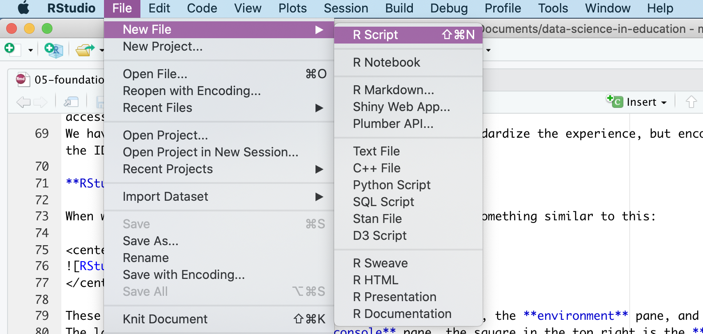
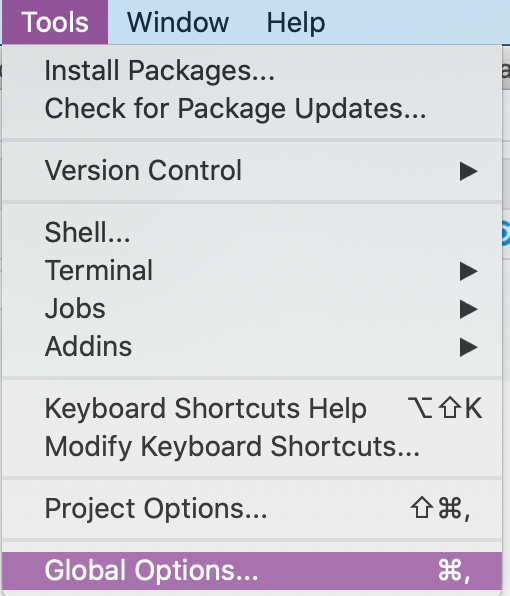
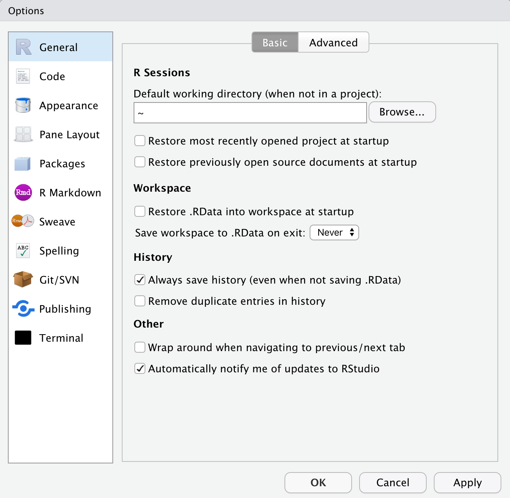
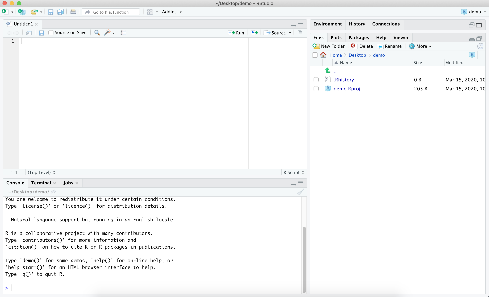
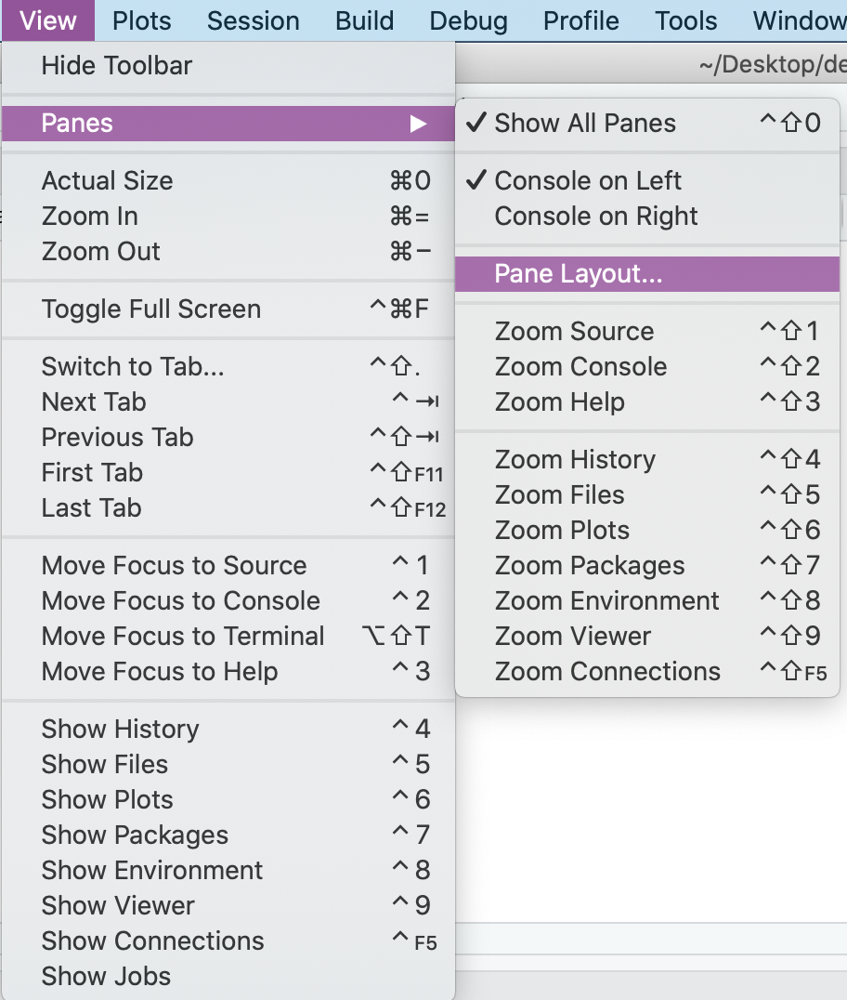
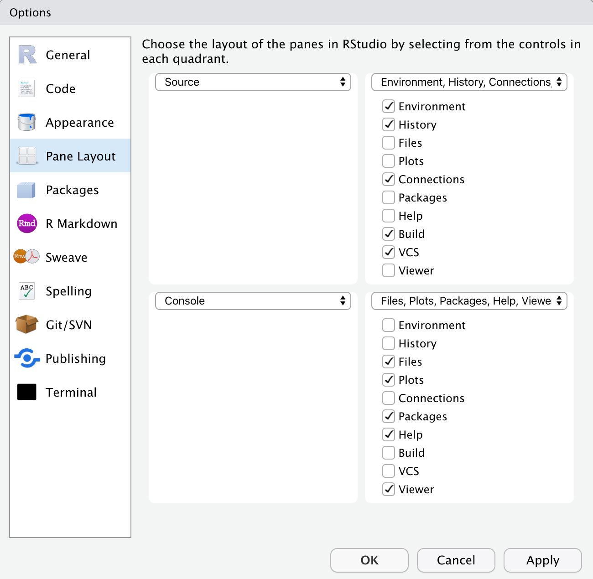
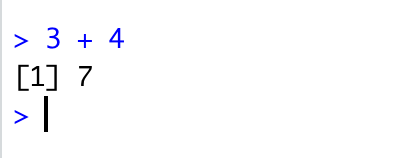
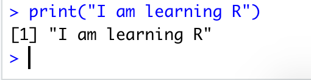
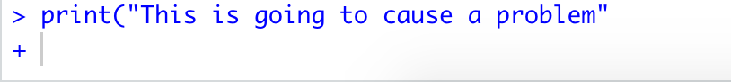

# Basics of R and Rstudio {#basics}

::: {.rmdnote}
This section is adapted from the book Data Science in Education Using R [@dataedu]
:::

## RStudio Layout and Customization: Getting to Know R through RStudio

Now that we've installed both R and RStudio, we will be accessing R _through_ RStudio. 
One of the most reliable ways to tell if you're opening R or RStudio is to look at the icons: 

```{r fig5-1, fig.cap = "Icons", echo = FALSE}
knitr::include_graphics("./inst/figures/Figure 5.1.png")
```

Whenever we want to work with R, we'll open RStudio. RStudio interfaces directly with R, and is an **I**ntegrated **D**evelopment **E**nvironment (IDE). This means that RStudio comes with built-in features that make using R a little easier. 

You do not _have_ to use RStudio to access R, and many people don't! 

Other IDEs that work with R include:

- [Jupyter notebook](https://jupyter.org/) (https[]()://jupyter.org/)
- [VisualStudio](https://visualstudio.microsoft.com/services/visual-studio-online/) (https[]()://visualstudio.microsoft.com/services/visual-studio-online/)
- [VIM](https://github.com/jalvesaq/Nvim-R) (https[]()://github.com/jalvesaq/Nvim-R)
- [IntelliJ IDEA](https://plugins.jetbrains.com/plugin/6632-r-language-for-intellij) (https[]()://plugins.jetbrains.com/plugin/6632-r-language-for-intellij)
- [EMACS Speaks Statistics (ESS)](https://ess.r-project.org/) (https[]()://ess.r-project.org/)

This is a non-exhaustive list, and most of these options require a good deal of familiarity with a given IDE.
However we bring up alternative IDEs---particularly ESS---because RStudio, as of this writing, is not fully accessible for learners who utilize screen readers. We have chosen to use RStudio in this text in order to standardize the experience, but we encourage you to choose the IDE that best suits your needs!

### RStudio Layout 

When we open RStudio for the first time, by default RStudio displays four rectangle panes:

```{r out.width = "100%", fig.align = "center", echo=F}
knitr::include_graphics(here::here("inst","figures", "RStudio_overview.PNG"))
```

::: {.rmdtip}
If your RStudio displays only one left pane it is because you have no scripts open yet.
:::


**The Source Pane**  
This pane, by default in the upper-left, is a space to edit, run, and save your scripts. Scripts contain the commands you want to run. This pane can also display datasets (data frames) for viewing.  

For Stata users, this pane is similar to your Do-file and Data Editor windows.


**The R Console Pane**  

The R Console, by default the left or lower-left pane in R Studio, is the home of the R "engine". This is where the commands are actually run and non-graphic outputs and error/warning messages appear. You can directly enter and run commands in the R Console, but realize that these commands are not saved as they are when running commands from a script.  

If you are familiar with Stata, the R Console is like the Command Window and also the Results Window.


**The Environment Pane**  
This pane, by default in the upper-right, is most often used to see brief summaries of objects in the R Environment in the current session. These objects could include imported, modified, or created datasets, parameters you have defined, or vectors or lists you have defined during analysis (e.g. names of regions). You can click on the arrow next to a data frame name to see its variables.  

In Stata, this is most similar to the Variables Manager window.

This pane also contains *History* where you can see commands that you can previously. It also has a "Tutorial" tab where you can complete interactive R tutorials if you have the **learnr** package installed. It also has a "Connections" pane for external connections, and can have a "Git" pane if you choose to interface with Github.  


**Plots, Viewer, Packages, and Help Pane**  
The lower-right pane includes several important tabs. Typical plot graphics including maps will display in the Plot pane. Interactive or HTML outputs will display in the Viewer pane. The Help pane can display documentation and help files. The Files pane is a browser which can be used to open or delete files. The Packages pane allows you to see, install, update, delete, load/unload R packages, and see which version of the package you have. To learn more about packages see Section \@ref(skills).  

This pane contains the Stata equivalents of the Plots Manager and Project Manager windows.


As you work with R more, you'll find yourself using the tabs within each of the panes.

We can open up an `.R` script in the source pane by going to "File", selecting "New File", and then selecting "R Script":

```{r fig5-3, fig.cap = "Creating a New R Script in RStudio", echo = FALSE}

```

You do not need to do anything specific with this file, but we encourage you to experiment with it if you would like!  

### Customizing RStudio  

One of the balances we've tried to strike in this text is a balance between best practices in your _workflow_ (how you'll use R in your projects) and your _R code_. A best practice for your _workflow_ is to ensure that you're starting with a blank slate every time you open R (through RStudio).  
To accomplish this, go to "Tools", and select "Global Options" from the dropdown menu.

```{r fig5-4, fig.cap = "Selecting Global Options from the Tool Dropdown Menu", echo = FALSE}

```

The "General" tab will open, with several checkboxes selected and unselected. The most important thing you can do is select "Never" next to the "Save workspace to .RData on exit:" prompt. After selecting "Never", go through and check and uncheck boxes so that your General tab looks like this: 

```{r fig5-5, fig.cap = "General Tab from Global Options", echo = FALSE}

```

::: {.rmdcaution}
It will become clear why this is a good idea in Section \@ref(projects).
:::

Last, but certainly not least, click on the "Appearance" tab from within Global Options. From here you can select your RStudio Font, Font Size, and Theme. Go through the options and select an appearance that works best for you, and know that you can _always_ come back and change it!
    
### Minimized and Missing Panes

If, at any point, you find that one of your panes seems to have "disappeared", one of two things has likely happened: 

- A pane has been minimized
- A pane has been closed

Let's look at the Environment pane as an example.
If the Environment pane has been minimized, we'll see something like this:  

```{r fig5-6, fig.cap = "RStudio Layout with the Environment Pane Minimized", echo = FALSE}

```

We know that the Environment pane has been minimized because although we can see the pane headers in the top right, we can't see the information _within_ the Environment pane. To fix this, we can click on the icon of two squares in the top right of the Environment pane. If you click on the icon of the large square in the top right of the Environment pane, you'll maximize the Environment pane and minimize the Files pane. We do not want to do this, since we would prefer to see all the panes at once.

If the Environment pane has somehow been closed, you can recover it by going to the "View" menu, selecting "Panes", and then selecting "Pane Layout", like so: 

```{r fig5-7, fig.cap = "Accessing the Pane Layout from the View Dropdown Menu", echo = FALSE}

```

When we select Pane Layout, we'll see this: 

```{r fig5-8, fig.cap = "Pane Layout Options within RStudio", echo = FALSE}

```

From here, you can select which tabs you'd like to appear within each pane, and you can even change where each pane appears within RStudio. If our Environment Pane had been closed, we would select it from the Pane Layout in order to re-open it within RStudio.


::: {.rmdtip}
**Restart**  
If your R freezes, you can re-start R by going to the Session menu and clicking "Restart R". This avoids the hassle of closing and opening RStudio. Everything in your R environment will be removed when you do this.  
:::


## Writing and Running Code in RStudio

Up to this point, we've been exploring the RStudio interface and setting up our preferences.
Now, we'll shift to some basic coding practices.
In order to run code in R, you need to type your code either in the Console or within an `.R` script. 

We generally recommend creating an `.R` script as you're learning, as it allows you to type all of your code, add comments, and then save your `.R` script for reference. If instead you work entirely in the Console, anything that you type in the Console will disappear as soon as you restart or close R, and you will not be able to reference it in the future.    

### Running Code in the Console

To run code in the Console, you type your code next to the `>` and hit `Enter`.  
We'll spend a little time practicing running code in the Console by exploring some basic properties of coding in R.  

In the Console, type `3 + 4` and hit `Enter`. 
You should see the following:  

```{r fig5-9, fig.cap = "Using the Console as a Calculator", echo = FALSE}

```

We've just used R to add the numbers 3 and 4. 
R has returned the sum of `3 + 4` on a new line, next to `[1]`.
The `[1]` tells us that there is one row of data.

We can also use R to print out text.
Type the following in the Console and hit `Enter`: 

```{r, eval = FALSE}
print("I am learning R")
```

We should see this in the Console:

```{r fig5-10, fig.cap = "Printing Text to the Console", echo = FALSE}

```

There's one error that you're likely going to come across, both when running code in the Console as well as in an R script. 
Let's explore that error now by running the following code in the Console and hitting `Enter`: 

```{r, eval = FALSE}
print("This is going to cause a problem"
```

Make sure that you left off the closing parenthesis! 
What you'll see in the Console is: 

```{r fig5-11, fig.cap = "Incomplete Parentheses Change What R Expects Next", echo = FALSE}

```

When we're missing a closing parenthesis, R is expecting us to provide more code.
We know this because instead of seeing a carat `>` in our Console, we see a `+`, and R has not returned the print statement that we were expecting! 
There are two ways to fix this problem: 

- Type the closing `)` in the Console and hit `Enter`
- Hit the `Esc` key

Go ahead and run this intentional error, and try each of the options above.
Compare the output of each, and think about how they're different.
Can you think of when you might want to use one option instead of the other? 

### Running Code in an R Script

The key to using the script editor effectively is to memorize one of the most important keyboard shortcuts: `Cmd + Enter` for Mac or `Ctrl + Enter` otherwise. This executes the current R expression in the console. 
For example, take the code below.
If your cursor is at █, pressing `Cmd/Ctrl + Enter` will run the complete command that generates `fit`.
It will also move the cursor to the next statement (`summary(fit)`).
That makes it easy to run your complete script by repeatedly pressing Cmd/Ctrl + Enter.

```{r, eval = FALSE}
data("mtcars")

fit <- lm(mpg ~ disp + hp + drat, 
          data = mtcars, █
          weights = runif(nrow(mtcars)))

summary(fit)
```

Instead of running expression-by-expression, you can also execute the complete script in one step: `Cmd/Ctrl + Shift + S`.
Doing this regularly is a great way to check that you've captured all the important parts of your code in the script.

I recommend that you always start your script with the packages that you need.
That way, if you share your code with others, they can easily see what packages they need to install.
Note, however, that you should never include `install.packages()` or `setwd()` in a script that you share.
It's very antisocial to change settings on someone else's computer!

When working through your assignments or research projects, I highly recommend starting in the editor and practicing your keyboard shortcuts.
Over time, sending code to the console in this way will become so natural that you won't even think about it.


### RStudio diagnostics

The script editor will also highlight syntax errors with a red squiggly line and a cross in the sidebar:

```{r echo = FALSE, out.width = NULL}
knitr::include_graphics(here::here("inst","figures", "rstudio-diagnostic.png"))
```

Hover over the cross to see what the problem is:

```{r echo = FALSE, out.width = NULL}
knitr::include_graphics(here::here("inst","figures", "rstudio-diagnostic-tip.png"))
```

RStudio will also let you know about potential problems:

```{r echo = FALSE, out.width = NULL}
knitr::include_graphics(here::here("inst","figures", "rstudio-diagnostic-warn.png"))
```

### Commenting Your Code in R

It is considered good practice to comment your code when working in an `.R` script. 
Even if you are the only person to ever work on your code, it can be helpful to write yourself notes about what you were trying to do with a specific piece of code. 
Moreover, writing comments in your code as you work through the examples in this book is a great way to help reinforce what you're learning.
Comments are ignored by R when running a script, so they will not affect your code or analysis. 

To comment out a line of code, you can place a pound sign (also called an octothorpe) `#` in front of the line of code that you want to exclude when you're running your script.
Be careful when excluding certain lines of code, especially in longer files, as it can be easy to forget where you've commented out code. 
It is often better to simply start a new section of code to tinker with until you get it working as expected, rather than commenting out individual lines of code.

We can also write comments in-line with our code, like this: 

```{r eval = FALSE}
#' this will be a short code example.
#' you are not expected to know what this does,
#' nor do you need to try running it on your computer.
library(readr)  # load the readr package
library(here)  # load the here package
data <- read_csv(here("file_path", "file_name.csv"))  # save file_name.csv as data
```


If you think you'll be writing more than one line of comments, you can do a pound sign followed by a single quotation mark (`#'`). 
This will continue to comment out lines of text or code each time you hit `Enter`.
You can delete the `#'` on a new line where you want to write code for R to run.
This method is useful when you're writing a long description of what you're doing in R.


::: {.rmdnote}
when we refer to "commenting" we're referring to adding in actual text comments, whereas "commenting out" refers to using the pound sign (octothorpe) in front of a line of code so that R ignores it. We will also use the phrase "uncomment code", which means you should delete (or omit when typing out) the `#` or `#'` in an example.
:::


## Autocomplete to avoid coding mistakes

::: {.rmdcaution}

```{r, echo=TRUE, error=TRUE}
read.csv("myfile.csv")
mean(y = 1:5)
```

The above errors undoubtedly happen to several students every time I teach this course. There's always a mistake in the filename, or the file doesn't exist in the current working directory, or the function argument is misspelled. This might not makes sense at this point, but please just get in the habit of using the Tab button. A demo is shown in Figure \@ref(fig:tabgif).  


```{r, echo=FALSE, fig.cap=c("Tab button on a Mac keyboard", "Tab button on most other keyboards")}
knitr::include_graphics(here::here("inst","figures","tab_mac.png"))
knitr::include_graphics(here::here("inst","figures","tab_windows.jpg"))
```
:::

Use your Tab key when typing to engage RStudio's auto-complete functionality. This can prevent spelling errors, remind you of function arguments, and easily find file paths. Press Tab while typing to produce a drop-down menu of likely functions and objects, based on what you have typed so far. In Figure \@ref(fig:tabgif), I show three commands which use the Tab functionality. These are the most common use cases.

```{r tabgif, echo=FALSE, fig.cap = "Autocomplete in RStudio using the Tab button. First line: I first type `lib` and then hit Tab. I then scroll down (using my arrow key) to search for the `library` function, then I hit Enter. Then I type `sp` and the hit Tab again. I then scroll down (using my arrow key) to search for the `splines` library. Then I hit Enter. The other two lines follow the same strategy. I encourage you to try it out for yourself.", out.width='95%'}
knitr::include_graphics(here::here("inst","gifs","tab.gif"))
```


## Keyboard shortcuts 

Some very useful keyboard shortcuts are below. See all the keyboard shortcuts for Windows, Max, and Linux in the second page of this RStudio [user interface cheatsheet](https://github.com/rstudio/cheatsheets/raw/master/rstudio-ide.pdf).  


Windows/Linux     |Mac             |Action                
------------------|----------------|-----------------------------------------
Esc               |Esc             |Interrupt current command (useful if you accidentally ran an incomplete command and cannot escape seeing "+" in the R console)
Ctrl+s            |Cmd+s           |Save (script)
Tab               |Tab             |Auto-complete  
Ctrl + Enter      |Cmd + Enter     |Run current line(s)/selection of code
Ctrl + Shift + C  |Cmd + Shift + c |comment/uncomment the highlighted lines
Alt + -           |Option + -      |Insert `<-`  
Ctrl + Shift + m  |Cmd + Shift + m |Insert `%>%`
Ctrl + l          |Cmd + l         |Clear the R console
Ctrl + Alt + b    |Cmd + Option + b|Run from start to current line
Ctrl + Alt + t    |Cmd + Option + t|Run the current code section (R Markdown)
Ctrl + Alt + i    |Cmd + Shift + r |Insert code chunk (into R Markdown)
Ctrl + Alt + c    |Cmd + Option + c|Run current code chunk (R Markdown)
up/down arrows in R console|Same |Toggle through recently run commands
Shift + up/down arrows in script|Same|Select multiple code lines
Ctrl + f |Cmd + f|Find and replace in current script
Ctrl + Shift + f|Cmd + Shift + f|Find in files (search/replace across many scripts)
Alt + l |Cmd + Option + l|Fold selected code
Shift + Alt + l|Cmd + Shift + Option+l|Unfold selected code


## Resources for learning R and Rstudio

You will have many opportunities to formally learn R in [EPIB613](https://www.mcgill.ca/study/2021-2022/courses/epib-613). This course is meant to provide the necessary coding background for EPIB607. This section provides some links to several additional learning resources, and finishes with some thoughts about the difficulty of learning R and


### Help documentation 

Functions, datasets, and other built-in objects in R are documented in its help system. Search the RStudio "Help" tab for documentation on R packages and specific functions. This is within the pane that also contains Files, Plots, and Packages (typically in the lower-right pane). As a shortcut, you can also type the name of a package or function into the R console after a question-mark to open the relevant Help page. Do not include parentheses.  

For example: `?mean`  or `?plot` or `help(plot)`.  

The quality of R's help pages varies somewhat. They tend to be on the terse side. However, they all have essentially the same structure and it is useful to know how to read them. Figure \@ref(fig:help) provides an overview of what to look for. Remember, functions take inputs, perform actions, and return outputs. Something goes in, it gets worked on, and then something comes out. That means you want to know what the function *requires*, what it *does*, and what it *returns*. What it requires is shown in the **Usage** and **Arguments** sections of the help page. The names of all the required and optional arguments are given by name and in the order the function expects them. Some arguments have default values. In the case of the `mean()` function the argument `na.rm` is set to `FALSE` by default. These will be shown in the **Usage** section. If a named argument has no default, you will have to give it a value. Depending on what the argument is, this might be a logical value, a number, a dataset, or any other object.


```{r help, echo=FALSE, fig.cap=c("How to read a help page [@kieran]."), out.width='97%'}
knitr::include_graphics(here::here("inst","figures","help_page.png"))
```


### Online Forums

These are community driven forums with hundreds of thousands of users. After looking at the help page, this is the next thing I do to find help.  

1. [StackOverflow](https://stackoverflow.com/) (a Q&A site with hundreds of thousands of answers to all sorts of programming questions)  
2. [RStudio Community](https://community.rstudio.com/) (a forum specifically designed for people using RStudio and the tidyverse.
3. Searching for help with R on Google can sometimes be tricky because the program name is a single letter. Google is generally smart enough to figure out what you mean when you search for "r scatterplot", but if it does struggle, try searching for "rstats" instead (e.g. "rstats scatterplot").  


### Cheatsheets 

There are many PDF "cheatsheets" available on the [RStudio website](https://rstudio.com/resources/cheatsheets/). Of particular interest to this course are:  

* [Base R](http://github.com/rstudio/cheatsheets/raw/master/base-r.pdf)  
* [RStudio IDE](https://github.com/rstudio/cheatsheets/raw/master/rstudio-ide.pdf)  
* [Dynamic documents with rmarkdown](https://github.com/rstudio/cheatsheets/raw/master/rmarkdown.pdf)  
* [Data visualization with ggplot2 cheatsheet](https://github.com/rstudio/cheatsheets/raw/master/data-visualization.pdf)  
* [Data transformation with dplyr cheatsheet](https://github.com/rstudio/cheatsheets/raw/master/data-transformation.pdf)  
* [Data import with readr, readxl, and googlesheets4 cheatsheet](https://github.com/rstudio/cheatsheets/raw/master/data-import.pdf)
* [Data tidying with tidyr cheatsheet](Data tidying with tidyr cheatsheet)  


### Twitter 

R has a vibrant twitter community where you can learn tips, shortcuts, and news - follow these accounts:  

* R Function A Day [\@rfuntionaday](https://twitter.com/rfunctionaday) is an *incredible* resource  
* R for Data Science [\@rstats4ds](https://twitter.com/rstats4ds?lang=en)  
* RStudio [\@RStudio](https://twitter.com/rstudio?lang=en)  
* RStudio Tips [\@rstudiotips](https://twitter.com/rstudiotips)  
* R-Bloggers [\@Rbloggers](https://twitter.com/Rbloggers)  
* R-ladies [\@RLadiesGlobal](https://twitter.com/RLadiesGlobal)  
* You can post R-related questions and content with [#rstats](https://twitter.com/search?q=%23rstats). The community there is exceptionally generous and helpful.  


### Exploring R with the {swirl} Package

In addition to the Datacamp courses needed to complete A1, you can supplement your learning through [{swirl}](https://swirlstats.com/students.html) (https[]()://swirlstats.com/students.html).  Students in previous years have found this helpful. You can install {swirl} by running the following code:  


```{r, eval = FALSE}
install.packages("swirl")
```

{swirl} is set of packages that you can download, providing an interactive method for learning R by using R in the RStudio Console.  
Since you've already installed R, RStudio, and the {swirl} package, you can follow the instructions on the {swirl} webpage or run the following code _in your Console pane_ to get started with a beginner-level course in {swirl}:

```{r, eval = FALSE}
library(swirl)
install_course("R_Programming_E")
swirl()
```

There are multiple courses available on {swirl}, and you can access them by installing them and then running the `swirl()` command in your console.


### Free online resources

* [R for Data Science](https://r4ds.had.co.nz/)   
* [RMarkdown Cookbook](https://bookdown.org/yihui/rmarkdown-cookbook/)  
* [Hands-On Programming with R](https://rstudio-education.github.io/hopr/)  
* [Data Visualization with R](https://rkabacoff.github.io/datavis/)  
* [Fundamentals of Data Visualization](https://clauswilke.com/dataviz/)  
* [Modern Data Science with R](https://mdsr-book.github.io/mdsr2e/)  
* [Big Book of R](https://www.bigbookofr.com/)  
* [Materiales de RStudio en Español](https://www.rstudio.com/collections/espanol/)  
* [Introduction à R et au tidyverse (Francais)](https://juba.github.io/tidyverse/index.html)   


### Learning R can be difficult


Learning R can be difficult at first—it's like learning a new language, just like Spanish, French, or Chinese. Hadley Wickham—the chief data scientist at RStudio and the author of some amazing R packages you'll be using like `ggplot2`—[made this wise observation](https://r-posts.com/advice-to-young-and-old-programmers-a-conversation-with-hadley-wickham/):

> It’s easy when you start out programming to get really frustrated and think, “Oh it’s me, I’m really stupid,” or, “I’m not made out to program.” But, that is absolutely not the case. Everyone gets frustrated. I still get frustrated occasionally when writing R code. It’s just a natural part of programming. So, it happens to everyone and gets less and less over time. Don’t blame yourself. Just take a break, do something fun, and then come back and try again later.


## What's next

The next four Chapters are designed to give you the skills and knowledge necessary to *get started* in any programming task. If you have not yet installed R and/or RStudio, please go through the steps outlined in Chapter \@ref(install) before beginning the next three.

Please note that these Chapters are not intended to be a full and complete introduction to programming with R nor to using R for data science. The Datacamp courses you will need to complete for A1 as well as EPIB613 will provide you with the tools to program for data science related tasks. The point of these Chapters is to establish good programming habits before you even start coding. I have gathered these resources here as a succinct reference of what I find to be the most useful to be successful in this course. The four core concepts are:

1. [Projects][RStudio Projects]  
2. [Functions](#functionsHOP)
3. [Packages][Packages]  
4. [Importing data](#import)
  


